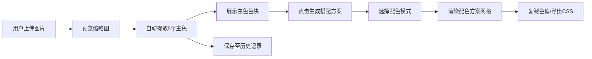

## 1. 产品概述

智能配色提取与搭配应用，为插画师和设计师提供从图片中自动提取主色调并生成和谐配色方案的工具。
- 主要目的：帮助数字绘画创作者快速获取图片色彩灵感，生成专业配色方案
- 目标用户：插画师、UI设计师、前端开发者、数字艺术爱好者
- 产品价值：简化配色流程，提升设计效率，确保色彩和谐性

## 2. 核心功能

### 2.1 功能模块
1. **首页（主工作区）**：图片上传区、主色提取展示区、配色方案生成区、历史记录区

### 2.2 页面详情
| 页面名称 | 模块名称 | 功能描述 |
|-----------|-------------|---------------------|
| 首页 | 图片上传区 | 支持拖拽/点击上传png/jpg/webp格式图片，预览缩略图，自动启动颜色提取 |
| 首页 | 主色提取展示区 | 横向滚动展示5个主色色块卡片，显示HEX色值，点击放大并复制色值 |
| 首页 | 配色方案生成区 | 5种配色模式选项卡（单色/互补/三角/四角/类似色），网格布局展示配色方案，支持CSS导出 |
| 首页 | 历史记录区 | 顶部显示最多10张历史图片缩略图，点击快速切换提取结果 |

## 3. 核心流程

用户上传图片 → 系统自动提取5个主色 → 展示主色色块卡片 → 用户点击"生成搭配方案" → 选择配色模式 → 系统生成对应配色方案 → 用户可复制单个色值或导出CSS变量 → 历史记录自动保存

## 4. 用户界面设计

### 4.1 设计风格
- 主色调：深色渐变背景 #1a1a2e → #16213e
- 强调色：按钮渐变 #e94560 → #ff6b6b
- 毛玻璃风格：卡片半透明背景（白色6%透明度 + blur(12px)）
- 按钮样式：渐变色圆角按钮，带涟漪扩散点击效果
- 布局风格：卡片式布局，横向滚动主色区，网格配色方案区
- 动画：所有过渡采用 cubic-bezier(.25,.1,.25,1)，0.3秒平滑过渡

### 4.2 页面设计概述
| 页面名称 | 模块名称 | UI元素 |
|-----------|-------------|-------------|
| 首页 | 图片上传区 | 拖拽区域、虚线边框、上传图标、加载旋转动画 |
| 首页 | 主色提取展示区 | 横向滚动容器、圆角12px色块卡片、内阴影凹陷效果、HEX色值标签 |
| 首页 | 配色方案生成区 | 选项卡导航、2行3列自适应网格、色块hover放大1.1倍、浮动色值标签、导出按钮 |
| 首页 | 历史记录区 | 顶部缩略图列表、40px正方形缩略图、数量指示器 |

### 4.3 响应式
- 桌面端（≥768px）：配色方案网格2行3列，历史缩略图正常尺寸
- 移动端（<768px）：网格变为2列，历史缩略图缩小为40px正方形
- 触摸优化：增加点击区域，优化滚动体验

### 4.4 性能约束
- 颜色提取：2秒内完成（图片≤3MB）
- 配色方案切换：≥55fps渲染帧率
- 复制操作：<50ms响应时间
- 交互反馈：150ms内完成
