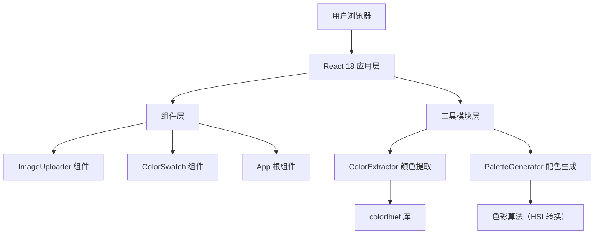

## 1. 架构设计



## 2. 技术描述
- 前端框架：React@18 + TypeScript
- 构建工具：Vite 5.x
- 颜色提取：colorthief
- 状态管理：React Hooks (useState, useCallback, useEffect)
- 样式方案：CSS Modules + 内联样式
- 无需后端，纯前端浏览器运行

## 3. 文件结构与调用关系

| 文件路径 | 职责 | 调用关系 |
|-----------|------|----------|
| src/main.tsx | 应用入口，渲染根组件 | 调用 App.tsx |
| src/App.tsx | 根组件，管理全局状态 | 调用 ImageUploader、ColorSwatch、ColorExtractor、PaletteGenerator |
| src/components/ImageUploader.tsx | 图片上传与预览组件 | 通过 onImageChange 回调向父组件传递 File/base64 |
| src/components/ColorSwatch.tsx | 色块卡片列表组件 | 接收 colorList 和 onSelect 回调，展示色块 |
| src/utils/ColorExtractor.ts | 颜色提取工具模块 | 使用 colorthief 从图片提取5个主色，返回 Promise<number[][]> |
| src/utils/PaletteGenerator.ts | 配色方案生成模块 | 接收主色数组，输出5种配色方案矩阵 |

## 4. 数据流向

```
用户上传图片
    ↓
ImageUploader (File/Base64)
    ↓ onImageChange 回调
App.tsx (全局状态: 图片对象)
    ↓
ColorExtractor.extractColors(image)
    ↓ Promise<number[][]>
App.tsx (全局状态: 主色板 colorList)
    ↓
ColorSwatch (渲染主色色块)
    ↓ 用户点击"生成搭配方案"
App.tsx (设置配色模式)
    ↓
PaletteGenerator.generatePalettes(primaryColors)
    ↓ 配色方案数组
ColorSwatch (渲染方案色块网格)
```

## 5. 核心数据结构

```typescript
// RGB颜色值
type RGB = [number, number, number];

// HEX颜色字符串
type HEX = string;

// 配色模式
type PaletteMode = 'monochromatic' | 'complementary' | 'triadic' | 'tetradic' | 'analogous';

// 历史记录项
interface HistoryItem {
  id: string;
  imageData: string; // base64
  colors: RGB[];
  timestamp: number;
}

// 全局状态
interface AppState {
  currentImage: string | null;
  primaryColors: RGB[];
  selectedPaletteMode: PaletteMode | null;
  history: HistoryItem[];
  isExtracting: boolean;
}
```
