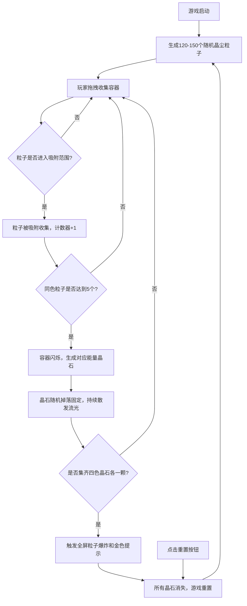

## 1. 产品概述

「晶尘幻境」是一款休闲收集类网页游戏，玩家在充满微光浮尘的神秘洞穴中，通过拖拽玻璃瓶收集飘散的彩色魔法晶尘，最终合成能量晶石触发绚丽爆炸效果。

- 核心玩法：鼠标拖拽收集容器追逐并捕获四种元素晶尘粒子，合成晶石，集齐四色触发全屏特效
- 目标用户：休闲游戏爱好者，喜欢视觉特效和收集玩法的玩家
- 产品价值：提供放松解压的沉浸式体验，精美的粒子动画和视觉反馈带来愉悦感

## 2. 核心功能

### 2.1 功能模块

1. **游戏主画布**：全屏Canvas渲染洞穴场景、晶尘粒子、收集容器、晶石和特效
2. **晶尘粒子系统**：随机生成四种元素粒子（火、水、风、土），带呼吸脉动和旋转动画
3. **收集容器系统**：鼠标拖拽移动玻璃瓶，吸附检测，粒子计数，晶石合成触发
4. **能量晶石系统**：合成后生成钻石形态晶石，持续散发流光粒子
5. **全屏爆炸特效**：集齐四色晶石触发200+粒子爆炸和金色提示文字
6. **UI界面**：信息面板（收集进度）、重置按钮

### 2.2 功能详情

| 功能模块 | 子功能 | 描述 |
|---------|--------|------|
| 洞穴场景渲染 | 背景渐变 | #0a0b1a → #1a1c3b 垂直渐变，底部地面#2a2d4e，顶部洞口渐变为#000 |
| 晶尘粒子 | 生成与运动 | 120-150个随机飘浮，大小5-9px，六边形 |
| 晶尘粒子 | 四种色系 | 火(#ff6b35→#ff0000)、水(#4fc3f7→#0288d1)、风(#aeea00→#6a1b9a)、土(#8d6e63→#3e2723) |
| 晶尘粒子 | 动画效果 | 呼吸脉动0.8-1.5秒，随机旋转0.3-0.6弧度/秒 |
| 收集容器 | 拖拽移动 | 直径60px圆形，半透明玻璃质感，鼠标拖拽延迟0.05秒缓动跟随 |
| 收集容器 | 吸附检测 | 距离<25px时吸附粒子并消失，容器内显示数量计数器 |
| 晶石合成 | 触发条件 | 每集齐5个同色粒子，容器闪烁，生成对应颜色能量晶石 |
| 晶石合成 | 晶石形态 | 钻石形状，边长20px，中心放射渐变光晕，1.2秒后凝固随机掉落固定 |
| 能量晶石 | 流光效果 | 每秒生成5-8个对应颜色流光粒子，方向随机，寿命1.5秒 |
| 全屏爆炸 | 触发条件 | 集齐四色晶石各一颗 |
| 全屏爆炸 | 特效表现 | 约200个混合色粒子中心向外扩散，带8-12px拖尾，持续3秒渐隐 |
| 全屏爆炸 | 提示文字 | 合成成功金色文字(Georgia, 36px)带金色渐变光泽，2秒后淡出 |
| UI界面 | 信息面板 | 左上角半透明面板，220px宽，显示四色收集进度(色块+数字) |
| UI界面 | 重置按钮 | 右上角圆形按钮(36px)，悬停/点击过渡动画，点击重置游戏 |

## 3. 核心流程

## 4. 用户界面设计

### 4.1 设计风格
- **主色调**：深邃神秘的暗色系（#0a0b1a, #1a1c3b, #2a2d4e），配以四元素鲜艳色彩点缀
- **视觉风格**：洞穴微光氛围，半透明玻璃质感，粒子发光特效，金色华丽提示
- **字体**：Georgia（提示文字），系统默认字体（数字计数）
- **交互反馈**：平滑缓动、闪烁动画、缩放过渡（重置按钮0.9缩放弹回）

### 4.2 界面布局

| 元素 | 位置 | 规格 |
|------|------|------|
| Canvas画布 | 全屏 | 100vw × 100vh |
| 信息面板 | 左上角(12px, 12px) | 宽220px，背景rgba(10,11,26,0.8)，圆角12px，1px银白边框，内边距12px |
| 进度色块 | 信息面板内 | 直径24px圆形，2px白色边框，色块间距8px |
| 重置按钮 | 右上角(12px, 12px) | 直径36px圆形，背景rgba(255,255,255,0.15)，0.2s过渡 |
| 收集容器 | 跟随鼠标 | 直径60px圆形，半透明，2px柔光描边 |
| 合成提示 | 画布上方中央 | 36px Georgia金色渐变文字 |

### 4.3 性能要求
- 粒子数量150时保持 ≥45FPS帧率
- 粒子吸附和爆炸动画响应延迟 ≤50ms
- 使用requestAnimationFrame实现流畅游戏循环

## 5. 技术实现要点
- 模块化架构：粒子系统、收集容器、特效系统分离
- Canvas 2D渲染，分层绘制优化
- 对象池模式管理粒子，避免频繁GC
- 距离检测优化：平方距离比较避免开方
