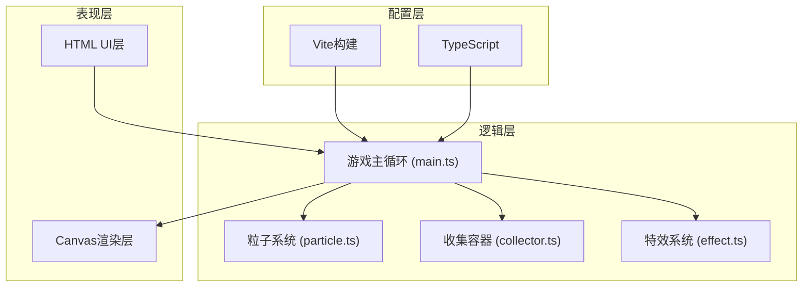
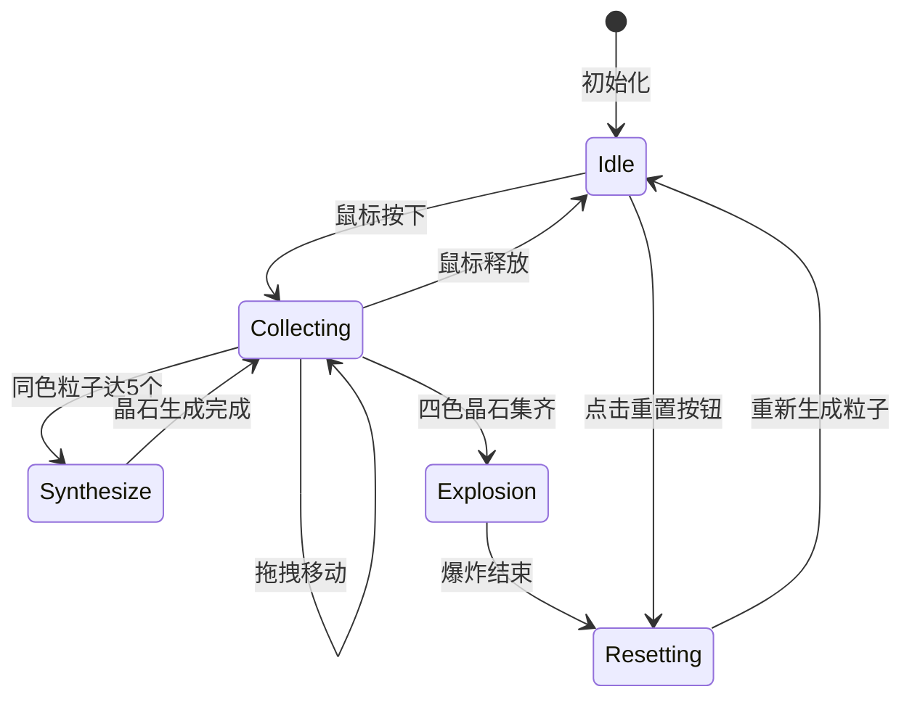

## 1. 架构设计



## 2. 技术描述

- **前端框架**：原生 TypeScript + HTML5 Canvas 2D
- **构建工具**：Vite 5.x（热更新HMR，端口5173）
- **编程语言**：TypeScript（严格模式，target ES2020，module ESNext）
- **包管理器**：npm
- **无后端**：纯前端单页应用，无数据持久化需求

## 3. 文件结构

```
project-root/
├── .trae/
│   └── documents/
│       ├── PRD-晶尘幻境.md
│       └── 技术架构-晶尘幻境.md
├── src/
│   ├── main.ts          # 主流程：Canvas初始化、游戏循环、模块协调
│   ├── particle.ts      # 粒子模块：晶尘粒子、能量晶石、流光粒子
│   ├── collector.ts     # 收集容器：拖拽、吸附、计数、合成
│   └── effect.ts        # 特效模块：全屏爆炸、提示文字
├── index.html           # 入口HTML页面
├── package.json         # 项目配置与依赖
├── vite.config.js       # Vite配置
└── tsconfig.json        # TypeScript配置
```

## 4. 模块接口定义

### 4.1 particle.ts

```typescript
// 元素类型
export type ElementType = 'fire' | 'water' | 'wind' | 'earth';

// 晶尘粒子
export interface DustParticle {
  id: number;
  x: number;
  y: number;
  vx: number;
  vy: number;
  size: number;
  element: ElementType;
  rotation: number;
  rotationSpeed: number;
  pulsePhase: number;
  pulseSpeed: number;
  alive: boolean;
}

// 能量晶石
export interface Crystal {
  id: number;
  x: number;
  y: number;
  vy: number;
  element: ElementType;
  size: number;
  glowIntensity: number;
  formingProgress: number; // 0~1, 1=完全凝固
  fixed: boolean;
  glowTimer: number;
}

// 流光粒子
export interface GlowParticle {
  id: number;
  x: number;
  y: number;
  vx: number;
  vy: number;
  element: ElementType;
  life: number;
  maxLife: number;
  size: number;
}

// 色系定义
export const ELEMENT_COLORS: Record<ElementType, { start: string; end: string }>;

// 粒子系统类
export class ParticleSystem {
  constructor(canvasWidth: number, canvasHeight: number);
  resize(w: number, h: number): void;
  spawnDustParticles(count: number): void;
  createCrystal(element: ElementType, x: number, y: number): void;
  update(dt: number): void;
  render(ctx: CanvasRenderingContext2D): void;
  getDustParticles(): DustParticle[];
  getCrystals(): Crystal[];
  collectParticle(id: number): void;
  removeAllCrystals(): void;
  reset(): void;
}
```

### 4.2 collector.ts

```typescript
export interface CollectedCounts {
  fire: number;
  water: number;
  wind: number;
  earth: number;
}

export interface CrystalOwned {
  fire: boolean;
  water: boolean;
  wind: boolean;
  earth: boolean;
}

export class Collector {
  constructor(canvas: HTMLCanvasElement);
  setPosition(x: number, y: number): void;
  update(dt: number): void;
  render(ctx: CanvasRenderingContext2D): void;
  checkAndCollect(particles: DustParticle[]): ElementType | null;
  getCounts(): CollectedCounts;
  getCrystalOwned(): CrystalOwned;
  triggerFlash(): void;
  markCrystalOwned(element: ElementType): void;
  reset(): void;
  x: number;
  y: number;
  targetX: number;
  targetY: number;
}
```

### 4.3 effect.ts

```typescript
export interface ExplosionParticle {
  x: number;
  y: number;
  vx: number;
  vy: number;
  color: string;
  life: number;
  maxLife: number;
  size: number;
  trail: { x: number; y: number }[];
}

export class EffectSystem {
  triggerExplosion(centerX: number, centerY: number): void;
  triggerSuccessText(canvasWidth: number): void;
  update(dt: number): void;
  render(ctx: CanvasRenderingContext2D): void;
  isExplosionActive(): boolean;
  reset(): void;
}
```

### 4.4 main.ts

```typescript
// 负责：
// 1. 获取Canvas元素，设置全屏尺寸
// 2. 初始化ParticleSystem, Collector, EffectSystem
// 3. 绑定鼠标事件（拖拽移动、按下/释放）
// 4. 绑定重置按钮点击事件
// 5. 实现requestAnimationFrame游戏循环
// 6. 协调模块间逻辑：收集检测→合成判断→爆炸触发→重置
// 7. 窗口resize事件处理
```

## 5. 性能优化策略

1. **Canvas渲染优化**
   - 所有粒子统一批量绘制，减少state切换
   - 使用`globalAlpha`和渐变时减少save/restore调用
   - 离屏Canvas预渲染静态元素（洞穴地面纹理）

2. **粒子管理优化**
   - 数组遍历使用索引而非for...of
   - 删除粒子时标记`alive=false`，定期清理或复用（对象池）
   - 距离检测使用平方比较，避免Math.sqrt

3. **动画帧率控制**
   - 使用deltaTime时间步长，保证不同帧率下动画速度一致
   - requestAnimationFrame驱动，避免setTimeout/setInterval

4. **内存管理**
   - 爆炸粒子和流光粒子限制最大数量
   - 及时移除已死亡粒子，避免数组无限增长

## 6. UI组件定义

- **信息面板**：HTML div元素（非Canvas绘制），绝对定位左上角，包含四个色块+数字
- **重置按钮**：HTML button元素，绝对定位右上角，带CSS过渡动画
- **合成成功提示**：Canvas绘制，保证与粒子特效融合

## 7. 游戏状态流转


