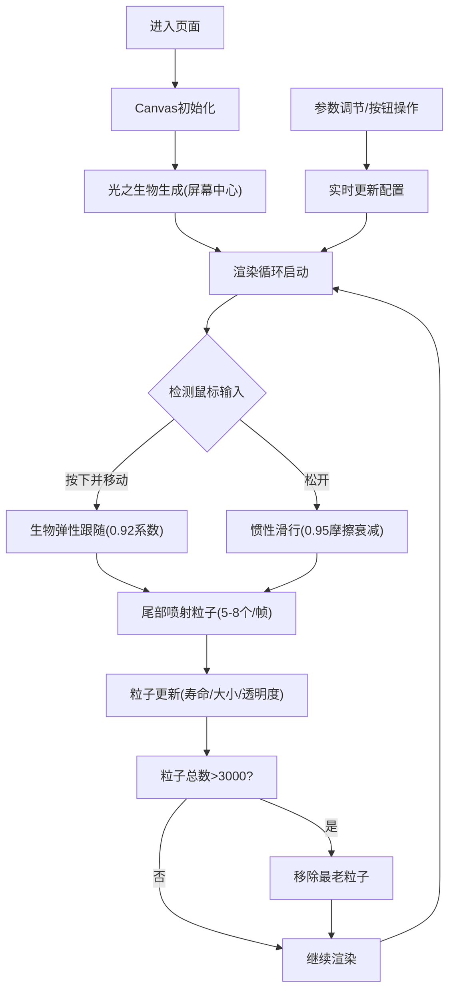

## 1. 产品概述

一款基于浏览器的Canvas互动游戏原型，玩家通过鼠标点击拖拽操控由流光线条构成的「光之生物」在黑暗虚空中自由游弋，为后续RPG或解谜游戏提供核心操控模块。

- **核心目标**：用最简代码实现基于物理（速度衰减、边界反弹）的流畅跟随运动与实时粒子拖尾特效
- **目标用户**：游戏开发者、交互设计师、创意编程爱好者
- **产品价值**：提供可复用的生物操控与粒子系统核心模块，降低后续游戏开发成本

## 2. 核心特性

### 2.1 功能模块

1. **主游戏场景**：全屏Canvas画布，黑暗虚空背景，光之生物渲染与物理运动
2. **粒子拖尾系统**：彩色流光粒子喷射，布朗运动干扰，渐隐渐消效果
3. **参数控制面板**：弹性系数、粒子数量、粒子寿命、背景亮度实时调节
4. **功能按钮区**：轨迹清除、速度冻结、染色模式三种切换功能

### 2.2 页面详情

| 页面名称 | 模块名称 | 功能描述 |
|---------|---------|---------|
| 游戏主页面 | Canvas画布 | 16:9响应式适配，径向渐变背景，生物与粒子渲染 |
| 游戏主页面 | 控制面板 | 右上角悬浮，4个滑块参数调节，半透明毛玻璃风格 |
| 游戏主页面 | 功能按钮 | 底部居中，3个圆形图标按钮，带悬停/点击动效 |

## 3. 核心流程

玩家进入页面后，画布中央出现一只光之生物。按住鼠标左键移动可控制生物跟随运动，松开时生物因惯性继续滑行。移动过程中尾部持续喷射彩色粒子留下轨迹。玩家可通过右上角滑块调整各项参数，或通过底部按钮进行轨迹清除、速度冻结、染色模式切换等操作。

## 4. 用户界面设计

### 4.1 设计风格

- **主色调**：深蓝背景(#0a0a12)与亮蓝主体(#4fc3f7)的暗色科幻对比
- **按钮样式**：圆形，毛玻璃半透明背景，悬停高亮，点击缩放动效
- **字体**：Google Fonts Quicksand，现代圆润无衬线字体
- **布局风格**：全屏沉浸式，UI元素悬浮于画布之上，不干扰游戏体验
- **视觉特效**：径向渐变背景、粒子光晕、生物呼吸脉动、线条粗细渐变

### 4.2 页面设计概览

| 页面名称 | 模块名称 | UI元素 |
|---------|---------|-------|
| 游戏主页面 | Canvas画布 | 16:9自适应，径向渐变(#0a0a12→#1a1a2e)，crosshair光标 |
| 游戏主页面 | 光之生物 | 10段光滑曲线，主色#4fc3f7，头部4px→尾部1px线宽渐变，呼吸脉动效果 |
| 游戏主页面 | 粒子系统 | HSL彩色圆形粒子，半透明光晕，5-8个/帧生成，1.5-2.5秒寿命 |
| 游戏主页面 | 控制面板 | 宽200px，rgba(20,20,40,0.8)背景，12px圆角，1px#4fc3f7边框，4个150px滑块 |
| 游戏主页面 | 功能按钮 | 32px圆形，rgba(255,255,255,0.1)背景，悬停rgba(79,195,247,0.3)，0.2s过渡 |

### 4.3 响应式设计

- **策略**：桌面优先，Canvas保持16:9宽高比，窗口缩放时自动适配，多余区域纯黑填充
- **UI定位**：控制面板固定右上角，按钮固定底部居中，使用绝对定位不随Canvas缩放偏移
- **触摸优化**：支持触控设备，触摸事件等价于鼠标事件处理

### 4.4 性能指标

- **帧率要求**：极端粒子场景下稳定55fps以上
- **粒子上限**：3000个，超出时优先移除寿命最长粒子
- **技术验证**：使用Chrome DevTools Performance面板验证帧率稳定性
