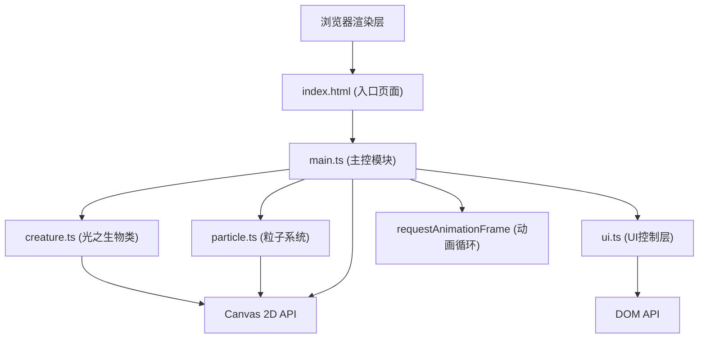

## 1. 架构设计



## 2. 技术描述

- **前端框架**：无外部UI框架，原生TypeScript + Canvas 2D API
- **构建工具**：Vite@5.x，端口5173，开启HMR热更新
- **编程语言**：TypeScript@5.x，严格模式，target ES2020，module ESNext
- **物理实现**：自研轻量物理，不依赖外部游戏引擎或物理库
- **字体**：Google Fonts Quicksand（通过CDN链入）

## 3. 文件结构

| 文件路径 | 用途 |
|---------|-----|
| `package.json` | 项目依赖配置（typescript, vite），启动脚本 npm run dev |
| `vite.config.js` | Vite基础配置，端口5173，HMR开启 |
| `tsconfig.json` | TypeScript严格模式配置 |
| `index.html` | 入口页面，Canvas容器与UI覆盖层结构，Quicksand字体引入 |
| `src/main.ts` | Canvas初始化、requestAnimationFrame动画循环、鼠标/触摸事件绑定、生物+粒子+UI系统整合 |
| `src/creature.ts` | LightCreature类：位置、速度、跟随逻辑、10段曲线绘制、呼吸脉动效果 |
| `src/particle.ts` | Particle类与ParticleSystem：粒子位置/速度/颜色/寿命管理、布朗运动、渐隐效果、上限控制 |
| `src/ui.ts` | ControlPanel类：DOM创建、4个滑块事件处理、3个按钮事件绑定、状态同步 |

## 4. 核心类设计

### 4.1 LightCreature (creature.ts)

```typescript
class LightCreature {
  x: number; y: number;           // 当前位置
  vx: number; vy: number;         // 速度向量
  targetX: number; targetY: number; // 目标位置（鼠标）
  elasticity: number;             // 弹性系数(0.5-1.0)
  friction: number;               // 摩擦系数(默认0.95)
  maxSpeed: number;               // 最大速度(8px/帧)
  segmentCount: number;           // 身体段数(10)
  segments: Array<{x:number, y:number}>; // 身体各段位置
  breathingPhase: number;         // 呼吸相位
  isGlowing: boolean;             // 点击高亮状态
  glowTimer: number;              // 高亮计时器

  update(isFollowing: boolean): void;      // 每帧更新位置与物理
  draw(ctx: CanvasRenderingContext2D): void; // 绘制10段曲线生物
  triggerGlow(): void;                      // 触发点击高亮效果
  getHeadAngle(): number;                   // 获取头部朝向角度
}
```

### 4.2 Particle / ParticleSystem (particle.ts)

```typescript
class Particle {
  x: number; y: number;
  vx: number; vy: number;
  color: { h: number; s: number; l: number };
  size: number;
  initialSize: number;
  life: number;           // 当前剩余寿命(秒)
  maxLife: number;        // 总寿命
  shrinkRate: number;     // 每帧缩小系数
  opacity: number;

  update(deltaTime: number, frozen: boolean): void;
  draw(ctx: CanvasRenderingContext2D): void;
  isDead(): boolean;
}

class ParticleSystem {
  particles: Particle[];
  maxParticles: number;   // 3000上限
  particlesPerFrame: number;  // 每帧生成数
  particleLife: number;   // 粒子寿命
  coloringMode: 'random' | 'mouse';

  emit(x: number, y: number, angle: number, mouseX?: number, mouseY?: number): void;
  update(deltaTime: number, frozen: boolean): void;
  draw(ctx: CanvasRenderingContext2D): void;
  clear(): void;
}
```

### 4.3 ControlPanel (ui.ts)

```typescript
interface UIState {
  elasticity: number;
  particlesPerFrame: number;
  particleLife: number;
  backgroundBrightness: number;
  frozen: boolean;
  coloringMode: 'random' | 'mouse';
}

class ControlPanel {
  state: UIState;
  onChange: (state: UIState) => void;
  onClearTrail: () => void;

  createPanel(): HTMLElement;      // 创建控制面板DOM
  createButtons(): HTMLElement;    // 创建底部按钮DOM
  bindEvents(): void;              // 绑定所有事件
}
```

## 5. 性能优化策略

1. **粒子池复用**：粒子死亡后对象复用，避免频繁GC
2. **批量绘制**：同色粒子批量路径绘制，减少状态切换
3. **软上限**：3000粒子硬上限，超出即移除最老粒子
4. **deltaTime计算**：基于时间差更新，帧率无关
5. **离屏缓存**：静态背景可离屏预渲染（可选优化）

## 6. 动画循环流程

```
requestAnimationFrame
    ↓
计算deltaTime(秒)
    ↓
处理输入状态(鼠标位置/是否按下)
    ↓
creature.update(isFollowing)
    ↓
particleSystem.emit(生物尾部位置, 角度)
    ↓
particleSystem.update(deltaTime, frozen)
    ↓
绘制背景(径向渐变)
    ↓
particleSystem.draw(ctx)
    ↓
creature.draw(ctx)
```
