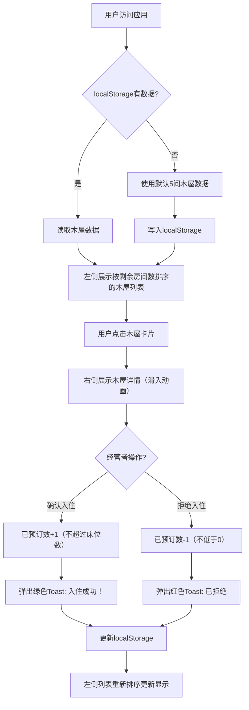

## 1. 产品概述

「小木屋日记」是一款面向独立民宿经营者的轻量级在线管理与展示Web应用，帮助经营者管理特色小木屋的预订状态，并为客人提供木屋信息浏览和入住申请功能。产品以纯前端技术实现（localStorage模拟后端），无需依赖外部服务器即可完整运行。

- **目标用户**：独立民宿经营者、小型木屋度假村管理者
- **核心价值**：极简部署、即时可用的木屋状态管理与预订工具

## 2. 核心功能

### 2.1 用户角色
| 角色 | 使用方式 | 核心权限 |
|------|----------|----------|
| 民宿经营者 | 直接访问Web应用 | 查看所有木屋状态、确认入住、拒绝入住、更新木屋信息 |
| 客人 | 通过浏览器访问 | 浏览木屋列表、查看木屋详情、了解实时预订状态 |

### 2.2 功能模块
1. **木屋列表展示**：左侧面板展示所有木屋卡片，按剩余房间数排序
2. **木屋详情展示**：右侧面板展示选中木屋的完整信息
3. **预订状态管理**：确认入住（已预订数+1）、拒绝入住（已预订数-1）
4. **数据持久化**：使用localStorage保存木屋状态，刷新页面不丢失
5. **操作反馈**：Toast提示显示操作结果

### 2.3 页面详情
| 页面名称 | 模块名称 | 功能描述 |
|----------|----------|----------|
| 主页面 | 顶部标题区 | 居中展示应用名称「小木屋日记」 |
| 主页面 | 左侧列表面板 | 木屋卡片列表（占宽35%），按剩余房间数降序排序 |
| 主页面 | 右侧详情面板 | 选中木屋的详细信息（占宽65%），含操作按钮 |
| 主页面 | Toast提示区 | 操作成功/失败的淡入淡出提示 |

## 3. 核心流程

客人或经营者访问应用 → 系统从localStorage读取木屋数据（无则使用默认数据）→ 左侧展示排序后的木屋列表 → 点击木屋卡片 → 右侧展示木屋详情 → 经营者点击「确认入住」→ 已预订数+1，弹出绿色Toast → 左侧列表自动重新排序 → 数据自动持久化到localStorage

## 4. 用户界面设计

### 4.1 设计风格
- **主色系**：复古原木风
  - 主背景：#f5f0e6（米白）
  - 左侧面板：#e8dcc8（浅黄褐）
  - 右侧面板：#ffffff（纯白）
  - 标题文字：#3e2723（深棕）
  - 价格文字：绿色粗体
  - 剩余房间数：橙色文字
- **按钮风格**：圆角8px，0.2秒hover背景色加深过渡
  - 确认按钮：#27ae60（绿色）
  - 拒绝按钮：#e74c3c（红色）
- **卡片风格**：磨砂玻璃效果（backdrop-filter: blur(8px)），悬浮时提升阴影，卡片间距8px
- **字体**：系统默认字体族，标题32px粗体，名称24px粗体，正文16px

### 4.2 页面设计概述
| 页面名称 | 模块名称 | UI元素 |
|----------|----------|--------|
| 主页面 | 顶部标题 | 「小木屋日记」居中，32px粗体#3e2723，行高1.5，底部间距12px |
| 主页面 | 木屋列表卡片 | 120x120缩略图、名称、剩余X间（橙色）、价格（绿色粗体）、已满标签（半透明） |
| 主页面 | 木屋详情 | 480x360大图、名称24px粗体#2c3e50、简介16px#7f8c8d、剩余房间数、两个操作按钮 |
| 主页面 | Toast提示 | 淡入动画，持续2.5秒自动消失，绿色/红色背景 |

### 4.3 响应式
- **桌面端**：左右分栏布局（左35%，右65%）
- **移动端（<768px）**：上下堆叠布局，列表卡片横向滚动

### 4.4 动画效果
- 详情面板切换：从右向左滑入（translateX(20px) → 0，opacity 0 → 1），0.3秒
- Toast提示：淡入淡出
- 按钮hover：背景色加深，0.2秒
- 卡片悬浮：阴影提升
