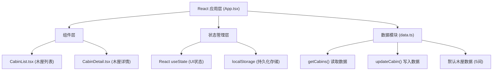

## 1. 架构设计

本项目为纯前端单页应用，使用localStorage模拟后端数据存储，无需外部服务依赖。



## 2. 技术描述

- **前端框架**：React 18 + TypeScript
- **构建工具**：Vite 5.x
- **状态管理**：React useState（轻量级状态）
- **数据存储**：浏览器 localStorage（模拟后端持久化）
- **样式方案**：CSS Modules / 内联样式（无第三方UI库）
- **开发服务器**：Vite HMR，端口 5173

### 2.1 依赖列表
| 依赖 | 版本说明 |
|------|----------|
| react | ^18.2.0 |
| react-dom | ^18.2.0 |
| typescript | ^5.3.0 |
| vite | ^5.0.0 |
| @vitejs/plugin-react | ^4.2.0 |

## 3. 文件结构与调用关系

```
project-root/
├── package.json              # 项目依赖与脚本配置
├── vite.config.js            # Vite 构建配置
├── tsconfig.json             # TypeScript 配置
├── index.html                # 入口HTML（内联全局样式）
└── src/
    ├── data.ts               # 数据存储模块（木屋数据、localStorage读写）
    ├── App.tsx               # 主应用组件（状态管理、布局协调）
    └── components/
        ├── CabinList.tsx     # 木屋列表组件（接收cabins+onSelect）
        └── CabinDetail.tsx   # 木屋详情组件（接收cabin+onUpdate）
```

### 数据流向说明
1. **初始化流程**：`App.tsx` → 调用 `data.ts:getCabins()` → 读取 localStorage → 无数据则使用默认值并写入
2. **列表展示**：`App.tsx` → 传递 `cabins` 数组 → `CabinList.tsx` 渲染排序后的卡片
3. **详情展示**：`CabinList.tsx` → 调用 `onSelect(id)` → `App.tsx` 更新选中ID → 传递 `cabin` → `CabinDetail.tsx`
4. **数据更新**：`CabinDetail.tsx` → 调用 `onUpdate(id, newBookedCount)` → `App.tsx` 更新状态 → 调用 `data.ts:updateCabin()` → 写入 localStorage → 列表自动重排

## 4. 数据模型

### 4.1 TypeScript 类型定义

```typescript
interface Cabin {
  id: string;
  name: string;
  imageUrl: string;
  beds: number;          // 总床位数
  booked: number;        // 已预订数
  description: string;   // 简介文字
  price: number;         // 价格/晚
  lat: number;           // 纬度模拟坐标
  lng: number;           // 经度模拟坐标
}
```

### 4.2 默认木屋数据（5间）
| ID | 名称 | 床位数 | 已预订 | 价格/晚 |
|----|------|--------|--------|---------|
| c1 | 松林小筑 | 4 | 1 | 388 |
| c2 | 湖畔木屋 | 6 | 2 | 568 |
| c3 | 山居岁月 | 3 | 3 | 298 |
| c4 | 星空营地 | 5 | 0 | 458 |
| c5 | 枫林别院 | 4 | 2 | 428 |

### 4.3 localStorage 存储规范
- **Key**: `cabin-diary-data`
- **Value**: JSON 序列化的 Cabin[] 数组
- **读写方式**：通过 `data.ts` 模块的 `getCabins()` 和 `updateCabin()` 统一操作

## 5. 核心组件接口定义

### 5.1 CabinList 组件 Props
```typescript
interface CabinListProps {
  cabins: Cabin[];
  onSelect: (id: string) => void;
}
```

### 5.2 CabinDetail 组件 Props
```typescript
interface CabinDetailProps {
  cabin: Cabin;
  onUpdate: (id: string, newBookedCount: number) => void;
}
```

## 6. 性能约束实现方案

| 约束 | 实现方案 |
|------|----------|
| 首屏加载 < 1.5s（3G） | 使用轻量依赖、无额外图片资源请求、CSS内联关键样式 |
| 详情切换无需重新请求 | 数据在App层统一管理，通过props传递，切换仅更新UI |
| 列表重排 < 16ms | 使用原生Array.sort，数据量仅5条，计算开销可忽略 |
