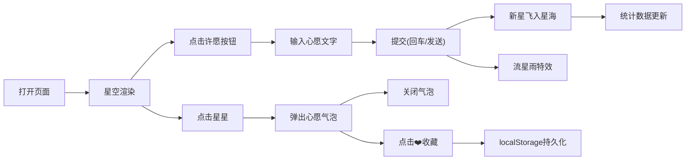

## 1. 产品概述

「星语心愿」是一个基于 Canvas 的交互式星空许愿瓶网页应用，用户可在虚拟玻璃瓶中漂浮的星海上浏览、许愿、收藏心愿。适合嵌入个人博客或儿童教育平台作为情感互动模块。

- 核心目标：提供治愈系的情感互动体验，让用户在闪烁的星海中寄托心愿
- 目标用户：博客访客、学生、儿童、任何需要情感寄托的互联网用户

## 2. 核心功能

### 2.1 功能模块
1. **主星空画布**：全屏 Canvas 渲染约 200 颗星星，含整体旋转、独立呼吸脉动、点击交互
2. **心愿气泡对话框**：点击星星弹出心愿详情，支持收藏和关闭
3. **许愿模式**：右下角按钮切换，输入心愿后生成新星并飞向星海
4. **统计面板**：左上角实时显示星星总数、收藏数、今日新增数
5. **收藏持久化**：使用 localStorage 存储收藏的心愿
6. **流星雨特效**：许愿成功时触发流星雨动画

### 2.2 页面详情
| 页面名称 | 模块名称 | 功能描述 |
|---------|---------|---------|
| 主页面 | 星空画布 | 深空渐变背景，星星整体旋转(60s/圈)，独立呼吸脉动(1-3s周期)，点击放大+光晕扩散 |
| 主页面 | 心愿气泡 | 半透明磨砂玻璃弹窗，显示心愿文字(≤30字)、❤️收藏按钮、关闭按钮 |
| 主页面 | 许愿按钮 | 右下角圆形半透明按钮，hover放大，点击回弹 |
| 主页面 | 许愿输入框 | 中央输入框(260×40px)，回车或点击发送按钮提交 |
| 主页面 | 统计面板 | 左上角面板，显示3个数据，可折叠为星形图标 |
| 主页面 | 流星雨特效 | 许愿成功时5-10条流星轨迹，持续1秒 |

## 3. 核心流程

用户打开页面 → 浏览缓慢旋转闪烁的星海 → 点击星星查看心愿详情 → 点击❤️收藏 / 关闭 → 点击右下角许愿按钮 → 输入心愿文字(≤30字) → 按回车或点击发送 → 新星从输入框飞出融入星海 + 流星雨特效 → 统计数据实时更新 → 收藏状态持久化存储。

## 4. 用户界面设计

### 4.1 设计风格
- **主色调**：深空蓝渐变 #0b0e27 → #1a1d4a
- **强调色**：金黄 #ffd700、蓝白 #e0f7fa、米黄 #fff8dc
- **辅助色**：收藏绿 #4caf50、徽章红(圆点)
- **按钮风格**：圆形半透明，圆角 50%，柔光阴影，hover 放大 1.1x，点击缩放 0.9x 回弹
- **字体**：白色 #fff，正文 16px，小字 12px/14px
- **布局风格**：全屏沉浸式 Canvas，UI 元素以浮层形式叠加
- **图标/emoji**：❤️ 收藏、✕ 关闭、▲ 发送、★ 星形

### 4.2 页面设计概述
| 页面名称 | 模块名称 | UI 元素 |
|---------|---------|---------|
| 主页面 | 星空画布 | 深空渐变背景、200颗随机大小/颜色/透明度星星、整体旋转、呼吸脉动 |
| 主页面 | 心愿气泡 | 圆角12px、rgba(10,10,30,0.85)背景、backdrop-filter:blur(6px)、金色边框 |
| 主页面 | 许愿按钮 | 直径56px、rgba(255,215,0,0.2)背景、hover变亮放大、柔光阴影 |
| 主页面 | 许愿输入框 | 圆角8px、rgba(255,255,255,0.15)背景、金色边框、右侧三角发送按钮 |
| 主页面 | 统计面板 | 宽180px、rgba(10,10,30,0.7)背景、圆角8px、fade-in动画、金色高亮数字 |
| 主页面 | 流星雨特效 | 5-10条随机位置/方向轨迹、1秒后消失 |

### 4.3 响应式
- 桌面端(≥768px)：全屏 Canvas，200 颗星星，气泡对话框固定宽度，输入框 260px，统计面板左上角
- 移动端(<768px)：全屏 Canvas，120 颗星星，气泡宽度 80% 屏幕，输入框宽度 80%，统计面板底部居中(100%宽，50px高，横向三数据)

## 5. 性能要求
- 画布帧率稳定 ≥55FPS，目标 60FPS
- 星星数量根据帧率和窗口大小动态调整
- 所有动画使用 requestAnimationFrame 驱动，无 setInterval
