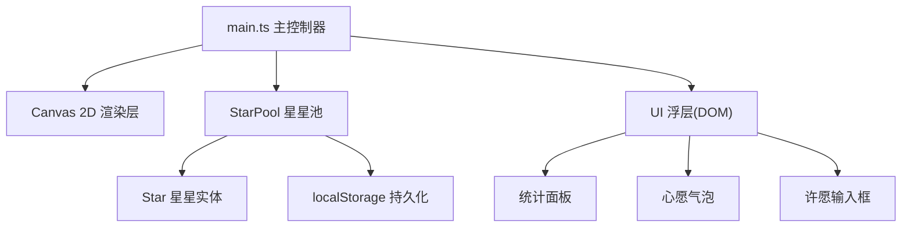

## 1. 架构设计

纯前端单页应用，基于 Canvas 2D API 渲染，无后端服务。



## 2. 技术描述

- **前端框架**：原生 TypeScript + Canvas 2D API（无 React/Vue）
- **构建工具**：Vite 5.x
- **语言**：TypeScript 5.x（严格模式，target ES2020，module ESNext）
- **数据存储**：localStorage（收藏持久化）
- **动画方案**：requestAnimationFrame 单循环驱动
- **性能优化**：帧率监控 + 动态星星数量调整

## 3. 文件结构

```
├── package.json
├── vite.config.js
├── tsconfig.json
├── index.html
└── src/
    ├── main.ts       # 主入口：画布初始化、事件处理、UI渲染、动画循环
    ├── star.ts       # Star 类：星星属性、呼吸脉动、轨道旋转、绘制、点击效果
    └── pool.ts       # StarPool 类：星星数组管理、增删、查询、收藏切换、统计
```

## 4. 核心类设计

### 4.1 Star 类 (star.ts)

**属性**：
- `x: number` - 当前 x 坐标
- `y: number` - 当前 y 坐标
- `baseX: number` - 基准 x（轨道中心偏移）
- `baseY: number` - 基准 y
- `size: number` - 基础大小 3-8px
- `color: string` - 颜色
- `opacity: number` - 透明度 0.6-1.0
- `phase: number` - 呼吸相位 0-2π
- `breathSpeed: number` - 呼吸速度 1-3s 周期
- `orbitAngle: number` - 当前轨道角度
- `wishText: string` - 心愿文字（≤30字）
- `isCollected: boolean` - 是否已收藏
- `sentiment: 'warm' | 'calm' | 'default'` - 情感倾向
- `clickAnim: { active: boolean; progress: number }` - 点击动画状态
- `flyAnim: { active: boolean; startX: number; startY: number; endX: number; endY: number; progress: number }` - 飞入动画
- `halo: { active: boolean; radius: number; opacity: number }` - 光晕扩散

**方法**：
- `update(deltaTime: number, centerX: number, centerY: number, orbitSpeed: number): void` - 更新一帧
- `draw(ctx: CanvasRenderingContext2D): void` - 绘制
- `handleClick(): void` - 触发点击动画
- `startFly(fromX: number, fromY: number, toX: number, toY: number): void` - 开始飞入动画

### 4.2 StarPool 类 (pool.ts)

**属性**：
- `stars: Star[]` - 星星数组
- `targetCount: number` - 目标星星数量
- `STORAGE_KEY` - localStorage key

**方法**：
- `addStar(star: Star): void`
- `removeStar(index: number): void`
- `getStarAtPosition(x: number, y: number, radius: number): Star | null`
- `toggleCollection(star: Star): void`
- `getStats(): { total: number; collected: number; todayNew: number }`
- `saveCollections(): void`
- `loadCollections(): void`

### 4.3 main.ts 职责

- 初始化 Canvas、监听 resize、设置 DPR
- 创建 StarPool，生成初始星星
- requestAnimationFrame 循环：计算 deltaTime → 更新所有 Star → 清空画布 → 深空渐变 → 绘制所有 Star → 流星特效 → 帧率监控 → 动态调节星星数
- 鼠标事件：hit-test 点击星星、按钮区域检测
- DOM UI 渲染：统计面板、心愿气泡、许愿输入框的显示/隐藏、内容更新
- 情感倾向判断、流星雨触发

## 5. 数据模型

### 5.1 localStorage 存储结构

```json
{
  "collectedWishes": [
    { "wishText": "...", "color": "#ffd700", "timestamp": 1718000000000 }
  ],
  "todayWishes": { "date": "2026-06-10", "count": 3 }
}
```

## 6. 性能策略

- FPS 监控：每 2 秒采样平均帧率
- 动态调节：<55FPS 减星，>58FPS 加星（步进 ±5 颗）
- 离屏裁剪：绘制前判断是否在视口内
- 批量路径：星星使用单个 beginPath + 多次 arc
- DPR 适配：根据 devicePixelRatio 设置画布实际像素
- 触摸优化：移动端减少星星至 120 颗
