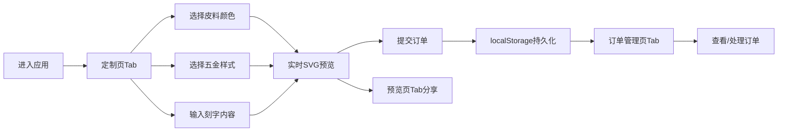

## 1. 产品概述

「皮匠实验室」是一款面向手工皮具工作室的在线定制系统，让客户通过浏览器实时预览并定制皮具产品，同时支持经营者后台订单管理。

- 核心目标：提供沉浸式的皮具定制体验，简化订单流程，提升工作室运营效率
- 目标用户：手工皮具工作室主理人及终端消费者

## 2. 核心功能

### 2.1 用户角色

| 角色 | 注册方式 | 核心权限 |
|------|----------|----------|
| 客户 | 无需注册 | 浏览定制选项、实时预览、提交定制订单、分享预览图 |
| 经营者 | 无需注册 | 查看所有订单、管理订单状态、删除订单、清空历史数据 |

### 2.2 功能模块

1. **定制面板**：皮料颜色选择、五金配件选择、刻字内容输入
2. **实时预览**：SVG钱包渲染、拖拽旋转视角、参数实时同步
3. **订单管理**：订单列表展示、状态变更、订单删除、数据清空
4. **分享功能**：预览图一键复制为图片

### 2.3 页面详情

| 页面名称 | 模块名称 | 功能描述 |
|----------|----------|----------|
| 定制页 | 皮料颜色选择 | 6种皮料色板，点击选中带缩放弹跳动画 |
| 定制页 | 五金样式选择 | 3种金属质感圆盘，选中高亮金色边框 |
| 定制页 | 刻字输入 | 20字上限输入框，实时字符计数与红色警告 |
| 定制页 | 提交按钮 | 提交定制订单到本地存储 |
| 预览页 | SVG钱包预览 | 400×400 SVG展示长款钱包，皮料/五金/刻字实时渲染 |
| 预览页 | 拖拽旋转 | 鼠标拖拽控制钱包视角旋转，60fps流畅体验 |
| 预览页 | 分享复制 | html2canvas捕获SVG区域，复制成功Toast提示 |
| 订单管理页 | 订单列表 | 展示所有订单（时间、参数摘要、状态圆点） |
| 订单管理页 | 状态管理 | 标记订单为已完成 |
| 订单管理页 | 订单删除 | 删除单个订单 |
| 订单管理页 | 清空数据 | 二次确认弹窗后清空所有历史订单 |

## 3. 核心流程

客户进入应用 → 切换到定制页Tab → 选择皮料颜色 → 选择五金样式 → 输入刻字内容 → 实时查看预览效果 → 满意后提交订单 → 可切换到预览页分享预览图 → 经营者切换到订单管理页查看并处理订单

## 4. 用户界面设计

### 4.1 设计风格

- **主色调**：暖白背景 #FDF2E9，深棕主色 #8B4513，辅助米色 #D4B89B
- **按钮风格**：圆角按钮，选中背景深棕，未选中米色，0.3秒平滑过渡
- **字体**：手写体 Caveat（刻字显示）+ 系统无衬线字体（界面文字）
- **布局风格**：卡片式布局，大圆角12px，最大宽度1200px居中
- **视觉元素**：木质纹理页头（repeating-linear-gradient木板条纹）

### 4.2 页面设计概览

| 页面名称 | 模块名称 | UI元素 |
|----------|----------|--------|
| 全局 | 页头 | 高100px木质纹理，标题居中 |
| 全局 | Tab导航 | 三按钮平铺（各200×48px），背景过渡动画 |
| 定制页 | 皮料色板 | 40×40圆形色块，hover缩放1.05，选中弹跳动画 |
| 定制页 | 五金圆盘 | 36px金属纹理圆盘，选中金色边框 #FFD700 |
| 定制页 | 刻字输入 | 字符计数（18字以上红色警告） |
| 预览页 | SVG钱包 | 弧线顶、缝线纹理、R角底、内阴影 |
| 订单管理页 | 订单项 | 80px高，白底，#E8DCC6底边框，hover皮料色竖条 |

### 4.3 响应式设计

- 桌面端（>768px）：定制面板左45%，预览区域右55%，左右并排
- 移动端（≤768px）：定制面板在上，预览区域在下，垂直堆叠

### 4.4 性能约束

- CSS动画使用transform/opacity属性，保证60fps
- Tab切换组件卸载/挂载延迟≤100ms
- localStorage读写单次≤5ms，数据超100条提示优化
