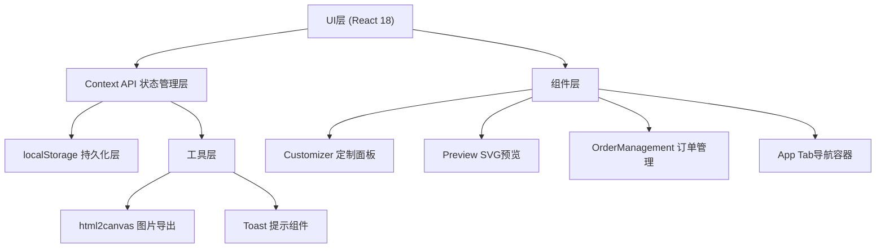
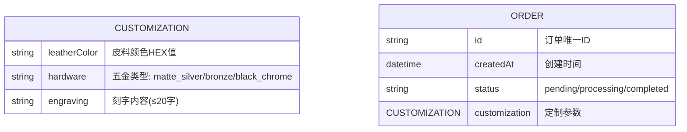

## 1. 架构设计



## 2. 技术说明

- **前端框架**：React 18 + TypeScript
- **构建工具**：Vite 5（端口5173，HMR热更新）
- **状态管理**：React Context API + useReducer
- **数据持久化**：localStorage（键名：'orders'）
- **图片导出**：html2canvas
- **图标**：lucide-react
- **样式方案**：原生CSS（CSS Modules风格，全局变量）
- **无后端**：纯前端模拟，所有数据存储于浏览器本地

## 3. 文件结构定义

| 文件/目录路径 | 职责说明 |
|---------------|----------|
| `package.json` | 项目依赖配置，含react/react-dom/typescript/vite/@vitejs/plugin-react/html2canvas/lucide-react |
| `vite.config.ts` | Vite配置：React插件、端口5173、HMR开启 |
| `tsconfig.json` | TS配置：严格模式、target ES2020、module ESNext、jsx preserve |
| `index.html` | 入口HTML，含viewport、中文标题"皮匠实验室"、Caveat字体引入 |
| `src/main.tsx` | React入口，挂载App到#root，初始化localStorage默认数据 |
| `src/App.tsx` | 主容器，管理三个Tab切换（定制/预览/订单管理），Context Provider |
| `src/types/index.ts` | 全局TypeScript类型定义（定制参数、订单、五金类型等） |
| `src/context/OrderContext.tsx` | 订单状态管理Context，封装localStorage读写 |
| `src/context/CustomizeContext.tsx` | 定制状态管理Context，跨组件共享定制参数 |
| `src/components/Customizer.tsx` | 定制面板组件：皮料色板、五金选择、刻字输入、提交按钮 |
| `src/components/Preview.tsx` | 实时预览组件：400×400 SVG钱包、鼠标拖拽旋转 |
| `src/components/OrderManagement.tsx` | 订单管理组件：订单列表、状态标记、删除、清空 |
| `src/components/Toast.tsx` | 轻量Toast提示组件 |
| `src/components/ConfirmDialog.tsx` | 二次确认弹窗组件 |
| `src/utils/storage.ts` | localStorage封装工具，带性能计时 |
| `src/utils/share.ts` | html2canvas封装，图片复制到剪贴板 |
| `src/styles/global.css` | 全局样式：CSS变量、木质纹理、手作风格主题 |

## 4. 数据流向

```
用户操作 → 组件本地state更新 → props传递 → Preview实时重渲染
                     ↓
           提交订单 → OrderContext → localStorage写入
                     ↓
           OrderManagement订阅Context → 列表自动刷新
```

## 5. 数据模型

### 5.1 数据模型定义



### 5.2 TypeScript 类型定义

```typescript
type LeatherColor = '#8B4513' | '#DEB887' | '#2F4F4F' | '#8B0000' | '#1C1C1C' | '#F5F5DC';

type HardwareType = 'matte_silver' | 'bronze' | 'black_chrome';

interface Customization {
  leatherColor: LeatherColor;
  hardware: HardwareType;
  engraving: string;
}

type OrderStatus = 'pending' | 'processing' | 'completed';

interface Order {
  id: string;
  createdAt: string;
  status: OrderStatus;
  customization: Customization;
}
```

## 6. 性能优化点

1. **SVG渲染**：使用useMemo缓存SVG计算结果
2. **拖拽旋转**：requestAnimationFrame + transform属性，避免重排
3. **localStorage**：读写封装带5ms超时检测，超100条订单提示优化
4. **动画**：全部使用transform/opacity，GPU加速
5. **组件拆分**：纯组件+React.memo避免不必要重渲染
