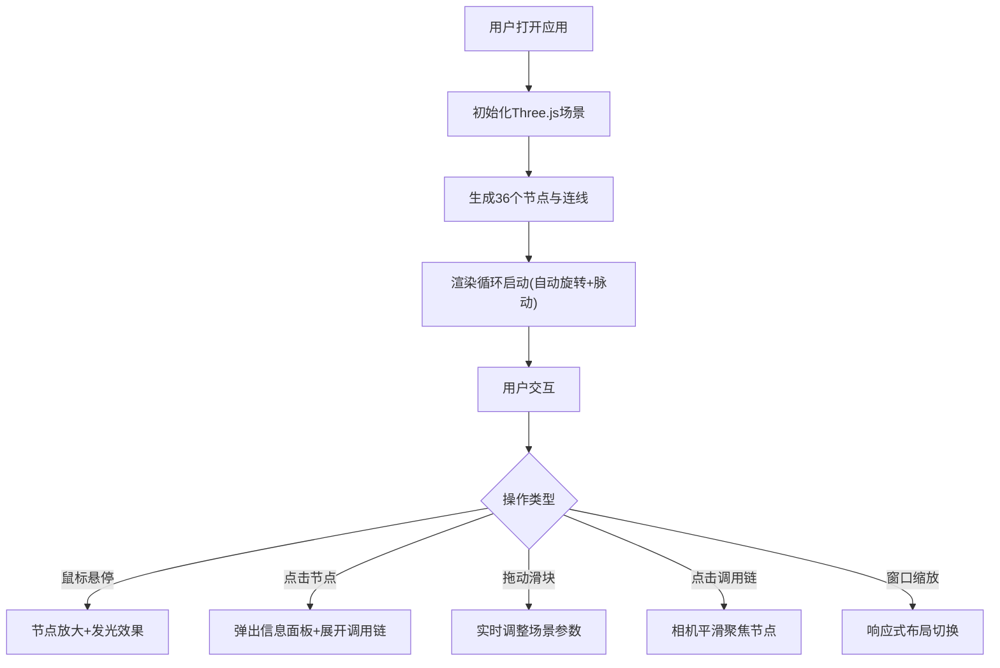

## 1. 产品概述

「代码经络」是一款面向开发者的浏览器端三维代码可视化工具，通过将代码依赖关系映射为三维空间中漂浮的节点和流光线条，帮助开发者直观理解函数调用链与模块间数据流向，解决代码分析的抽象性问题。

- 目标用户：软件开发者、架构师、代码审查人员
- 核心价值：沉浸式代码分析体验，三维可视化辅助理解复杂调用关系

## 2. 核心功能

### 2.1 功能模块

1. **主场景三维网络**：36个球体节点构成的立体网络，自动旋转与脉动动画
2. **节点交互系统**：悬停放大发光、点击弹出信息面板
3. **左侧控制面板**：节点尺寸、连接线透明度、旋转速度的实时调节
4. **底部信息栏**：调用链树状展示，支持节点跳转聚焦
5. **响应式适配**：桌面端与移动端的差异化界面呈现

### 2.2 功能详情

| 模块名称 | 功能描述 |
|---------|---------|
| 主场景渲染 | Three.js渲染深空背景(#0b0b1a→#1a1a2e径向渐变)，36个随机分布球体节点(半径0.3-0.6)，6色调色板，半透明发光连线，自动绕Y轴旋转(45秒/圈)，节点持续脉动(幅度0.1，周期3秒) |
| 节点交互 | 悬停时节点放大1.3倍+白色发光边框；点击弹出200×120px圆角面板(rgba(20,20,40,0.9)背景，4px模糊)，显示名称、调用次数、平均耗时 |
| 控制面板 | 240px宽半透明面板(rgba(10,10,30,0.85)，圆角12px，1px白色边框)，三个滑块(节点尺寸0.5-2、连线透明度0.1-1.0、旋转速度0-90秒/圈)，实时数值显示，0.2秒过渡动画 |
| 信息栏 | 360×200px抽屉式(默认收起40px)，底部圆角0，上边缘圆角12px，展示3层调用链树(颜色#a0a0ff→#ffa0a0渐变)，点击节点聚焦(1.5秒ease-in-out) |
| 响应式 | <768px时控制面板变为50px圆形按钮(全屏遮罩菜单)，信息栏变为50px底部标签，去除脉动与模糊效果 |

## 3. 核心流程

## 4. 用户界面设计

### 4.1 设计风格
- **视觉风格**：暗色调赛博朋克
- **主色调**：#e74c3c(红)、#3498db(蓝)、#2ecc71(绿)、#f1c40f(黄)、#9b59b6(紫)、#e67e22(橙)
- **背景**：深空径向渐变 #0b0b1a → #1a1a2e
- **材质效果**：磨砂玻璃(backdrop-filter:blur(6px))，细微发光边框(box-shadow:0 0 8px rgba(255,255,255,0.15))
- **动画**：呼吸脉冲，所有过渡0.3秒缓动

### 4.2 页面设计概览

| 区域 | UI元素 | 样式细节 |
|-----|--------|---------|
| 主场景 | Canvas全屏 | 径向渐变背景，3D节点网络，轨道控制器 |
| 左侧控制面板 | 滑块组(3个) | 半透明玻璃面板，1px边框，圆角12px，数值实时显示 |
| 右下角信息栏 | 可抽屉面板 | 默认收起40px，展开200px，树状调用链文本 |
| 悬浮节点面板 | 信息卡片 | 200×120px，圆角8px，4px模糊，白色边框 |
| 移动端按钮 | 圆形控制按钮 | 直径50px，悬浮左下角 |

### 4.3 响应式
- 桌面端(≥768px)：完整控制面板与信息栏
- 移动端(<768px)：简化交互，控制面板转为悬浮按钮，信息栏底部标签式，粒子效果简化

### 4.4 3D场景指导
- **环境**：深空暗色径向渐变，营造宇宙空间感
- **光照**：环境光(0.5强度)+ 2个点光源(分别置于场景对角，彩色光)
- **相机**：PerspectiveCamera(fov 60)，OrbitControls(damping 0.05)
- **节点材质**：MeshStandardMaterial，带发光效果(emissive)
- **连线材质**：LineBasicMaterial，半透明(transparent:true, opacity:0.4)
- **动画**：整体Y轴旋转、节点脉动缩放、脉冲信号沿连线传播
- **性能目标**：30FPS+，支持最多50个节点流畅交互
