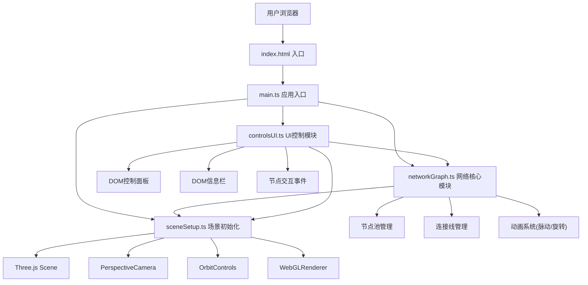

## 1. 架构设计



## 2. 技术描述

- **前端框架**：TypeScript + Three.js@0.160 + Vite
- **构建工具**：Vite (端口5173，HMR热更新，输出目录dist)
- **后端服务**：无(纯前端应用)
- **数据库**：无(使用随机生成的模拟数据)
- **包管理器**：npm

## 3. 项目文件结构

| 文件路径 | 作用描述 |
|---------|---------|
| package.json | 项目依赖(three@0.160, @types/three, vite, typescript)与脚本(npm run dev) |
| vite.config.js | Vite基础配置，输出dist，端口5173，开启HMR |
| tsconfig.json | TypeScript严格模式，target ES2020，module ESNext |
| index.html | 入口页面，全屏Canvas容器，title"代码经络"，viewport设置 |
| src/main.ts | 应用入口：初始化场景、相机、控制器，挂载渲染循环，监听resize |
| src/sceneSetup.ts | 场景初始化：Scene、PerspectiveCamera(fov60)、OrbitControls(damping0.05)、WebGLRenderer(antialias)、环境光与点光源 |
| src/networkGraph.ts | 核心模块：生成36节点+连线，管理节点池/连接池，update动画方法，getNodeInfo方法 |
| src/controlsUI.ts | UI控制模块：创建控制面板与信息栏DOM，绑定事件，通过回调调整场景参数 |

## 4. 数据模型

### 4.1 节点数据类型

```typescript
interface NodeData {
  id: string;
  name: string;
  color: string;
  baseRadius: number;
  position: { x: number; y: number; z: number };
  callCount: number;
  avgDuration: number;
  callChain: CallChainNode[];
}

interface CallChainNode {
  id: string;
  name: string;
  level: number;
  children?: CallChainNode[];
}
```

### 4.2 连接线数据类型

```typescript
interface ConnectionData {
  sourceId: string;
  targetId: string;
  color: string;
}
```

### 4.3 全局配置参数

```typescript
interface GraphConfig {
  nodeScale: number;       // 节点尺寸缩放 (0.5-2, 默认1)
  lineOpacity: number;     // 连线透明度 (0.1-1.0, 默认0.4)
  rotationSpeed: number;   // 旋转速度秒/圈 (0-90, 默认45)
}
```

## 5. 核心模块接口定义

### sceneSetup.ts

```typescript
export class SceneSetup {
  scene: THREE.Scene;
  camera: THREE.PerspectiveCamera;
  renderer: THREE.WebGLRenderer;
  controls: OrbitControls;
  
  constructor(container: HTMLElement);
  focusOnNode(position: THREE.Vector3, duration?: number): void;
  onResize(): void;
}
```

### networkGraph.ts

```typescript
export class NetworkGraph {
  nodes: Map<string, THREE.Mesh>;
  connections: THREE.LineSegments;
  config: GraphConfig;
  
  constructor(scene: THREE.Scene);
  update(time: number): void;
  getNodeInfo(nodeId: string): NodeData | null;
  handleNodeHover(nodeId: string | null): void;
  handleNodeClick(nodeId: string): NodeData | null;
  setNodeScale(scale: number): void;
  setLineOpacity(opacity: number): void;
  setRotationSpeed(speed: number): void;
  getNodePosition(nodeId: string): THREE.Vector3 | null;
}
```

### controlsUI.ts

```typescript
export class ControlsUI {
  constructor(
    container: HTMLElement,
    onConfigChange: (config: Partial<GraphConfig>) => void,
    onNodeClick: (nodeId: string) => void,
    onFocusNode: (nodeId: string) => void
  );
  showNodePanel(data: NodeData, screenX: number, screenY: number): void;
  hideNodePanel(): void;
  updateCallChain(nodeData: NodeData): void;
}
```

## 6. 调色板常量

```typescript
const COLOR_PALETTE = [
  '#e74c3c',  // 红
  '#3498db',  // 蓝
  '#2ecc71',  // 绿
  '#f1c40f',  // 黄
  '#9b59b6',  // 紫
  '#e67e22',  // 橙
];
```
