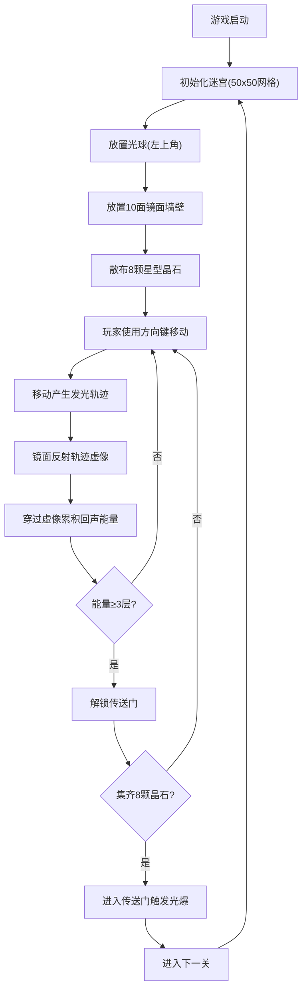

## 1. 产品概述

「镜界回声」是一款2D迷宫探索游戏，玩家在黑暗的镜面迷宫中操控发光球体移动，通过收集晶石、穿越虚像解锁传送门进入下一关。

- 核心玩法：迷宫探索 + 光迹反射解谜 + 晶石收集
- 目标用户：休闲游戏玩家，喜欢解谜和视觉体验的用户
- 产品价值：独特的镜面反射视觉效果，沉浸式迷宫探索体验

## 2. 核心功能

### 2.1 功能模块

1. **主游戏场景**：全屏Canvas画布，径向渐变背景，50x50网格迷宫
2. **玩家控制**：键盘方向键操控光球移动，发光轨迹记录
3. **镜面反射系统**：10面镜面墙壁反射轨迹虚像，回声能量累积
4. **晶石收集**：8颗星型晶石散布迷宫，收集解锁传送门
5. **传送门与关卡**：回声能量达3层解锁传送门，集齐晶石可进入下一关
6. **特效系统**：光球光晕呼吸、轨迹消退、光爆扩散、旋转传送门

### 2.2 页面详情

| 页面名称 | 模块名称 | 功能描述 |
|-----------|-------------|---------------------|
| 主游戏场景 | Canvas渲染 | 全屏Canvas画布，径向渐变背景(#0a0a0a到#1a1a2e)，50x50迷宫网格 |
| 主游戏场景 | 迷宫绘制 | 墙壁2px亮线#3498db，地面半透明黑色rgba(0,0,0,0.7) |
| 主游戏场景 | 玩家光球 | 左上角起始，10px径向渐变(#ffffff到#f1c40f)，30px呼吸光晕 |
| 主游戏场景 | 移动轨迹 | 4px蓝色发光尾迹#3498db，透明度0.9到0渐变，3秒消失 |
| 主游戏场景 | 镜面墙壁 | 10面银色#c0c0c0镜面，反射虚像#add8e6，透明度降低30% |
| 主游戏场景 | 回声能量 | 穿过虚像累积能量，3层后解锁传送门 |
| 主游戏场景 | 星型晶石 | 8颗12px五角星，#ff6347到#ff4500渐变，1.5秒脉动缩放 |
| 主游戏场景 | 传送门 | 右下角旋转发光圆环，内径15px外径25px，#00ff00到#7fff00渐变 |
| 主游戏场景 | 光爆特效 | 进入传送门时1.2秒中心扩散白色光爆，透明度0.9到0 |
| 底部状态栏 | 状态显示 | 显示当前层数、晶石收集数、回声能量层数 |

## 3. 核心流程

## 4. 用户界面设计

### 4.1 设计风格

- **主色调**：深色背景(#0a0a0a ~ #1a1a2e) + 蓝色光效(#3498db) + 金色玩家(#f1c40f)
- **辅助色**：银色镜面(#c0c0c0)、淡蓝虚像(#add8e6)、红色晶石(#ff6347 ~ #ff4500)、绿色传送门(#00ff00 ~ #7fff00)
- **视觉风格**：暗色系科技感，发光体与反射效果营造神秘氛围
- **动画风格**：平滑呼吸光晕、轨迹渐变消退、传送门旋转、晶石脉动、光爆扩散

### 4.2 页面设计概览

| 页面名称 | 模块名称 | UI元素 |
|-----------|-------------|-------------|
| 主游戏场景 | Canvas画布 | 全屏径向渐变背景，居中迷宫网格，发光球体，蓝色轨迹，银色镜面，星型晶石，旋转传送门 |
| 主游戏场景 | 底部状态栏 | 半透明深色背景，白色文字显示层数/晶石/能量信息 |

### 4.3 响应式

- 桌面端优先，全屏Canvas自适应窗口大小
- 迷宫网格根据Canvas尺寸等比缩放，保持正方形格子
- 状态栏固定底部，宽度自适应

### 4.4 性能要求

- 帧率稳定在55fps以上
- 轨迹粒子数量不超过500个时无卡顿
- 使用Canvas 2D API原生渲染，避免重绘优化
