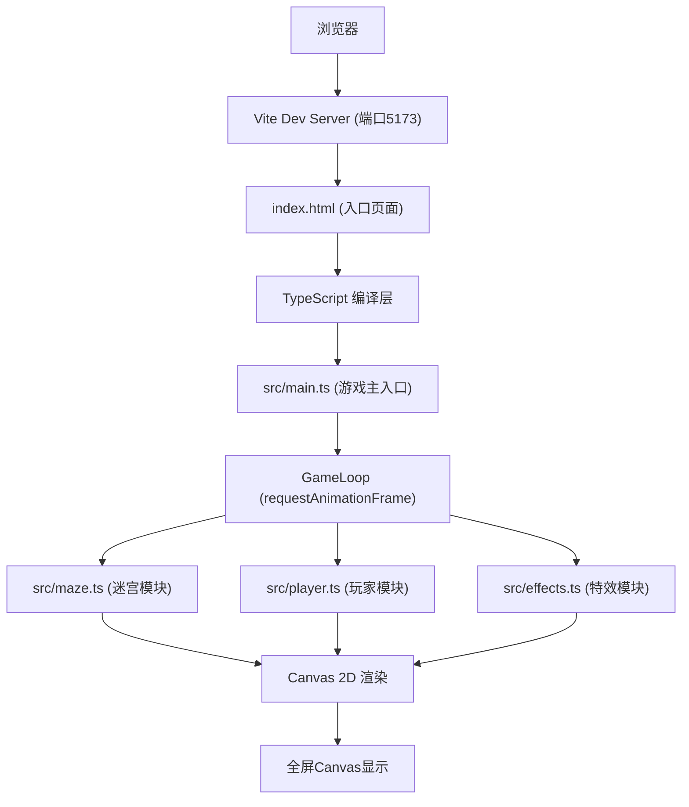

## 1. 架构设计



## 2. 技术描述

- **前端框架**: 原生 TypeScript (无外部游戏引擎/库)
- **构建工具**: Vite@5
- **编程语言**: TypeScript@5 (严格模式, target ES2020, module ESNext)
- **渲染技术**: Canvas 2D API
- **开发服务器**: Vite HMR (端口5173)

## 3. 文件结构

| 文件路径 | 用途 |
|-------|---------|
| package.json | 项目依赖与脚本配置 |
| vite.config.js | Vite构建配置 |
| tsconfig.json | TypeScript编译配置 |
| index.html | 入口HTML页面，包含Canvas容器与状态栏 |
| src/main.ts | 游戏主入口：初始化Canvas、启动游戏循环、协调各模块 |
| src/maze.ts | 迷宫生成与渲染：50x50网格、墙壁、地面、传送门、晶石 |
| src/player.ts | 玩家光球：键盘输入、位置更新、轨迹记录、碰撞检测 |
| src/effects.ts | 特效系统：轨迹消退、光晕呼吸、光爆扩散、镜面反射虚像 |

## 4. 核心数据结构定义

### 4.1 迷宫相关类型

```typescript
// 格子类型
type CellType = 'empty' | 'wall' | 'mirror';

// 格子坐标
interface Position {
  x: number;
  y: number;
}

// 迷宫格子
interface Cell {
  type: CellType;
  mirrorDir?: 'horizontal' | 'vertical';
}

// 星型晶石
interface Crystal {
  pos: Position;
  collected: boolean;
}

// 传送门
interface Portal {
  pos: Position;
  unlocked: boolean;
  rotation: number;
}
```

### 4.2 玩家与轨迹类型

```typescript
// 玩家光球
interface Player {
  gridPos: Position;
  pixelPos: { x: number; y: number };
  glowPhase: number;
}

// 轨迹点
interface TrailPoint {
  x: number;
  y: number;
  createdAt: number;
  opacity: number;
}

// 反射虚像
interface VirtualImage {
  mirrorIndex: number;
  points: { x: number; y: number; opacity: number }[];
  crossed: boolean;
}
```

### 4.3 特效类型

```typescript
// 光爆特效
interface LightBurst {
  active: boolean;
  x: number;
  y: number;
  startTime: number;
  duration: number;
}

// 游戏状态
interface GameState {
  level: number;
  crystalsCollected: number;
  echoEnergy: number;
  portalUnlocked: boolean;
}
```

## 5. 核心算法说明

### 5.1 迷宫生成
- 使用预定义地图模式生成50x50网格迷宫
- 墙壁分布遵循迷宫连通性原则
- 随机在可行走区域放置10面镜面墙壁

### 5.2 镜面反射计算
- 针对每面镜面墙壁，对轨迹点进行对称翻转计算
- 水平镜面：y坐标翻转
- 垂直镜面：x坐标翻转
- 虚像颜色变淡，透明度降低30%

### 5.3 碰撞检测
- 玩家移动前检测目标格子是否为墙壁
- 检测玩家是否与晶石碰撞（同格子）
- 检测玩家是否穿过虚像轨迹
- 检测玩家是否进入已解锁传送门

### 5.4 性能优化
- 轨迹点数组限制最大500个，超出自动移除最旧点
- 每帧仅更新活跃特效状态，不重复计算静态迷宫
- 使用Canvas批量绘制减少状态切换
