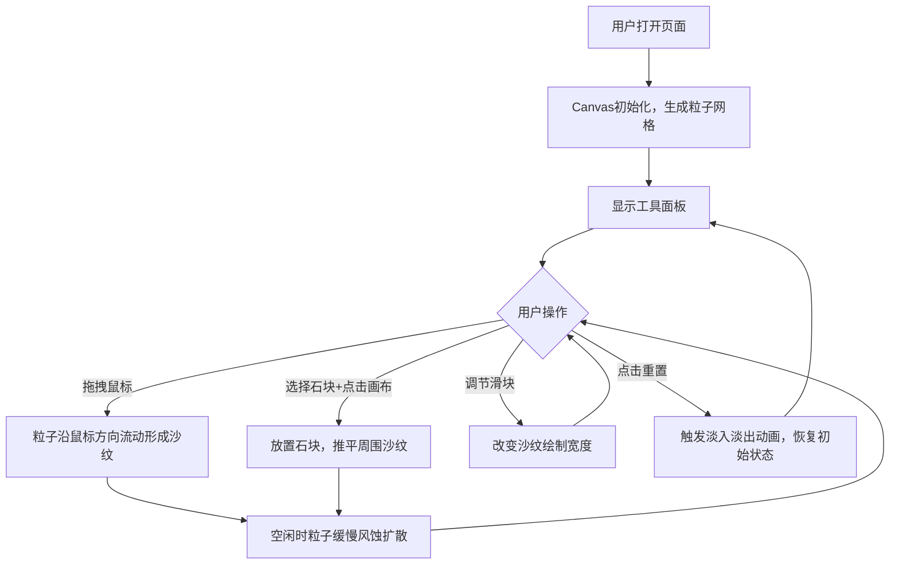

## 1. 产品概述

「枯山水禅意」是一款基于浏览器的交互式数字沙盘应用，用户可以通过点击和拖拽在虚拟沙盘上绘制沙纹、放置石块，体验禅意美学。

- 主要目的：为用户提供一个沉浸式的日式枯山水禅意体验，通过沙纹粒子流动和石块布置获得心灵放松
- 目标用户：喜欢禅意美学、需要放松减压的互联网用户
- 产品价值：在数字世界中复刻传统枯山水园林的宁静氛围，提供低门槛的艺术创作体验

## 2. 核心功能

### 2.1 用户角色
无需用户注册，所有访问者均可直接使用全部功能。

| 角色 | 注册方式 | 核心权限 |
|------|----------|----------|
| 访客用户 | 无需注册 | 绘制沙纹、放置石块、重置沙盘 |

### 2.2 功能模块
1. **沙盘主画布**：全屏Canvas，展示沙纹粒子和石块
2. **沙纹绘制系统**：鼠标拖拽绘制流动沙纹
3. **石块放置系统**：选择并放置5种不同形状的石块
4. **工具控制面板**：沙纹粗细调节、石块选择、重置功能
5. **风蚀动画系统**：空闲时沙纹缓慢自然扩散

### 2.3 页面详情
| 页面名称 | 模块名称 | 功能描述 |
|----------|----------|----------|
| 沙盘主页 | 渐变背景 | 从#d4c9a8到#b8a98a的渐变模拟沙盘底色 |
| 沙盘主页 | 粒子网格 | 200x200粒子网格，每颗粒子2px，沙色系随机颜色 |
| 沙盘主页 | 鼠标交互 | 按住左键拖动生成半径30px作用区域，粒子沿移动方向流动 |
| 沙盘主页 | 石块放置 | 5种形状石块，带阴影，推平范围内沙纹 |
| 沙盘主页 | 风蚀效果 | 空闲时粒子以0.05px/帧随机扩散 |
| 工具面板 | 粗细滑块 | range类型，10-100，默认50，映射到5px-50px纹路宽度 |
| 工具面板 | 石块选择器 | 5种形状按钮（圆/椭圆/三角/矩形/不规则），32x32px |
| 工具面板 | 重置按钮 | 红色文字，清空石块恢复初始沙纹，带淡入淡出动画 |

## 3. 核心流程

## 4. 用户界面设计

### 4.1 设计风格
- **主色调**：沙色#d4c9a8，深沙色#8c663a，石灰色#4a4a4a，点缀色#d4a373
- **整体风格**：日式和风极简禅意，无多余文字装饰
- **按钮样式**：圆角设计，石块按钮1px#8b7355描边，选中高亮为#d4a373
- **面板样式**：半透明浮层，毛玻璃backdrop-filter: blur(10px)，圆角12px，背景rgba(210,180,140,0.2)

### 4.2 页面设计概览
| 页面名称 | 模块名称 | UI元素 |
|----------|----------|--------|
| 沙盘主页 | 全屏Canvas | 渐变背景、200x200粒子网格、石块、流动动画 |
| 沙盘主页 | 右下角工具面板 | 200px宽浮层、滑块、5个石块按钮、重置按钮 |

### 4.3 响应式设计
- 桌面端优先，Canvas自适应窗口大小
- 屏幕宽度<768px时：工具面板宽度缩为140px，石块按钮缩小为24x24px
- 触摸设备优化：支持触摸拖拽和点击

### 4.4 动效设计
- 鼠标悬停石块按钮：放大1.1倍缩放动画
- 重置操作：0.3秒淡入淡出，粒子从模糊到清晰，石块从右下角飞出
- 沙纹流动：粒子0.5px/帧沿鼠标方向流动
- 风蚀效果：空闲时粒子0.05px/帧随机扩散
