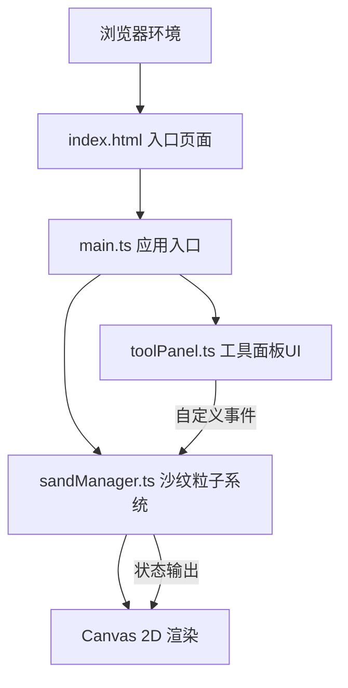

## 1. 架构设计



## 2. 技术说明

- **前端框架**：原生 TypeScript（无框架）
- **构建工具**：Vite 5.x
- **渲染技术**：HTML5 Canvas 2D API
- **动画方案**：requestAnimationFrame 自实现（不依赖外部动画库）
- **开发语言**：TypeScript（严格模式，target ES2020，module ESNext）

## 3. 模块设计

| 模块文件 | 职责说明 |
|----------|----------|
| src/main.ts | 应用入口：Canvas初始化、事件绑定（鼠标/触摸/resize）、动画循环驱动、协调sandManager和toolPanel |
| src/sandManager.ts | 核心逻辑：粒子网格数据结构、沙纹流动算法、石块管理、风蚀效果、重置动画、渲染输出 |
| src/toolPanel.ts | UI层：工具面板DOM创建、滑块/石块按钮/重置按钮、悬停动效、通过自定义事件与sandManager通讯 |

## 4. 数据结构定义

### 4.1 粒子结构
```typescript
interface Particle {
  x: number;           // 当前X坐标
  y: number;           // 当前Y坐标
  originX: number;     // 原始X坐标（网格位置）
  originY: number;     // 原始Y坐标（网格位置）
  color: string;       // 粒子颜色（沙色系随机）
  vx: number;          // X方向速度
  vy: number;          // Y方向速度
}
```

### 4.2 石块结构
```typescript
interface Stone {
  x: number;           // 中心X坐标
  y: number;           // 中心Y坐标
  shape: 'circle' | 'ellipse' | 'triangle' | 'rectangle' | 'irregular';
  size: number;        // 尺寸40px
  color: string;       // 深灰色#4a4a4a~#5a5a5a
}
```

### 4.3 交互状态
```typescript
interface InteractionState {
  isDrawing: boolean;          // 是否正在绘制沙纹
  mouseX: number;              // 当前鼠标X
  mouseY: number;              // 当前鼠标Y
  lastMouseX: number;          // 上一帧鼠标X
  lastMouseY: number;          // 上一帧鼠标Y
  brushWidth: number;          // 沙纹粗细（5-50px）
  selectedStone: StoneShape | null;  // 当前选中的石块形状
}
```

## 5. 自定义事件定义

| 事件名称 | 触发源 | 数据载荷 | 用途 |
|----------|--------|----------|------|
| sand:brushWidthChange | toolPanel | { width: number } | 通知沙纹粗细变更 |
| sand:stoneSelect | toolPanel | { shape: StoneShape \| null } | 通知石块选择变更 |
| sand:reset | toolPanel | 无 | 通知重置沙盘 |

## 6. 性能优化策略

1. **粒子批量渲染**：使用单一fillRect循环绘制所有粒子，避免逐粒子状态切换
2. **空间分区检测**：对鼠标影响区域采用网格空间划分，避免40000粒子逐粒距离计算
3. **双缓冲优化**：粒子位置计算与渲染分离，计算阶段不操作Canvas
4. **节流风蚀计算**：风蚀效果每2帧执行一次，降低CPU占用
5. **石块阴影缓存**：石块阴影使用离屏Canvas预渲染
