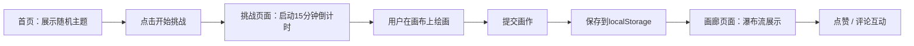

# 灵感捕手 - 产品需求文档 (PRD)

## 1. 产品概述
「灵感捕手」是一款面向独立插画师和绘画爱好者的在线速写挑战工具。用户每天可参与随机主题的15分钟限时速写创作，完成后提交作品并在画廊中与他人互动交流。

- 核心价值：通过限时挑战激发创作灵感，建立创作者社区互动
- 目标用户：独立插画师、绘画爱好者、创意工作者
- 产品定位：轻量级、纯前端、本地持久化的速写创作与分享平台

## 2. 核心功能

### 2.1 用户角色
| 角色 | 注册方式 | 核心权限 |
|------|---------|---------|
| 普通用户 | 无需注册，本地匿名使用 | 参与挑战、创作画作、浏览画廊、点赞评论 |

### 2.2 功能模块
1. **首页**：随机主题展示、挑战入口按钮
2. **挑战页面**：主题显示、15分钟倒计时、绘画画布、提交功能
3. **画廊页面**：瀑布流作品展示、点赞、评论、详情模态框

### 2.3 页面详情
| 页面名称 | 模块名称 | 功能描述 |
|---------|---------|---------|
| 首页 | 主题展示区 | 随机展示今日速写主题，主题文字带轻阴影效果 |
| 首页 | 行动按钮 | "开始挑战"按钮跳转至挑战页面 |
| 挑战页面 | 主题与倒计时 | 顶部显示挑战主题和15分钟倒计时，时间到自动禁用画布 |
| 挑战页面 | 绘画画布 | 支持6种预设颜色、3种笔触宽度、橡皮擦、撤销（最多10步） |
| 挑战页面 | 提交功能 | 将canvas转为base64并保存到本地存储 |
| 画廊页面 | 瀑布流展示 | 以瀑布流布局展示所有提交画作，支持响应式 |
| 画廊页面 | 点赞功能 | 点击爱心图标点赞/取消点赞，实时更新计数 |
| 画廊页面 | 评论功能 | 弹出评论输入框（最多100字），提交后显示最新评论 |
| 画廊页面 | 详情模态框 | 点击画作卡片弹出详情，显示完整画作和评论列表 |

## 3. 核心流程
用户打开首页 → 随机抽取今日主题 → 点击"开始挑战"进入创作页 → 自动开始15分钟倒计时 → 用户在画布上绘画 → 完成后点击提交（或时间到自动提示提交） → 画作保存至本地存储 → 进入画廊浏览所有作品 → 对喜欢的作品点赞/评论

## 4. 用户界面设计

### 4.1 设计风格
- 主色调：#3498db（蓝色），辅助色：#e74c3c（红色倒计时），背景色：#f0f0f0
- 按钮风格：圆角8px，背景#3498db，白色文字，hover加深至#2980b9，过渡0.2s
- 字体：system-ui 无衬线字体，主题文字 2rem、#2c3e50、带轻阴影
- 布局风格：居中式单栏，最大宽度960px，两侧留白
- 图标/emoji：使用emoji爱心❤️作为点赞图标

### 4.2 页面设计概览
| 页面名称 | 模块名称 | UI元素 |
|---------|---------|--------|
| 首页 | 主题展示 | 居中大标题2rem，#2c3e50，文字阴影 |
| 首页 | 开始按钮 | 圆角8px，蓝色背景，hover过渡效果 |
| 挑战页面 | 顶部状态栏 | 主题文字 + 红色倒计时1.5rem（脉冲动画） |
| 挑战页面 | 画布区域 | 600x400白色画布，居中展示 |
| 挑战页面 | 工具栏 | 颜色选择器、笔触宽度、橡皮擦、撤销按钮 |
| 画廊页面 | 瀑布流卡片 | 宽240px，间距12px，圆角8px，白色背景，阴影，hover上浮4px |
| 画廊页面 | 详情模态框 | 半透明遮罩#000 0.5，白色卡片圆角12px，居中展示 |

### 4.3 响应式设计
- 桌面端（>640px）：瀑布流多列展示，Canvas 600x400
- 移动端（≤640px）：瀑布流单列居中，Canvas缩小为320x240，按钮和输入框宽度100%
- 触控优化：按钮最小触控区域44x44px

### 4.4 动画效果
- 倒计时数字：每隔1秒透明度在0.6和1之间变化（脉冲动画）
- 卡片悬停：上浮4px，阴影加深至0.15
- 按钮过渡：颜色变化0.2s平滑过渡
