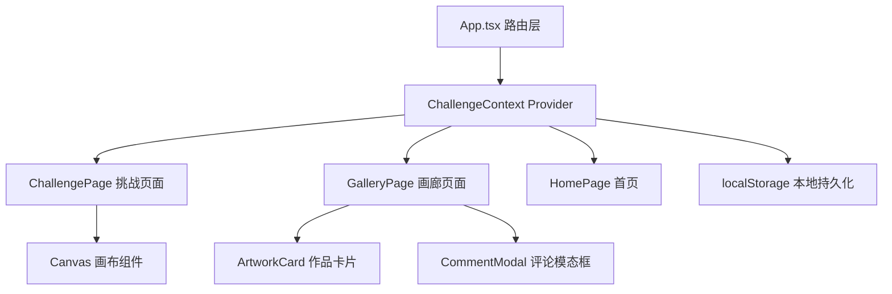
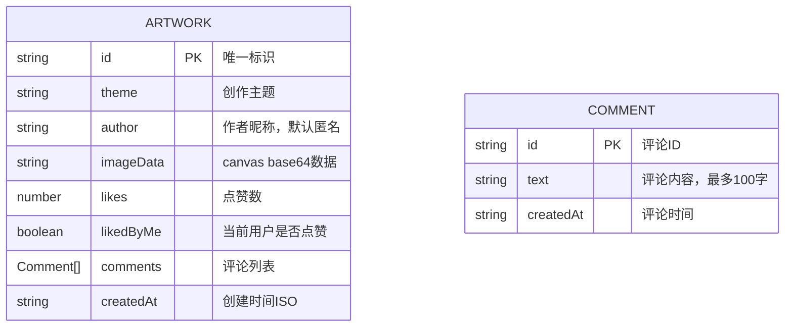

# 灵感捕手 - 技术架构文档

## 1. 架构设计



## 2. 技术说明
- 前端框架：React@18 + TypeScript
- 构建工具：Vite@5 + @vitejs/plugin-react
- 路由管理：react-router-dom@6
- 状态管理：React Context API
- 数据存储：localStorage（纯前端模拟后端）
- 样式方案：原生 CSS（含 CSS 变量、媒体查询）

## 3. 路由定义
| 路由路径 | 页面用途 |
|---------|---------|
| / | 首页，展示随机主题与挑战入口 |
| /challenge | 挑战页面，15分钟限时绘画 |
| /gallery | 画廊页面，作品展示与互动 |

## 4. 数据模型

### 4.1 数据结构定义



### 4.2 TypeScript 类型定义

```typescript
interface Comment {
  id: string;
  text: string;
  createdAt: string;
}

interface Artwork {
  id: string;
  theme: string;
  author: string;
  imageData: string;
  likes: number;
  likedByMe: boolean;
  comments: Comment[];
  createdAt: string;
}

interface ChallengeState {
  currentTheme: string;
  previousTheme: string | null;
  artworks: Artwork[];
}
```

## 5. 模块文件结构与数据流向

```
src/
├── App.tsx                    # 主路由，被Context Provider包裹
├── context/
│   └── ChallengeContext.tsx   # 全局状态：主题、画作、点赞、评论
├── pages/
│   ├── HomePage.tsx           # 首页：读取currentTheme
│   ├── ChallengePage.tsx      # 挑战页：读主题，写addArtwork
│   └── GalleryPage.tsx        # 画廊页：读artworks，写toggleLike/addComment
├── components/
│   ├── Canvas.tsx             # 画布：输出base64给父组件
│   ├── ArtworkCard.tsx        # 作品卡片：瀑布流item
│   └── ArtworkModal.tsx       # 详情模态框：画作+评论
└── index.css                  # 全局样式
```

**数据流向说明：**
1. App.tsx 使用 ChallengeContext.Provider 包裹所有路由
2. ChallengeContext 初始化时从 localStorage 读取数据
3. ChallengePage 读取 currentTheme，提交时调用 addArtwork(artwork)
4. Canvas 组件通过 onSubmit(imageData) 将 base64 回传给 ChallengePage
5. GalleryPage 读取 artworks 列表，点赞调 toggleLike(id)，评论调 addComment(id, text)
6. 所有状态变更自动同步写入 localStorage

## 6. 性能优化策略
- Canvas 绘图：使用 requestAnimationFrame 保证 60FPS 刷新率
- 瀑布流渲染：使用 CSS columns 实现高性能多列布局
- 图片优化：canvas 导出时压缩 quality=0.85，缩略图复用原始 imageData
- 状态更新：Context 中使用 useReducer 避免不必要的重渲染
- 存储限制：单张画作 imageData 约 200-500KB，localStorage 一般 5MB 容量，约可存 10-25 张
