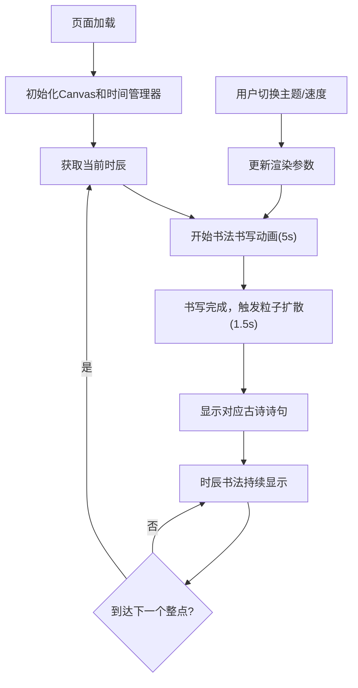

## 1. 产品概述
「墨韵时钟」是一款交互式数字书法时钟，在浏览器中呈现古风屏风式的页面，背景为宣纸纹理，中央悬挂随时间变化的动态书法作品——每整点以水墨笔触缓缓书写当前时辰，形成兼具计时与艺术感的数字挂轴。
- 目标用户：追求雅致数字生活体验的用户，可置于个人桌面或数字画廊作为氛围时钟
- 产品价值：将传统十二时辰文化与水墨书法艺术结合，打造兼具实用计时功能与审美价值的数字艺术作品

## 2. 核心特性

### 2.1 功能模块
1. **主时钟页面**：全屏宣纸背景、竖长条形 Canvas 画布、卷轴丝绳动画、十二时辰书法展示
2. **控制面板**：主题色切换（墨色/朱砂红/黛青）、墨迹扩散速度滑块
3. **粒子特效系统**：时辰切换时的水墨粒子扩散动画
4. **信息展示栏**：顶部公历/农历日期、节气显示
5. **古诗诗句展示**：时辰对应的草书诗句逐字浮现

### 2.2 页面详情

| 页面名称 | 模块名称 | 功能描述 |
|----------|----------|----------|
| 主时钟页面 | 宣纸背景层 | 浅米色径向渐变+纤维纹路+纸张颗粒噪点，CSS background-image 实现 |
| 主时钟页面 | Canvas 书法画布 | 宽高比1:2.5，宽400px，深褐色木框+内侧高光线，背景色#f9f4e9 |
| 主时钟页面 | 卷轴丝绳动画 | 红色丝绳CSS animate左右摆动，周期4秒 |
| 主时钟页面 | 书法字形绘制 | 十二时辰毛笔书法风格字形，笔锋渐变，5秒书写动画，透明度0.2→0.9 |
| 主时钟页面 | 水墨粒子特效 | 60-80个半透明粒子，大小2-5px随机，1.5秒扩散消失 |
| 主时钟页面 | 顶部信息栏 | 高度28px，显示公历日期、农历日期、节气，楷体11px |
| 控制面板 | 主题色切换 | 墨色(#2a1a0a)、朱砂红(#c0392b)、黛青(#1a5276)三种 |
| 控制面板 | 扩散速度滑块 | 范围1-10，步长1，渐变轨道#c8b896→#5a3e2b，圆形手柄#8e44ad |
| 控制面板 | 古诗诗句展示 | 时辰对应诗句，草书字体逐字浮现（每字0.3秒间隔），字间距4px |

## 3. 核心流程

用户打开页面 → 初始化Canvas与时间系统 → 检测当前时辰 → 触发书写动画（5秒）→ 触发粒子特效（1.5秒）→ 显示对应古诗诗句 → 显示当前时辰书法 → 等待下一个整点 → 切换时辰重复动画

## 4. 用户界面设计

### 4.1 设计风格
- **主色调**：宣纸米色系（#f5f0e8 / #efe5d6 / #f9f4e9）+ 深褐色木框（#5a3e2b）
- **主题色**：墨黑（#2a1a0a）、朱砂红（#c0392b）、黛青（#1a5276）
- **辅助色**：高光线#c8b896、滑块手柄#8e44ad
- **字体**：楷体（信息栏）、草书（诗句）、书法风格（时辰）
- **布局**：桌面端全屏16:9，四周留白40px，画布居中，控制面板在画布右侧20px、顶部80px
- **交互动画**：所有交互元素 transition: all 0.3s ease，控制面板透明度0.9→0.96微变化

### 4.2 页面设计总览

| 页面名称 | 模块名称 | UI 元素 |
|----------|----------|---------|
| 主时钟页面 | 宣纸背景层 | 径向渐变、纤维纹理噪点、全屏覆盖、16:9布局 |
| 主时钟页面 | Canvas画框 | 竖长条形(400×1000)、8px深褐色边框、2px内侧高光线、居中悬挂 |
| 主时钟页面 | 卷轴丝绳 | 红色、CSS摆动动画、4秒周期、悬挂于画布顶部 |
| 主时钟页面 | 书法字形 | 毛笔风格、笔锋粗细渐变(8px→2px)、透明度动画、主题色填充 |
| 主时钟页面 | 粒子特效 | 圆形粒子、随机大小、半透明、径向扩散、渐隐消失 |
| 主时钟页面 | 顶部信息栏 | 28px高、半透明背景、居中文字、楷体11px、深褐色 |
| 控制面板 | 容器 | 260px宽、磨砂玻璃、圆角12px、半透明背景、自适应高度 |
| 控制面板 | 主题按钮 | 三种主题色块、悬停过渡、选中态高亮 |
| 控制面板 | 速度滑块 | 渐变轨道、圆形手柄、数值显示 |
| 控制面板 | 诗句区域 | 草书字体、逐字浮现动画、主题色文字、字间距4px |

### 4.3 响应式设计
- **桌面端（≥768px）**：画布宽400px居中，控制面板在画布右侧20px，顶部80px
- **移动端（<768px）**：画布宽60vw，控制面板移至画布下方，水平排列布局

### 4.4 性能要求
- 刷新率稳定30fps以上
- 粒子数量控制在60-80个，不随时间累积
- Canvas绘制使用 requestAnimationFrame 优化
