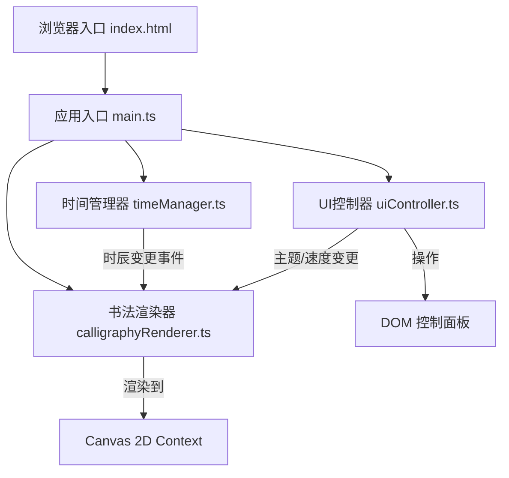

## 1. 架构设计



## 2. 技术说明
- **前端框架**：原生 TypeScript + Vite，无外部UI/动画/Canvas库依赖
- **构建工具**：Vite@5，端口5173，输出目录dist，开启HMR
- **编译目标**：TypeScript 严格模式，target ES2020，module ESNext
- **渲染技术**：Canvas 2D API 原生实现书法绘制与粒子特效
- **动画技术**：requestAnimationFrame 驱动主循环 + CSS animate 辅助动画
- **样式方案**：纯CSS（内联<style>或外部CSS），磨砂玻璃使用 backdrop-filter

## 3. 文件结构

| 文件路径 | 职责说明 |
|----------|----------|
| package.json | 项目依赖（typescript, vite）与启动脚本 |
| vite.config.js | Vite基础配置（端口、输出目录、HMR） |
| tsconfig.json | TypeScript配置（严格模式、ES2020） |
| index.html | 入口HTML，包含背景容器、Canvas、控制面板骨架、字体引入 |
| src/main.ts | 应用入口：初始化各模块、绑定事件、启动时间循环 |
| src/timeManager.ts | 时空计算：十二时辰、农历、节气，事件通知机制 |
| src/calligraphyRenderer.ts | Canvas渲染：书法字形绘制、书写动画、粒子特效 |
| src/uiController.ts | DOM交互：主题切换、滑块控制、诗句展示 |

## 4. 模块接口定义

### 4.1 timeManager.ts
```typescript
export interface TimeInfo {
  period: string;      // 时辰名：子丑寅卯辰巳午未申酉戌亥
  lunarDate: string;   // 农历日期字符串
  solarTerm: string;   // 节气名称
  poem: string;        // 对应时辰的古诗
}

export function getCurrentPeriod(): string;
export function getLunarDate(): string;
export function getSolarTerm(): string;
export function getCurrentPoem(): string;
export function onPeriodChange(callback: (period: string) => void): () => void;
export function startTicker(): void;
```

### 4.2 calligraphyRenderer.ts
```typescript
export type ThemeColor = '#2a1a0a' | '#c0392b' | '#1a5276';

export interface RenderOptions {
  theme: ThemeColor;
  diffusionSpeed: number;  // 1-10
}

export function drawCalligraphy(
  canvas: HTMLCanvasElement,
  period: string,
  options: RenderOptions
): void;

export function triggerParticleEffect(
  canvas: HTMLCanvasElement,
  centerX: number,
  centerY: number,
  color: string
): void;
```

### 4.3 uiController.ts
```typescript
export type ThemeColor = '#2a1a0a' | '#c0392b' | '#1a5276';

export function initUI(): void;
export function onThemeChange(callback: (theme: ThemeColor) => void): () => void;
export function onSpeedChange(callback: (speed: number) => void): () => void;
export function displayPoem(poem: string, theme: ThemeColor): void;
export function updateInfoBar(dateInfo: { lunar: string; solarTerm: string }): void;
```

## 5. 数据模型

### 5.1 十二时辰映射表
```
子时: 23:00-01:00, 诗句: "夜半钟声到客船"
丑时: 01:00-03:00, 诗句: "鸡声茅店月"
寅时: 03:00-05:00, 诗句: "平旦气方清"
卯时: 05:00-07:00, 诗句: "日出而作"
辰时: 07:00-09:00, 诗句: "晨光熹微"
巳时: 09:00-11:00, 诗句: "日上正赤如丹"
午时: 11:00-13:00, 诗句: "日中为市"
未时: 13:00-15:00, 诗句: "日昃之离"
申时: 15:00-17:00, 诗句: "哺时啜粥"
酉时: 17:00-19:00, 诗句: "日落西山"
戌时: 19:00-21:00, 诗句: "黄昏时分"
亥时: 21:00-23:00, 诗句: "夜深人静"
```

### 5.2 粒子数据结构
```typescript
interface Particle {
  x: number;
  y: number;
  vx: number;
  vy: number;
  radius: number;
  opacity: number;
  life: number;
  maxLife: number;
}
```

## 6. 性能优化策略
- 使用 requestAnimationFrame 统一驱动动画循环
- 粒子数量限制在60-80个，生命周期结束后自动回收
- 书法字形路径预计算，避免每帧重复计算
- Canvas 绘制使用离屏缓存（如需重绘背景）
- CSS动画使用 transform + opacity 确保GPU加速
