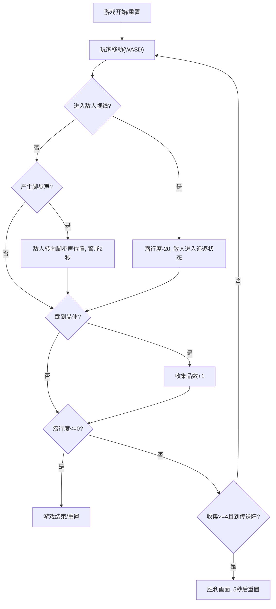

## 1. 产品概述

「深渊回响」是一款基于浏览器Canvas的潜行类小游戏交互原型，通过简洁代码实现基于网格的视线遮挡、脚步声扩散与敌人AI巡逻警戒等核心潜行玩法机制，为后续完整潜行冒险提供可复用的前端原型模块。

- 核心目的：验证潜行类游戏的核心机制（视线遮挡、听觉感知、敌人AI状态机、迷雾探索）在纯Canvas/TypeScript环境下的实现可行性
- 目标用户：游戏开发者、前端技术原型验证人员

## 2. 核心功能

### 2.1 功能模块

1. **地图系统**：20x15网格地图，随机墙壁布局，晶体收集点，传送阵生成
2. **玩家系统**：WASD移动、脚步声产生、潜行状态、晶体收集
3. **敌人AI系统**：巡逻路径、90°扇形视线（半径6格）、圆形听觉范围（半径4格）、追逐/警戒状态切换
4. **视线遮挡系统**：墙壁阻挡视线、迷雾探索、已探索区域半保留亮度
5. **状态显示系统**：潜行度、探索度、收集品数量面板，数值闪烁动画
6. **游戏流程控制**：胜利判定、重置功能、胜利画面展示

### 2.2 页面详情

| 页面名称 | 模块名称 | 功能描述 |
|---------|---------|---------|
| 主游戏画面 | 全屏Canvas | 20x15网格地图渲染、所有游戏元素绘制、动画帧率≥30FPS |
| 状态面板 | HUD | 左上角显示潜行度、探索度、收集品数，数值变化闪烁 |
| 胜利画面 | Overlay | 画布中央显示"深渊脱出"文字、收集统计、5秒后自动重置 |

## 3. 核心流程

玩家通过WASD控制角色在网格地图中移动，躲避敌人的视线和听觉范围，收集至少4个晶体后前往传送阵触发胜利。

## 4. 用户界面设计

### 4.1 设计风格
- **主色调**：黑暗洞穴风格，黑色、深紫、暗蓝为主（#100b12 → #1a1423渐变背景）
- **墙壁**：#2a1f33 深色块
- **地面**：#1f1829 暗色调
- **玩家**：#6dd3ff 带4px外发光
- **晶体**：#ffd700 金色发光点
- **传送阵**：#00ff88 → #00cc66 呼吸闪烁渐变
- **网格线**：半透明灰色 #333，线宽0.5px
- **敌人视线**：半透明白色扇形
- **敌人听觉**：半透明黄色圆环
- **脚步声**：淡蓝色圈，持续1.5秒

### 4.2 页面设计概述

| 页面名称 | 模块名称 | UI元素 |
|---------|---------|---------|
| 主游戏画面 | Canvas | 深色渐变背景、网格、墙壁/地面、玩家圆点、敌人、视线扇形、听觉圈、脚步声圈、迷雾层、晶体、传送阵 |
| 状态面板 | HUD | 180x60半透明面板(圆角8px)，潜行度/探索度/收集品，数值变化白→金→白闪烁0.3s |
| 胜利画面 | Overlay | 中央48px金色文字带2px黑描边，1.0→1.2→1.0放缩动画周期2s |

### 4.3 响应性
- 桌面全屏Canvas，无移动端适配需求
- 键盘WASD操作，R键重置
