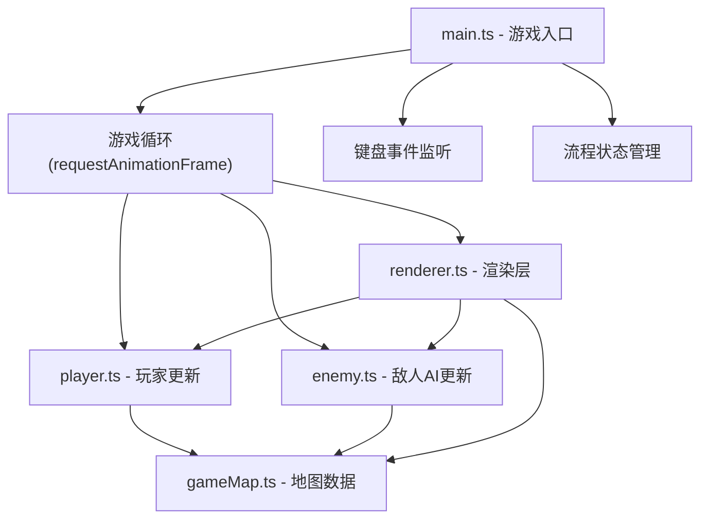

## 1. 架构设计



## 2. 技术描述

- **前端框架**：纯 TypeScript，不依赖React/Vue/游戏引擎
- **构建工具**：Vite，端口5173，开启HMR
- **渲染方式**：原生 HTML5 Canvas 2D API
- **语言版本**：TypeScript 严格模式，target ES2020，module ESNext

## 3. 模块职责

### 3.1 文件结构

| 文件 | 职责 |
|------|------|
| `src/gameMap.ts` | 地图数据定义、网格生成、墙壁随机布局、传送阵/晶体位置、格子查询、视线检测（Bresenham射线法）、迷雾探索记录 |
| `src/player.ts` | 玩家类：位置、移动速度、WASD输入处理、碰撞检测、脚步声生成、潜行度、收集品计数 |
| `src/enemy.ts` | 敌人类：巡逻路径点、90°扇形视线检测、圆形听觉检测、追逐/巡逻/警戒状态机、速度插值 |
| `src/renderer.ts` | 所有Canvas绘图：背景渐变、网格线、墙壁/地面、玩家、敌人、视线扇形、听觉圈、脚步声圈、迷雾层、HUD面板、胜利画面 |
| `src/main.ts` | 画布初始化、游戏主循环、键盘事件绑定、全局状态管理（胜利/失败/重置） |

### 3.2 核心数据结构

```typescript
// 格子类型
enum CellType { WALL = 0, FLOOR = 1 }

// 游戏状态
type GameState = 'playing' | 'victory' | 'gameover'

// 敌人状态
type EnemyState = 'patrol' | 'chase' | 'alert'

// 脚步声
interface Footstep { x: number; y: number; startTime: number }

// 晶体
interface Crystal { x: number; y: number; collected: boolean }
```

### 3.3 关键算法

- **视线遮挡检测**：Bresenham直线算法，从敌人向玩家方向逐格采样，遇墙壁则阻断
- **扇形视线判定**：计算玩家相对于敌人的角度差 ≤ 45°，距离 ≤ 6格，且视线无阻挡
- **迷雾探索**：玩家周围半径4格内标记为当前可见，已访问格子保留50%亮度
- **敌人AI状态机**：patrol → (视线发现玩家) → chase → (3秒未追上) → patrol；patrol → (听到脚步声) → alert(停留2秒) → patrol
