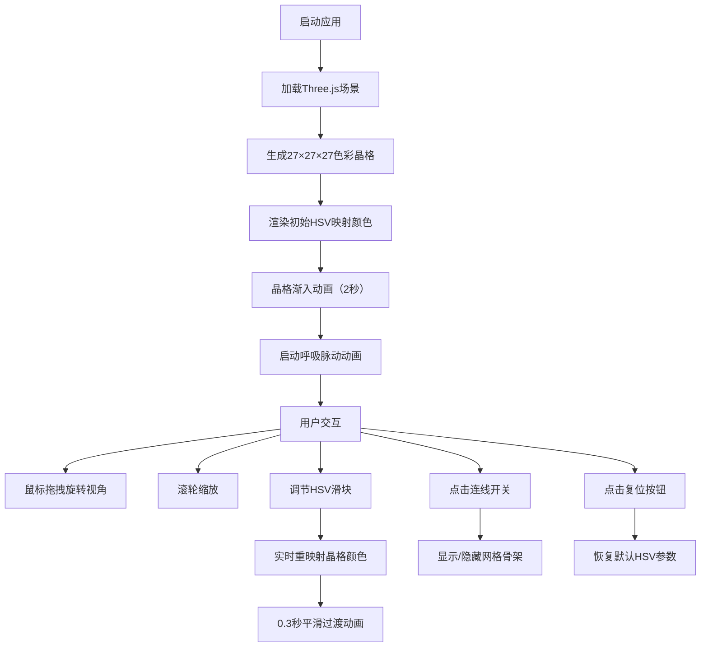

## 1. 产品概述

「晶格调色盘」是一个交互式3D色彩空间探索可视化应用，通过三维空间直观展示HSV色彩模型向RGB模型的映射关系。用户可通过鼠标拖拽旋转视角、滚轮缩放，并通过滑块调节色相、饱和度、明度参数，实时观察色彩晶格的动态变化。

- **目标用户**：设计师、前端开发者、色彩研究者和对色彩理论感兴趣的学习者
- **产品价值**：以沉浸式3D交互方式帮助用户理解色彩空间结构，直观感受HSV到RGB的色彩映射过程

---

## 2. 核心功能

### 2.1 功能模块

1. **3D色彩晶格渲染**：27×27×27个彩色小球组成的三维晶格，位置对应HSV值，颜色映射为RGB
2. **视角交互控制**：鼠标拖拽旋转、滚轮缩放，带阻尼平滑效果
3. **色彩参数调节**：HSV三滑块实时调节晶格色彩映射
4. **动态视觉效果**：小球呼吸脉动动画、色彩流光偏移、半透明网格骨架连线
5. **显示切换**：一键开启/关闭网格骨架连线

### 2.2 功能详情

| 模块名称 | 功能描述 |
|----------|----------|
| 色彩晶格渲染 | 19683个小球按HSV坐标分布在6×6×6的立方体空间内，中心位于原点 |
| 呼吸脉动动画 | 每个小球半径在0.12~0.2单位间以2秒周期正弦振荡，相位随机 |
| 色彩流光效果 | 小球颜色在基础色相附近±5度范围内偏移，产生流动感 |
| 网格骨架连线 | 相邻小球间用半透明细线连接，颜色为两端小球颜色平均值，透明度0.15 |
| 视角控制 | OrbitControls实现，距离限制4~16单位，旋转阻尼0.1，缩放阻尼0.2 |
| HSV滑块调节 | 色相0~360°、饱和度0~1、明度0~1，实时触发色彩重映射 |
| 色彩平滑过渡 | 参数变化时颜色0.3秒补间插值渐变 |
| 复位功能 | 一键恢复默认HSV值（H=180, S=0.75, V=0.60） |
| 数值显示 | 实时显示当前HSV和RGB值 |
| 连线开关 | 切换网格骨架的显示/隐藏 |

---

## 3. 核心流程

---

## 4. 用户界面设计

### 4.1 设计风格

- **主色调**：深空色背景径向渐变（#0d0d1a → #1a1a2e）
- **UI面板**：半透明深色毛玻璃效果（rgba(13,13,26,0.85) + backdrop-filter: blur(8px)）
- **文字**：等宽字体，颜色#e0e0e0，主字号14px，辅助字号12px
- **圆角**：UI面板圆角12px
- **滑块样式**：细长条（180px × 8px），圆形滑钮（直径16px，颜色与当前值对应）

### 4.2 页面布局

| 区域 | 位置 | 描述 |
|------|------|------|
| 3D场景 | 全屏 | Three.js Canvas渲染色彩晶格 |
| UI控制面板 | 左侧，距左20px、距上20px，宽220px | HSV滑块、数值显示、复位按钮、连线开关 |
| 底部提示文字 | 页面底部正中 | 版本信息 + "拖拽旋转 · 滚轮缩放 · 滑块调色" |

### 4.3 响应式适配

- **桌面端（≥768px）**：左侧浮动画板，纵向排列
- **移动端（<768px）**：底部横向面板，宽度100%，滑块横向排列

### 4.4 动画效果

- **加载渐入**：晶格从透明到不透明，2秒过渡
- **底部提示**：0.8秒渐入动画
- **颜色过渡**：参数变化时0.3秒补间平滑

### 4.5 3D场景设计

- **环境**：深空径向渐变背景，营造宇宙空间氛围
- **光照**：环境光 + 半球光，确保色彩晶格清晰可见
- **相机**：PerspectiveCamera，初始距离约10单位
- **晶格构成**：27×27×27球体 + 可选网格骨架连线
- **性能优化**：InstancedMesh共享几何体，BufferGeometry高效更新
