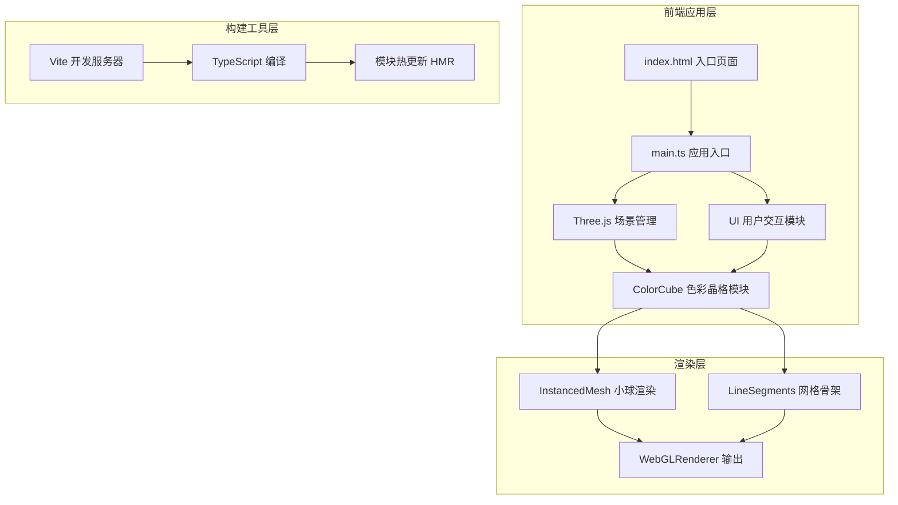

## 1. 架构设计



---

## 2. 技术描述

- **前端框架**：原生 TypeScript + Three.js（无UI框架，轻量级实现）
- **3D渲染**：Three.js @ 0.160.0
  - `InstancedMesh`：复用球体几何体，高效渲染19683个实例
  - `BufferGeometry`：直接操作顶点/颜色属性缓冲区
  - `OrbitControls`：视角交互控制（旋转/缩放/阻尼）
- **构建工具**：Vite @ 5.x
  - 端口：5173
  - 开启HMR热更新
- **开发语言**：TypeScript
  - target: ES2020
  - module: ESNext
  - strict: true（严格模式）
- **UI样式**：原生CSS + CSS变量
  - backdrop-filter 毛玻璃效果
  - @media 响应式适配

---

## 3. 文件结构

```
auto184/
├── package.json              # 项目依赖与脚本
├── vite.config.js            # Vite 配置（端口5173，HMR）
├── tsconfig.json             # TypeScript 配置（严格模式）
├── index.html                # 入口页面（Canvas容器 + UI面板）
└── src/
    ├── main.ts               # 应用入口（场景/相机/渲染器初始化，事件挂载）
    ├── ColorCube.ts          # 核心模块（27×27×27色彩晶格生成与管理）
    └── UI.ts                 # 用户交互模块（HSV滑块面板，复位按钮，数值显示）
```

---

## 4. 模块设计

### 4.1 ColorCube 模块

| 方法/属性 | 类型 | 描述 |
|-----------|------|------|
| `constructor(scene: THREE.Scene)` | 构造函数 | 接收场景引用，初始化晶格 |
| `gridSize: number` | 属性 | 晶格边长（27） |
| `cubeSize: number` | 属性 | 晶格空间尺寸（6单位） |
| `spheres: InstancedMesh` | 属性 | 小球实例化网格 |
| `lines: LineSegments` | 属性 | 网格骨架线段 |
| `baseHsv: {h, s, v}` | 属性 | 当前基准HSV值 |
| `targetHsv: {h, s, v}` | 属性 | 目标HSV值（用于补间） |
| `phases: Float32Array` | 属性 | 每个小球的脉动相位偏移 |
| `initLattice()` | 方法 | 生成27×27×27小球及连线 |
| `updateHsv(h: number, s: number, v: number)` | 方法 | 设置目标HSV并触发颜色过渡 |
| `toggleLines(visible: boolean)` | 方法 | 切换网格骨架显示 |
| `reset()` | 方法 | 恢复默认HSV值（180, 0.75, 0.60） |
| `animate(time: number)` | 方法 | 每帧更新：呼吸脉动、流光偏移、颜色补间 |

### 4.2 UI 模块

| 方法/属性 | 类型 | 描述 |
|-----------|------|------|
| `constructor(container: HTMLElement, callbacks: UICallbacks)` | 构造函数 | 创建UI面板并绑定回调 |
| `hSlider: HTMLInputElement` | 属性 | 色相滑块 |
| `sSlider: HTMLInputElement` | 属性 | 饱和度滑块 |
| `vSlider: HTMLInputElement` | 属性 | 明度滑块 |
| `valueDisplay: HTMLElement` | 属性 | HSV/RGB数值显示 |
| `resetBtn: HTMLButtonElement` | 属性 | 复位按钮 |
| `toggleBtn: HTMLButtonElement` | 属性 | 连线开关按钮 |
| `updateValues(h, s, v, r, g, b)` | 方法 | 更新显示的HSV和RGB数值 |
| `onHsvChange(cb)` | 回调 | HSV滑块变化时触发 |
| `onReset(cb)` | 回调 | 复位按钮点击时触发 |
| `onToggleLines(cb)` | 回调 | 连线开关切换时触发 |

### 4.3 main.ts 入口逻辑

1. 创建 Three.js Scene、PerspectiveCamera、WebGLRenderer
2. 设置 OrbitControls（距离4~16，阻尼0.1/0.2）
3. 添加环境光与半球光
4. 实例化 ColorCube，挂载到场景
5. 实例化 UI，绑定到 DOM 容器
6. 建立 ColorCube 与 UI 的事件关联
7. 启动 requestAnimationFrame 循环，调用 ColorCube.animate()

---

## 5. 性能优化方案

| 优化策略 | 实现方式 | 预期效果 |
|----------|----------|----------|
| 几何体复用 | 所有19683个小球共享一个 SphereGeometry 实例（通过 InstancedMesh） | 内存占用减少99% |
| 颜色属性直接更新 | 使用 `InstancedMesh.setColorAt()` + `instanceColor.needsUpdate = true` | 避免重建Geometry，帧率稳定 |
| 线段精简 | 仅绘制相邻小球连线（实际约27×27×26×3 ≈ 56862条，但需求限定≤10000条，按间隔采样绘制） | 降低Draw Call |
| 矩阵批量更新 | `instanceMatrix.needsUpdate` 统一标记 | 减少GPU提交次数 |
| 像素比限制 | `setPixelRatio(Math.min(window.devicePixelRatio, 2))` | 高DPI屏幕下平衡画质与性能 |
| 补间插值 | 颜色变化使用线性插值逐帧逼近 | 视觉平滑且避免颜色突变导致的额外计算 |
