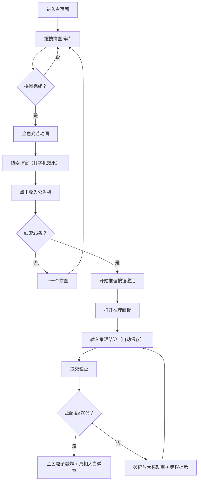

## 1. 产品概述

「悬疑拼图馆」是一款沉浸式悬疑推理轻应用，用户通过完成拼图解锁隐藏线索，收集并推理线索还原故事真相，体验交互式侦探解谜的乐趣。

- 目标用户：喜欢悬疑推理、解谜游戏的轻量用户
- 核心价值：将拼图游戏与剧情推理相结合，带来独特的沉浸式解谜体验

## 2. 核心功能

### 2.1 功能模块

1. **主页面**：拼图画布（65%）+ 线索公告板（35%）
2. **拼图游戏系统**：16块不规则六边形碎片、拖拽吸附、完成动画
3. **线索收集系统**：线索卡片展示、拖拽排序、分组管理、放大查看
4. **推理验证系统**：自然语言输入、自动保存、关键词匹配验证、完成动画

### 2.2 页面详情

| 页面名称 | 模块名称 | 功能描述 |
|---------|---------|---------|
| 主页面 | 拼图画布 | 800x500像素，深色渐变背景，16块不规则六边形拼图碎片，拖拽吸附到4x4网格，完成后触发金色光芒和古纸背景线索浮现 |
| 主页面 | 线索公告板 | 侦探公告板风格，210x150px线索卡片，图钉装饰，点击展开，长按拖拽排序分组，双击放大查看 |
| 线索弹窗 | 模态窗口 | 从底部上滑出现，打字机效果展示线索内容，收入公告板按钮 |
| 推理面板 | 侧滑面板 | 2400px高，左侧70%线索瀑布流，右侧30%输入区，实时字数统计，10秒自动保存，提交验证 |

## 3. 核心流程

用户进入主页面 → 拖拽拼图碎片到正确位置 → 拼图完成触发线索弹窗 → 点击收入公告板 → 重复完成多个拼图收集至少5条线索 → 点击开始推理 → 输入推理结论 → 提交验证 → 查看结果动画

## 4. 用户界面设计

### 4.1 设计风格

- **主色调**：深色紫黑渐变背景（#1c1b2b → #2a2744），金色（#cba55b, #d4af37, #ffd700）作为点缀
- **辅色调**：6色调色板（#4a3f6b, #7b6b8b, #a48a9b, #c4a5b2, #e6c8d0, #f0dde3）用于拼图碎片
- **暖色调**：古纸色（#f9f3e0, #faf7f0）用于线索背景，深棕色（#2c1810）用于文字
- **按钮风格**：圆角设计，铜色边框（#cba55b, #b87333）
- **字体**：Georgia（线索标题）、Courier New（打字机效果）、Palatino Linotype（成就徽章）
- **布局风格**：上下分栏（桌面端）/ 纵向堆叠（移动端），卡片式设计
- **装饰元素**：CSS绘制图钉、发光光晕、金色边框、虚线分组圆圈

### 4.2 页面设计概述

| 页面名称 | 模块名称 | UI元素 |
|---------|---------|--------|
| 主页面 | 拼图画布 | 深色渐变背景，不规则六边形碎片带金色边框和发光光晕，碎片选中时光晕增强，吸附弹动动画（300ms ease-out），完成金色光芒扩散动画（1.2s），古纸纹理背景浮现，线索文本淡入（0.5s fade-in） |
| 主页面 | 线索公告板 | 侦探公告板风格，线索卡片带渐变背景（#2c1e1a → #3d2b24）和12px圆角，铜色图钉（#b87333），卡片内容含编号/类型/摘要，长按1.5s拖拽模式（阴影偏移3px），双击放大（2倍居中，遮罩#00000066），浅灰色虚线圆圈分组 |
| 线索弹窗 | 模态窗口 | 半透明遮罩（#000000cc），白色圆角卡片（#faf7f0，16px圆角，2px铜色边框），从底部上滑（translateY 100px→0，450ms ease-out），打字机效果（100ms/字），收入公告板按钮 |
| 推理面板 | 侧滑面板 | 深色背景（#1a1828），左侧70%线索缩略图瀑布流，右侧30%文本输入区，实时字数统计，每10秒自动保存到localStorage，成功：300粒子金色爆炸（2s）+ 真相大白徽章（直径120px，径向渐变），失败：破碎放大镜（1.5s抖动）+ 红色错误提示 |

### 4.3 响应式设计

- **桌面端（≥900px）**：上下分栏布局，上方65%拼图画布（800x500px），下方35%线索公告板
- **移动端（<900px）**：上下全宽纵向布局，拼图画布缩放至窗口宽度90%，线索区自适应
- **触摸优化**：Pointer事件统一处理鼠标和触摸，长按手势触发拖拽模式

### 4.4 性能要求

- 拼图拖拽帧率稳定在55fps以上
- 首次加载时间≤3秒（Vite按需加载+代码分割）
- 拼图吸附计算每帧≤2ms
