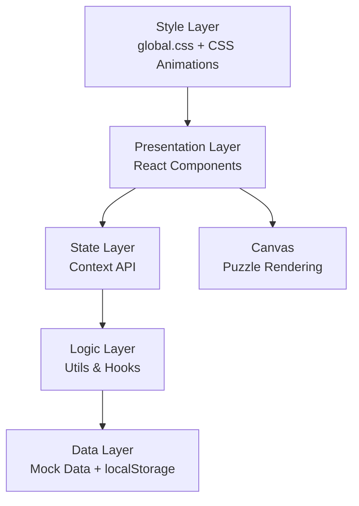

## 1. 架构设计



## 2. 技术说明

- **前端框架**：React 18 + TypeScript + Vite
- **状态管理**：React Context API（不引入额外状态管理库）
- **渲染**：Canvas API（拼图绘制）+ DOM（线索卡片与推理面板）
- **数据持久化**：localStorage（线索进度 + 推理草稿自动保存）
- **构建工具**：Vite（端口 5173，HMR 热更新，@ → src 路径别名）
- **后端**：无后端，纯前端 Mock 数据

## 3. 路由定义

| Route | Purpose |
|-------|---------|
| / | 主页面（HomePage.tsx），包含拼图画布、线索公告板、推理面板 |

本应用为单页应用，不使用 react-router，采用内部状态切换模态与面板。

## 4. API 定义（无后端）

所有数据来自 `src/data/clues.ts` 静态数据；持久化通过 localStorage 完成，Key 定义如下：

| Key | 类型 | 说明 |
|-----|------|------|
| `mystery_puzzle_collected_clue_ids` | `number[]` | 已解锁线索 id 列表 |
| `mystery_puzzle_inference_draft` | `string` | 推理输入草稿（自动保存） |
| `mystery_puzzle_current_index` | `number` | 当前拼图索引（已完成第几个） |

## 5. 数据模型

### 5.1 线索数据类型

```typescript
type ClueType = 'text' | 'symbol' | 'url';

interface Clue {
  id: number;
  type: ClueType;
  title: string;
  summary: string;      // 卡片摘要，最多20字
  content: string;      // 完整内容，打字机展示
}
```

### 5.2 拼图碎片类型

```typescript
interface PuzzlePiece {
  id: number;
  gridRow: number;           // 目标网格行 0-3
  gridCol: number;           // 目标网格列 0-3
  x: number;                 // 当前画布 x
  y: number;                 // 当前画布 y
  rotation: number;          // 当前旋转角度（度）
  targetX: number;           // 吸附目标 x
  targetY: number;           // 吸附目标 y
  color: string;             // 碎片填充色
  path: Path2D;              // Canvas 不规则路径
  edgeTemplate: [number, number, number, number, number, number]; // 六边模板索引
  snapped: boolean;          // 是否已吸附
  animating: boolean;        // 是否正在播放弹动动画
}
```

### 5.3 分组与卡片位置

```typescript
interface ClueCardPosition {
  clueId: number;
  x: number;
  y: number;
  groupId: number | null;
}

interface ClueGroup {
  id: number;
  x: number;
  y: number;
  radius: number;
}
```

## 6. 项目文件结构

```
.
├── package.json
├── vite.config.js
├── tsconfig.json
├── index.html
└── src/
    ├── main.tsx              # 入口
    ├── App.tsx               # 根组件 + Context Provider
    ├── global.css            # 全局样式与动画关键帧
    ├── pages/
    │   └── HomePage.tsx      # 主页面布局
    ├── components/
    │   ├── PuzzleCanvas.tsx  # 拼图画布（Canvas）
    │   ├── ClueBoard.tsx     # 线索公告板
    │   └── InferencePanel.tsx# 推理面板
    ├── utils/
    │   └── puzzleUtils.ts    # 路径生成、吸附判定、匹配度计算
    └── data/
        └── clues.ts          # 线索与正确答案数据
```

## 7. 关键技术决策

1. **拼图渲染**：使用原生 Canvas 2D API，碎片路径由 6 条边的 4 种曲线模板组合生成，确保相邻碎片边缘匹配
2. **拖拽交互**：统一使用 Pointer Events（兼容鼠标/触摸），拖拽采用 0.3 惯性系数
3. **吸附判定**：每帧计算欧几里得距离，<20px 触发吸附并播放 140ms scale 弹动
4. **动画**：主要动画采用 CSS `@keyframes`（fade-in、glow、pop、shimmer 等）；粒子动画用 Canvas requestAnimationFrame
5. **性能**：
   - 拼图吸附计算控制在 2ms 内（O(1) 网格取最近点）
   - Canvas 渲染仅在状态变化时重绘（脏标记）
   - 拖拽使用 requestAnimationFrame 节流到 60fps
