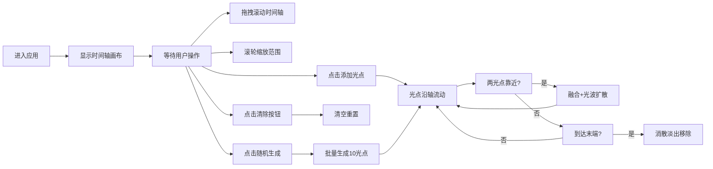

## 1. 产品概述

「光影年轮」是一款沉浸式交互式数字时间轴应用，用户通过点击和拖拽在时间轴上创建彩色光点粒子，观赏光点随时间流动、融合与消散的视觉艺术效果。

- 核心价值：将抽象时间概念可视化，通过粒子物理模拟营造宁静而富有诗意的数字艺术体验
- 目标用户：数字艺术爱好者、创意工作者、追求视觉美感的普通用户

## 2. 核心功能

### 2.1 功能模块

1. **主时间轴画布**：全屏 Canvas 渲染，时间轴线、刻度标记、光点粒子、流动轨迹、光波特效
2. **交互系统**：点击添加光点、拖拽滚动时间轴、滚轮缩放时间范围、按钮控制
3. **粒子物理系统**：光点流动、呼吸脉动、融合合并、消散淡出、光波扩散
4. **底部工具栏**：清除按钮、随机生成按钮、当前时间显示

### 2.2 功能详情

| 模块名称 | 子功能 | 功能描述 |
|---------|--------|----------|
| 时间轴渲染 | 主轴线 | 页面中部水平粗线（3px，#555588，圆角端点） |
| 时间轴渲染 | 刻度标记 | 每0.5秒短刻度，每2秒长刻度带数字（14px #777799） |
| 时间轴渲染 | 背景渐变 | 垂直线性渐变 #0d0d1a 至 #1a1a2e |
| 光点粒子 | 创建 | 点击时间轴任意位置，初始大小20px，12色随机，透明度0.9，4px光晕 |
| 光点粒子 | 流动 | 水平从左到右，流速0.5-1.5随机，三阶段变速（慢-匀-加速） |
| 光点粒子 | 脉动 | 1.2秒正弦周期，大小±3px，透明度±0.05 |
| 光点粒子 | 消散 | 第12秒到达末端时透明度线性淡出并移除 |
| 光点粒子 | 融合 | 间距<30px合并，新光点取两者平均值，触发60px光波扩散 |
| 光波特效 | 扩散动画 | 融合时产生，0.6秒持续，透明度0.8→0 |
| 交互控制 | 拖拽滚动 | 拖拽时间轴区域水平滚动查看不同时段 |
| 交互控制 | 滚轮缩放 | 时间范围6-24秒可调，默认12秒 |
| 工具栏 | 清除按钮 | 清空所有光点并重置时间轴 |
| 工具栏 | 随机生成 | 1秒内连续生成10个光点（间隔0.1秒，0-2秒范围） |
| 工具栏 | 时间显示 | 实时显示当前时间轴时间 |

## 3. 核心流程

用户进入应用后看到全屏深色渐变背景与水平时间轴，可通过以下方式交互：

## 4. 用户界面设计

### 4.1 设计风格

- **主色调**：深色宇宙风格，#0d0d1a → #1a1a2e 垂直渐变
- **强调色**：12色调色板（#ff6b6b, #ffd93d, #6bcb77, #4d96ff, #ff9ff3, #feca57, #48dbfb, #1dd1a1, #ff6348, #a29bfe, #fd79a8, #00b894）
- **辅助色**：时间轴 #555588，刻度 #777799
- **字体**：无衬线系统字体，14px 刻度数字
- **动效**：所有交互 0.3s ease-out 平滑过渡，光点呼吸脉动，光波扩散

### 4.2 页面设计概述

| 区域 | UI元素 | 设计说明 |
|------|--------|----------|
| 全屏背景 | Canvas 渐变层 | 垂直线性渐变 #0d0d1a 至 #1a1a2e |
| 时间轴区域 | 水平线+刻度 | 页面垂直居中，刻度线+时间数字标记 |
| 粒子层 | 彩色圆点 | 带4px柔和光晕，呼吸脉动效果 |
| 特效层 | 光波扩散圆环 | 融合触发时短暂显示 |
| 底部工具栏 | 半透明浮层 | rgba(20,20,40,0.7)，含2按钮+时间显示 |

### 4.3 响应式

- 桌面端优先，全屏自适应
- Canvas 随窗口大小自动缩放
- 鼠标交互优化，滚轮缩放流畅
