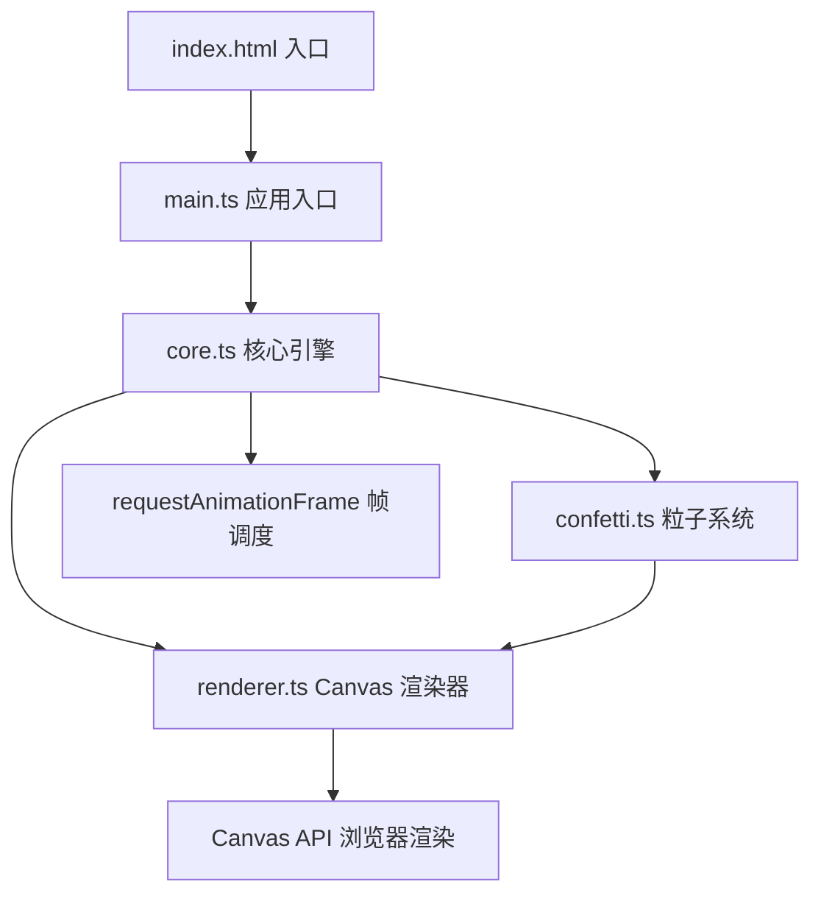

## 1. 架构设计



## 2. 技术描述

- **前端框架**：原生 TypeScript（无 UI 框架）
- **构建工具**：Vite 5.x（开发服务器 + HMR）
- **渲染技术**：HTML5 Canvas 2D API
- **动画方案**：requestAnimationFrame 手写帧循环，无外部动画库
- **编程语言**：TypeScript 5.x，target ES2020，module ESNext，严格模式

## 3. 模块设计

### 3.1 core.ts - 核心时间轴引擎

| 类/接口 | 职责 |
|---------|------|
| TimelineEngine | 时间轴主控制器，管理全局状态、帧循环调度、交互事件分发 |
| TimelineState | 时间轴状态：时间偏移、缩放范围、光点列表、光波列表 |

核心方法：
- `start()`: 启动帧循环
- `stop()`: 停止帧循环
- `addConfetti(x, y)`: 在指定位置添加光点
- `clearAll()`: 清空所有光点
- `generateCluster()`: 随机生成光点簇
- `onFrame(deltaTime)`: 每帧更新逻辑

### 3.2 confetti.ts - 光点粒子系统

| 类/接口 | 职责 |
|---------|------|
| Confetti | 单个光点粒子数据与行为 |
| ConfettiManager | 光点集合管理、融合检测、生命周期维护 |
| LightWave | 光波扩散特效数据 |

Confetti 属性：
- `x, y`: 坐标位置
- `size`: 大小（带呼吸脉动计算）
- `color`: 颜色（#rrggbb）
- `alpha`: 透明度（带呼吸脉动计算）
- `timestamp`: 绑定的时间戳（秒）
- `velocity`: 流速系数（0.5-1.5）
- `birthTime`: 创建时的引擎时间

Confetti 行为：
- `update(deltaTime, engineTime)`: 计算流动位移、透明度淡出、脉动
- `getSpeedMultiplier(age)`: 三阶段变速（0-3s 0.5x, 3-8s 1x, 8-12s 加速至1.5x）
- `isExpired(engineTime)`: 是否已到达消散时间

### 3.3 renderer.ts - Canvas 渲染器

| 类/接口 | 职责 |
|---------|------|
| CanvasRenderer | Canvas 上下文管理与全场景绘制 |

渲染管线（每帧顺序）：
1. `drawBackground()`: 绘制垂直渐变背景
2. `drawTimeline()`: 绘制时间轴主线
3. `drawTicks()`: 绘制刻度标记与数字
4. `drawConfettiTrails()`: 绘制光点流动轨迹（可选拖尾）
5. `drawConfetti()`: 绘制所有光点（含光晕与脉动）
6. `drawLightWaves()`: 绘制光波扩散特效
7. `drawHighlight()`: 绘制鼠标悬停交互高亮

## 4. 数据结构

### 4.1 光点粒子

```typescript
interface ConfettiData {
  id: number;
  x: number;           // 水平位置（像素，相对时间轴起始点）
  y: number;           // 垂直位置（像素）
  baseSize: number;    // 基础大小 20px
  color: string;       // #rrggbb
  baseAlpha: number;   // 基础透明度 0.9
  timestamp: number;   // 绑定的时间戳（秒）
  velocity: number;    // 流速系数 0.5-1.5
  birthTime: number;   // 创建时的引擎时间（ms）
}
```

### 4.2 光波特效

```typescript
interface LightWave {
  id: number;
  x: number;
  y: number;
  startTime: number;   // 创建时间（ms）
  duration: number;    // 持续时间 600ms
  startRadius: number; // 起始半径 0
  endRadius: number;   // 终止半径 30px（直径60px）
  color: string;
}
```

### 4.3 时间轴状态

```typescript
interface TimelineState {
  timeOffset: number;     // 时间偏移（秒），拖拽滚动时改变
  visibleDuration: number;// 当前可见时间范围（秒），6-24，默认12
  confettiList: Confetti[];
  lightWaves: LightWave[];
  engineTime: number;     // 引擎累计运行时间（ms）
}
```

## 5. 交互事件处理

| 事件 | 触发条件 | 处理逻辑 |
|------|----------|----------|
| `mousedown` | Canvas 上按下 | 记录起始位置，判断是否进入拖拽模式 |
| `mousemove` | 拖拽模式中 | 更新 timeOffset，水平滚动时间轴 |
| `mouseup` | 拖拽结束 | 若位移<5px 视为点击，在时间轴位置添加光点 |
| `wheel` | 鼠标滚轮 | 调整 visibleDuration（clamp 6-24），以鼠标位置为缩放中心 |
| `click` | 清除按钮 | 调用 engine.clearAll() |
| `click` | 随机生成按钮 | 调用 engine.generateCluster() |

## 6. 性能优化

- **帧率控制**：requestAnimationFrame 锁定 60FPS
- **粒子上限**：200 个，超过时移除 timestamp 最旧的
- **Canvas 优化**：
  - 背景渐变缓存到离屏 Canvas
  - 避免每帧创建大量临时对象
  - 粒子坐标计算复用变量
- **融合检测**：空间分桶或按 x 排序后相邻检测，避免 O(n²)
- **脏矩形**：如有必要使用局部重绘
