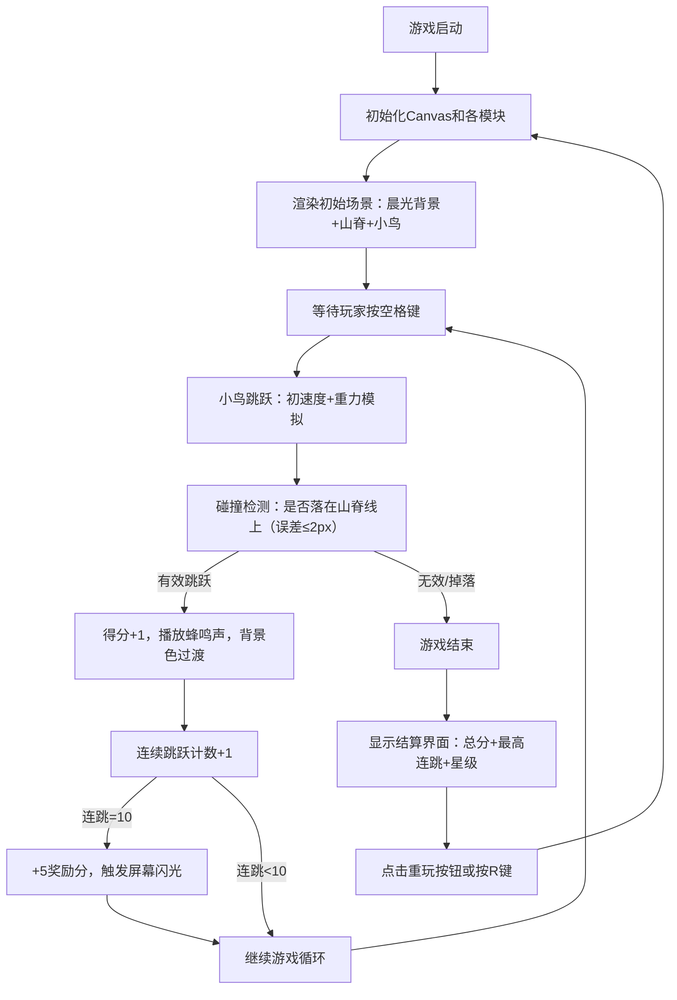

## 1. 产品概述

「幻音像素鸟」是一款极简节奏跳跃游戏，玩家操控像素小鸟在随音乐节奏起伏的像素山脊上连续跳跃，每次跳跃触发拟声调，背景色调随跳跃次数从晨光渐变到黄昏，最终在星空下结算得分。

- 面向休闲游戏玩家，提供节奏感与视觉渐变结合的独特游戏体验
- 核心价值在于简单易上手的操作配合动态视觉与音效反馈

## 2. 核心功能

### 2.1 功能模块
1. **主游戏场景**：全屏Canvas渲染，包含渐变背景、起伏山脊、像素小鸟
2. **跳跃物理系统**：重力模拟、初速度控制、山脊高度碰撞检测
3. **节拍山脊系统**：BPM 120节拍器驱动山脊波动，随机高度三角波地形
4. **音频反馈系统**：跳跃蜂鸣声（440Hz方波）、节拍提示音
5. **得分系统**：有效跳跃计分、连续10次跳跃额外奖励、屏幕闪光效果
6. **结算界面**：总分显示、最高连跳记录、星级评价、重玩按钮

### 2.2 功能详情
| 模块名称 | 功能描述 |
|-----------|----------|
| 背景渐变 | 从#87CEEB到#f0e68c清晨渐变，每次跳跃色相旋转4度，120次跳跃后到达#0a0a2e夜空 |
| 山脊绘制 | 随机高度三角波，颜色从#556b2f到#8b4513渐变，1px黑色描边，随BPM 120上下波动3-12px |
| 小鸟渲染 | 16x24像素块，fillRect绘制，主体#ff6347，翅膀#ff4500，眼睛白色圆点 |
| 跳跃物理 | 空格键触发，初速度12px/帧，重力0.6px/帧²，落地误差≤2px判定有效跳跃 |
| 音频反馈 | Web Audio API OscillatorNode生成440Hz方波持续0.08秒 |
| 得分显示 | 画布左上角16px monospace字体，白色文字带2px黑色描边 |
| 连跳奖励 | 连续10次有效跳跃+5分，触发屏幕边缘白色半透明矩形闪光0.3秒 |
| 结算界面 | 60%区域半透明黑色(rgba(0,0,0,0.7))遮罩，显示总分、最高连跳、星级（0-30一星，31-70二星，71+三星） |
| 重玩按钮 | #ff6347背景，hover变#ff4500，白色文字，闪烁提示，click/R键重置游戏 |

## 3. 核心流程

## 4. 用户界面设计

### 4.1 设计风格
- **像素复古风**：所有元素无抗锯齿(imageSmoothingEnabled=false)，8色限定调色板（黑、白、红、橙、黄、绿、蓝、紫）
- **主色调**：晨光蓝(#87CEEB) → 黄昏金(#f0e68c) → 夜空深蓝(#0a0a2e)动态渐变
- **强调色**：鸟身红(#ff6347)、按钮橙(#ff4500)、山脊绿褐渐变(#556b2f→#8b4513)
- **字体**：16px monospace，像素感
- **整体布局**：全屏Canvas，无多余UI元素，极简沉浸

### 4.2 界面设计概览
| 界面状态 | 核心元素 | 视觉特点 |
|----------|---------|---------|
| 游戏中 | 渐变天空、波动山脊、跳跃小鸟、左上角得分 | 60FPS流畅动画，色调随进程渐变 |
| 连跳奖励 | 屏幕边缘白色半透明闪光 | 0.3秒快速闪烁，反馈明确 |
| 结算界面 | 半透明黑遮罩、居中统计文字、闪烁重玩按钮 | 60%区域覆盖，信息层级清晰 |

### 4.3 响应式
- 全屏Canvas自适应窗口大小
- 游戏逻辑基于固定坐标系，绘制时按比例缩放
