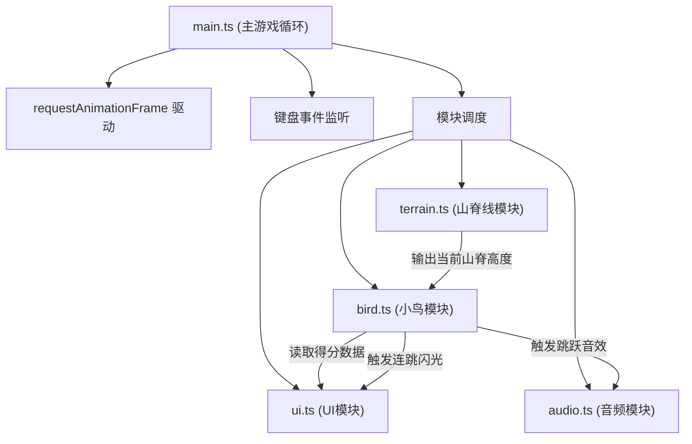

## 1. 架构设计



## 2. 技术描述

- **前端框架**：纯 TypeScript + Canvas API，无UI框架
- **构建工具**：Vite@5 (端口5173，开启HMR)
- **音频**：Web Audio API (OscillatorNode)
- **渲染**：HTML5 Canvas 2D Context，imageSmoothingEnabled=false
- **语言规范**：TypeScript 严格模式，target ES2020，module ESNext

## 3. 文件结构

```
project-root/
├── package.json
├── vite.config.js
├── tsconfig.json
├── index.html
└── src/
    ├── main.ts       # 主游戏循环、初始化、事件监听
    ├── bird.ts       # 小鸟物理、跳跃、碰撞检测、绘制
    ├── terrain.ts    # 山脊生成、节拍波动、绘制
    ├── audio.ts      # Web Audio封装、蜂鸣音效
    └── ui.ts         # 得分、闪光、结算界面绘制
```

## 4. 模块接口定义

### 4.1 terrain.ts - 山脊线模块
```typescript
class Terrain {
  constructor(canvasWidth: number, canvasHeight: number);
  update(beatTime: number): void;      // 更新山脊波动（基于节拍时间）
  draw(ctx: CanvasRenderingContext2D): void;
  getHeightAt(x: number): number;       // 获取指定x位置的山脊高度
  getBeatPhase(): number;               // 获取当前节拍相位 0-1
}
```

### 4.2 bird.ts - 小鸟模块
```typescript
class Bird {
  constructor(startX: number, startY: number);
  jump(): void;                          // 触发跳跃
  update(terrainHeight: number): boolean; // 返回是否游戏结束（掉落）
  draw(ctx: CanvasRenderingContext2D): void;
  getScore(): number;
  getMaxCombo(): number;
  getJumpCount(): number;
  isGameOver(): boolean;
  reset(): void;
  onValidJump?: () => void;              // 有效跳跃回调
  onComboBonus?: () => void;             // 连跳奖励回调
}
```

### 4.3 audio.ts - 音频模块
```typescript
class AudioManager {
  constructor();
  init(): Promise<void>;                 // 初始化AudioContext（需用户交互）
  playJumpSound(): void;                 // 播放跳跃蜂鸣声
  playBeatSound(): void;                 // 播放节拍提示音
}
```

### 4.4 ui.ts - UI模块
```typescript
class UIManager {
  constructor();
  drawScore(ctx: CanvasRenderingContext2D, score: number): void;
  triggerFlash(): void;                  // 触发边缘闪光
  drawGameOver(ctx: CanvasRenderingContext2D, score: number, maxCombo: number, onRestart: () => void): void;
  update(deltaTime: number): void;       // 更新闪光等动画
  reset(): void;
}
```

## 5. 核心性能指标

- **帧率**：稳定60FPS，使用requestAnimationFrame
- **碰撞精度**：落地判定误差≤2像素
- **色调过渡**：每次跳跃后2秒内平滑色相旋转4度
- **山脊波动**：BPM 120 (每拍0.5秒)，振幅3-12px
