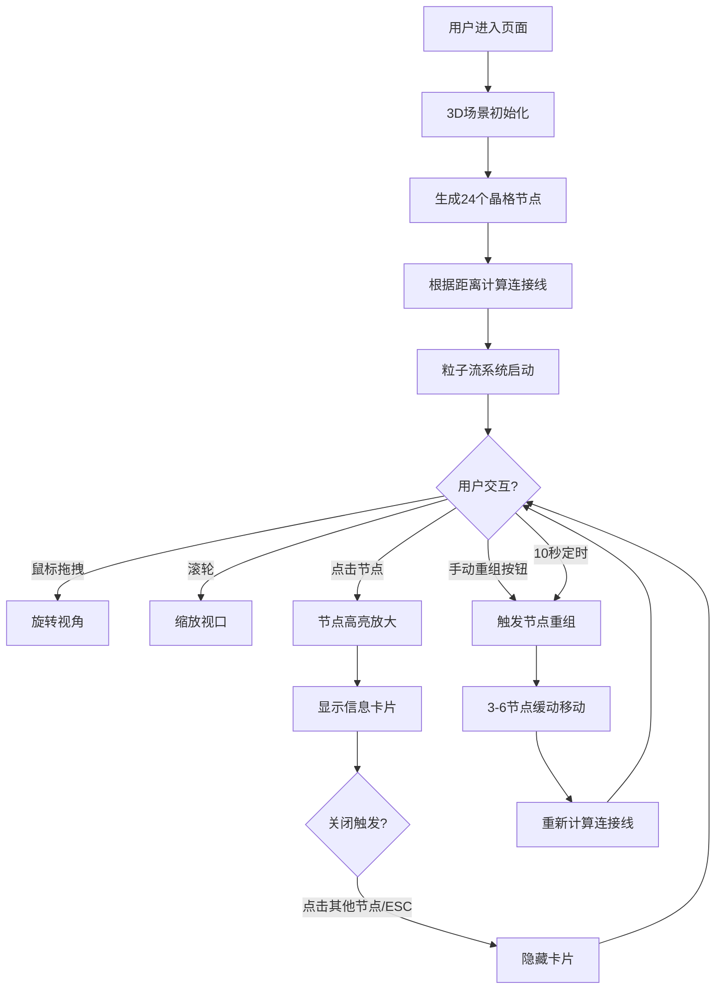

## 1. 产品概述

「记忆晶格」是一款沉浸式3D记忆网络可视化应用，将科幻小说中的"记忆晶格"概念具象化——每个记忆片段以悬浮发光多面体呈现，通过粒子流连接形成动态演化的记忆网络。读者可在浏览器中自由探索这个记忆宇宙。

- 目标用户：科幻小说读者、艺术爱好者、交互体验探索者
- 产品价值：通过沉浸式3D交互体验，将抽象概念可视化，增强读者对科幻世界观的代入感与理解

## 2. 核心功能

### 2.1 用户角色
| 角色 | 注册方式 | 核心权限 |
|------|----------|----------|
| 普通用户 | 无需注册，直接访问 | 自由探索3D场景、交互节点、触发重组动画 |

### 2.2 功能模块
1. **3D场景主视口**：24个晶格节点悬浮于三维空间，动态连接线与粒子流
2. **节点交互系统**：点击节点查看记忆描述，节点高亮放大
3. **记忆重组机制**：定时/手动触发节点位置重组，带动画过渡
4. **UI覆盖层**：信息卡片展示、手动重组按钮、交互提示

### 2.3 页面详情
| 页面名称 | 模块名称 | 功能描述 |
|----------|----------|----------|
| 主场景页面 | 3D视口模块 | 鼠标拖拽旋转视角、滚轮缩放、全屏自适应 |
| 主场景页面 | 晶格节点系统 | 24个正十二面体节点，半透明玻璃质感，中心发光球体 |
| 主场景页面 | 连接与粒子流 | 根据距离动态生成连接线，渐变色彩，粒子匀速流动形成脉冲 |
| 主场景页面 | 记忆重组引擎 | 每10秒自动触发，可选3-6个节点移动到新位置，2秒缓动动画 |
| 主场景页面 | 信息卡片模块 | 左上角半透明毛玻璃卡片，展示记忆文本，ESC/点击其他节点关闭 |
| 主场景页面 | 手动重组按钮 | 右下角圆形按钮，点击触发随机重组 |

## 3. 核心流程

用户打开页面 → 3D场景加载，24个晶格节点呈现 → 连接线与粒子流动画自动播放 → 用户鼠标拖拽旋转视角 / 滚轮缩放 → 点击晶格节点 → 节点放大高亮，信息卡片滑入展示记忆描述 → 点击其他节点/按ESC关闭卡片 → 每10秒自动触发记忆重组动画 → 用户可随时点击右下角按钮手动触发重组。

## 4. 用户界面设计

### 4.1 设计风格
- **主色调**：深空蓝紫渐变背景（#0b0e1a → #1a1d3a → #2a244a），左上略亮
- **节点调色板**：#ff6b6b、#feca57、#48dbfb、#ff9ff3、#54a0ff、#5f27cd（6色随机）
- **高亮色**：#ffffff（节点选中时）、#48dbfb（UI边框、按钮）
- **字体**：现代无衬线字体，简洁未来感
- **按钮风格**：圆形透明按钮，悬停填充实色，弹性缩放反馈
- **卡片风格**：毛玻璃（backdrop-filter: blur(8px)），圆角，半透明深蓝背景带青色边框
- **布局**：全屏Flexbox居中，Canvas自适应，UI浮层绝对定位

### 4.2 页面设计概览
| 页面名称 | 模块名称 | UI元素 |
|----------|----------|--------|
| 主场景 | 3D视口 | 全屏Canvas，径向渐变背景，柔和环境光+旋转定向光 |
| 主场景 | 信息卡片 | 左上角定位，12px内边距，圆角，毛玻璃，缩放进入动画 |
| 主场景 | 重组按钮 | 右下角圆形，半透明#48dbfb，悬停/点击弹性缩放 |

### 4.3 响应式设计
- 桌面优先：1920x1080、1440x900、1366x768主流分辨率适配
- Canvas通过CSS 100vw/100vh自适应，Three.js内部监听resize更新相机
- UI元素采用固定像素与视口百分比混合布局

### 4.4 3D场景指南
- **环境与氛围**：深空宇宙，蓝紫径向渐变背景，营造神秘记忆空间
- **光照设置**：环境光（强度0.4，#404060）+ 旋转定向光（强度1.2，#8888ff，4秒/圈绕Y轴）
- **相机设置**：PerspectiveCamera，初始距离15-20单位，OrbitControls控制（拖拽旋转、滚轮缩放、禁用平移）
- **构图与焦点**：24节点均匀分布在半径8的球体内，节点为视觉焦点
- **交互与动画**：节点选中缩放1.5倍、中心球体光晕增强；节点重组采用easeInOutCubic缓动2秒；粒子沿连接线0.5单位/秒匀速流动
- **性能优化**：粒子对象池复用，几何体复用，材质共享，目标帧率40+FPS（Iris Xe集成显卡）
