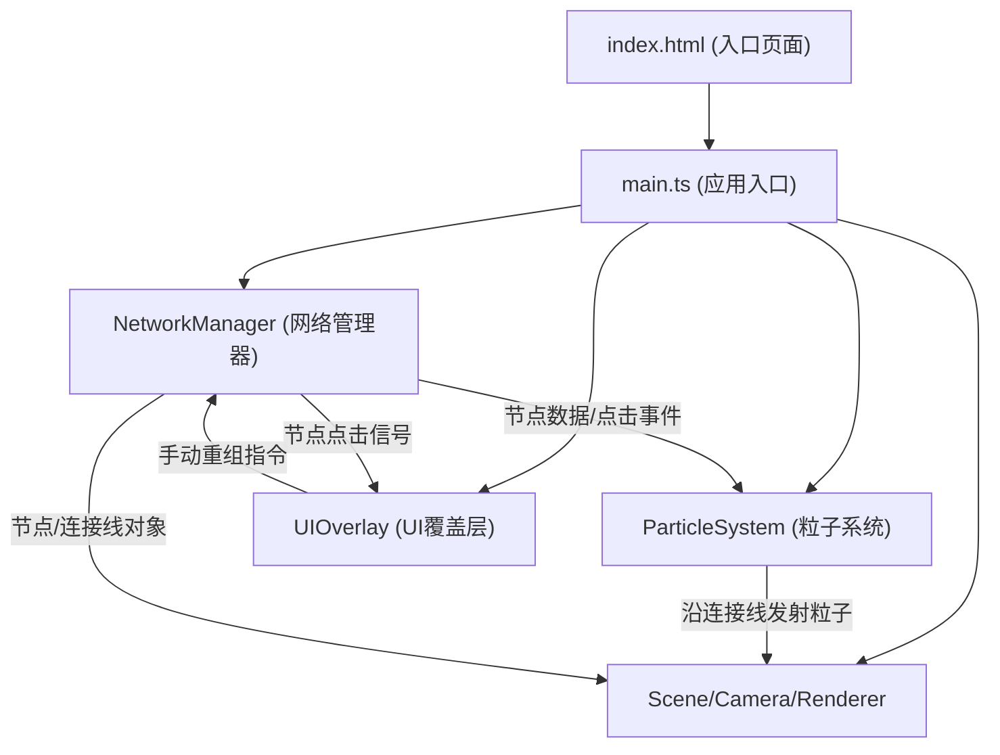

## 1. 架构设计

纯前端3D应用，采用模块化分层架构：



模块职责与数据流向：
- **main.ts**：场景装配中心，创建Three.js核心对象，实例化各管理器，驱动动画循环（requestAnimationFrame），将delta时间分发到各模块的update方法
- **NetworkManager.ts**：数据/状态中心，管理24个晶格节点（位置、颜色、缩放、选中状态）与连接线集合，响应点击更新节点状态，每10秒或手动触发重组（缓动移动+重连计算）
- **ParticleSystem.ts**：视觉效果层，订阅NetworkManager的连接集合，沿每条连接线以0.3单位间隔生成粒子并以0.5单位/秒移动，生命周期结束后回收到对象池
- **UIOverlay.ts**：交互层，监听NetworkManager的节点点击事件展示/隐藏记忆卡片，提供手动重组按钮并回调到NetworkManager

## 2. 技术选型

- **前端框架**：原生TypeScript（无UI框架，直接操作DOM + Three.js）
- **3D引擎**：three@0.160.0 + @types/three
- **构建工具**：Vite@5（端口5173，HMR开启）
- **语言规范**：TypeScript严格模式，target ES2020，module ESNext
- **初始化方式**：Vite vanilla-ts模板手动改造（按用户指定文件结构）

## 3. 项目文件结构

```
.
├── index.html                 入口HTML，全屏布局，canvas容器
├── package.json               three@0.160 / @types/three / vite / typescript
├── vite.config.js             Vite基础配置，端口5173，开启HMR
├── tsconfig.json              strict + ES2020 + ESNext
└── src/
    ├── main.ts                应用入口：场景/相机/渲染器/动画循环
    ├── NetworkManager.ts      节点与连接线管理、重组逻辑
    ├── ParticleSystem.ts      粒子流生成/更新/回收
    └── UIOverlay.ts           HTML覆盖层：信息卡片+重组按钮
```

## 4. 核心数据模型

### 4.1 晶格节点 (LatticeNode)
```typescript
interface LatticeNode {
  id: number;
  position: THREE.Vector3;          // 当前位置
  targetPosition?: THREE.Vector3;   // 重组目标位置（动画中使用）
  startPosition?: THREE.Vector3;    // 重组起始位置
  color: THREE.Color;               // 调色板颜色
  scale: number;                    // 基础缩放（0.4-1.0随机）
  selected: boolean;                // 是否被选中
  mesh: THREE.Mesh;                 // 正十二面体网格
  glowMesh: THREE.Mesh;             // 中心发光球体
  memoryText: string;               // 记忆描述文本（模拟数据）
}
```

### 4.2 连接线 (Connection)
```typescript
interface Connection {
  nodeA: LatticeNode;
  nodeB: LatticeNode;
  line: THREE.Line;                 // 半透明渐变线条
  distance: number;                 // 节点间距
}
```

### 4.3 粒子流 (FlowParticle)
```typescript
interface FlowParticle {
  mesh: THREE.Mesh;                 // 小球体
  connection: Connection;           // 所属连接线
  progress: number;                 // 0-1 沿连接线的进度
  speed: number;                    // 速度（单位/秒）
  active: boolean;                  // 是否活跃
}
```

## 5. 关键算法

### 5.1 节点位置生成
在半径8的球体内均匀分布：采用球坐标随机 + 半径立方根分布保证体积均匀。

### 5.2 连接线计算
每帧或重组后，对所有节点对计算欧几里得距离，阈值≤5时建立连接；使用LRU缓存避免重复创建几何体。

### 5.3 缓动函数 easeInOutCubic
```typescript
function easeInOutCubic(t: number): number {
  return t < 0.5 ? 4*t*t*t : 1 - Math.pow(-2*t + 2, 3) / 2;
}
```

### 5.4 粒子对象池
预分配足够的粒子Mesh，active标志控制可见性，避免频繁创建/销毁导致GC压力。

## 6. 性能保障策略

- **几何体复用**：所有正十二面体共享一个DodecahedronGeometry实例，粒子共享一个SphereGeometry实例
- **材质复用**：同色节点共享MeshPhysicalMaterial实例，仅通过uniform或clone后调整透明度
- **粒子池化**：预创建粒子Mesh数组，进度重置替代新建/销毁
- **距离阈值优化**：重组后才重算连接，非每帧全量O(n²)计算
- **分辨率适配**：renderer.setPixelRatio(Math.min(window.devicePixelRatio, 2))避免高DPI过度采样
