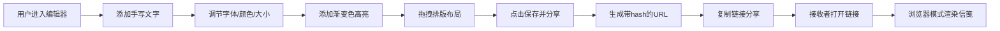

## 1. 产品概述

「光语信笺」是一款基于浏览器的交互式数字信件生成与浏览应用，用户可创作带有动态光影背景和粒子特效的虚拟信笺，通过URL分享给他人浏览。

- 核心价值：让数字信件焕发温暖的手写质感与动态美感，提供传统书信无法比拟的视觉体验
- 目标用户：希望以创新方式传递情感、分享心情的互联网用户

## 2. 核心功能

### 2.1 功能模块

1. **信笺编辑器**：动态粒子背景绘制、手写文字输入、渐变色高亮、拖拽排版、删除功能
2. **信笺浏览器**：深色背景渲染、信笺居中展示、缓动动画播放、粒子状态延续
3. **数据存储**：URL hash序列化、localStorage备份、分享链接生成

### 2.2 页面详情

| 页面名称 | 模块名称 | 功能描述 |
|-----------|-------------|---------------------|
| 编辑器页面 | 动态背景层 | 奶油色径向渐变 + 80个椭圆轨迹流动粒子 |
| 编辑器页面 | 文字编辑区 | 手写字体输入、5色板选色、字号行高调节（200字限制） |
| 编辑器页面 | 高亮标注功能 | 最多3段渐变色高亮，水平条状，随文字自动定位 |
| 编辑器页面 | 交互工具栏 | 拖拽排版、长按删除按钮、保存分享按钮 |
| 浏览器页面 | 展示容器 | 深色径向渐变背景、信笺居中、悬停阴影效果 |
| 浏览器页面 | 动画播放 | 缓动入场动画、粒子流延续保存状态 |

## 3. 核心流程

## 4. 用户界面设计

### 4.1 设计风格

- **主色调**：奶油色(#fdf6e3)、卡其色(#d4a373)、深褐色(#5c4033)
- **背景纹理**：细腻布纹纹理（CSS linear-gradient模拟）
- **按钮样式**：圆角10px、半透明磨砂玻璃效果（rgba(255,248,220,0.7)背景、1px rgba(255,255,255,0.3)边框、backdrop-filter:blur(5px)）
- **交互动画**：悬停亮度+10%、上移2px（0.3s ease）、点击缩小至0.95
- **字体**：Google Fonts 'Caveat' 手写风格字体
- **模式切换**：淡入淡出过渡（opacity 0→1，0.5s）

### 4.2 页面设计概述

| 页面名称 | 模块名称 | UI元素 |
|-----------|-------------|-------------|
| 编辑器页面 | 动态背景 | 奶油色径向渐变、80个流动粒子（椭圆轨迹、2-5px、#d4a373→#faedcd渐变） |
| 编辑器页面 | 工具栏 | 磨砂玻璃按钮组、5色选色板、字号滑块、行高滑块 |
| 编辑器页面 | 文字元素 | 手写字体、可拖拽、长按显示红色圆形删除按钮 |
| 编辑器页面 | 高亮元素 | 水平条状渐变(#ffe082→#ffb74d)、随文字联动 |
| 浏览器页面 | 外层容器 | 深色径向渐变(#2b2b2b→#1a1a1a)、静态无动画 |
| 浏览器页面 | 信笺卡片 | 居中显示、box-shadow:0 10px 30px rgba(0,0,0,0.5) |
| 浏览器页面 | 入场动画 | 信笺缓动淡入、粒子0.5秒渐入延迟 |

### 4.3 响应性

桌面端优先设计，Canvas自适应窗口大小，所有交互元素确保在主流浏览器（Chrome 110+、Firefox 110+、Edge 110+）上正常运行。

### 4.4 性能要求

- 粒子系统采用requestAnimationFrame驱动，帧率稳定55fps以上
- 粒子上限200个，默认80个
- 保存/加载响应时间≤200ms
