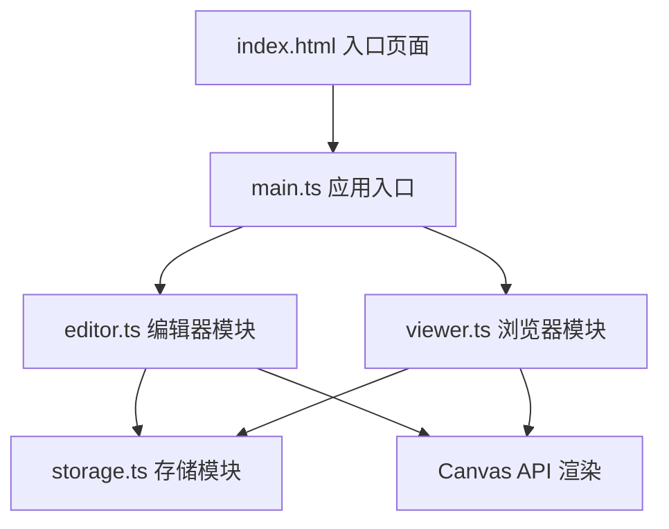
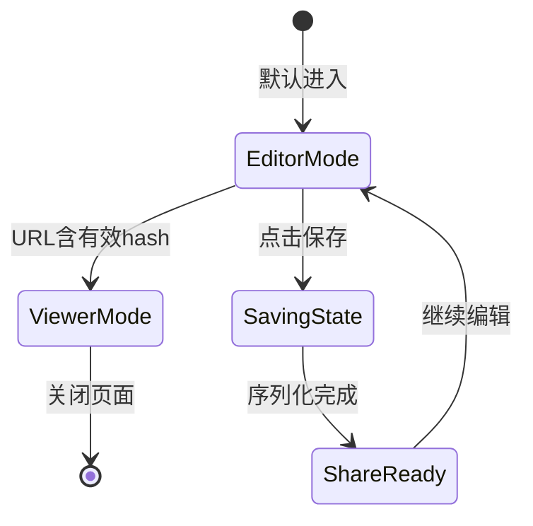

## 1. 架构设计



## 2. 技术说明

- **前端框架**：原生 TypeScript（无UI框架）
- **构建工具**：Vite 5.x
- **渲染技术**：HTML5 Canvas 2D API
- **动画方案**：requestAnimationFrame（无外部动画库）
- **字体方案**：Google Fonts 'Caveat'
- **数据存储**：URL Hash + localStorage 双重备份

## 3. 文件结构

| 文件路径 | 职责说明 |
|-------|---------|
| `package.json` | 依赖声明（typescript, vite）、启动脚本 |
| `vite.config.js` | Vite配置（端口5173、HMR开启） |
| `tsconfig.json` | TypeScript配置（严格模式、ES2020、ESNext） |
| `index.html` | 入口页面（全屏Canvas、UI控件容器） |
| `src/main.ts` | 应用初始化、状态管理、路由切换（editor/viewer） |
| `src/editor.ts` | 编辑器：动态背景、粒子系统、文字/高亮编辑 |
| `src/viewer.ts` | 浏览器：信笺渲染、缓动动画、粒子状态恢复 |
| `src/storage.ts` | 序列化、URL hash、localStorage、分享链接 |

## 4. 数据模型定义

### 4.1 核心数据结构

```typescript
interface Particle {
  x: number;
  y: number;
  size: number;
  color: string;
  opacity: number;
  angle: number;
  speed: number;
  ellipseA: number;
  ellipseB: number;
  centerX: number;
  centerY: number;
}

interface HighlightSegment {
  id: string;
  textId: string;
  startIndex: number;
  endIndex: number;
}

interface TextElement {
  id: string;
  content: string;
  x: number;
  y: number;
  color: string;
  fontSize: number;
  lineHeight: number;
  highlights: HighlightSegment[];
}

interface LetterData {
  version: number;
  timestamp: number;
  texts: TextElement[];
  particles: Particle[];
  canvasWidth: number;
  canvasHeight: number;
}
```

### 4.2 状态流转



## 5. 核心实现要点

### 5.1 粒子系统

- 粒子沿椭圆轨迹运动：`x = cx + a * cos(angle), y = cy + b * sin(angle)`
- 颜色插值：`#d4a373` → `#faedcd` 线性渐变
- 性能优化：离屏预渲染、批量绘制、帧率监控
- 首次加载：粒子透明度0→目标值，0.5秒渐入

### 5.2 Canvas文字渲染

- 使用 `CanvasRenderingContext2D.measureText()` 计算文字布局
- 高亮段计算：基于字符索引和文字度量定位水平条
- 拖拽检测：命中测试基于文字包围盒

### 5.3 数据序列化

- JSON → Base64URL 编码（压缩hash长度）
- localStorage 本地备份防止URL过长丢失
- 版本号兼容未来格式升级

### 5.4 性能保障

- 粒子数动态调整（根据设备性能）
- 脏矩形渲染（仅重绘变化区域）
- 节流处理输入事件
