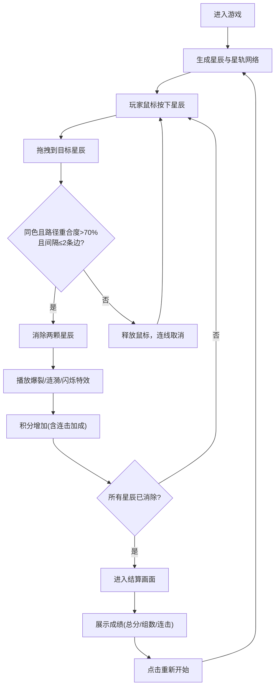

## 1. 产品概述

「星轨连连看」是一款在浏览器中运行的星空连线消除小游戏。玩家在银河般的沉浸式背景下，按照星轨路径的提示，用鼠标拖拽将同色星辰连接消除。

- 核心玩法：鼠标拖拽连接同色星辰，遵循星轨网络路径，成功消除后获得积分并触发视觉特效
- 目标用户：休闲游戏玩家，喜爱唯美视觉体验的用户
- 产品价值：提供轻松愉悦、视觉精美的休闲游戏体验

## 2. 核心功能

### 2.1 用户角色

| 角色 | 注册方式 | 核心权限 |
|------|----------|----------|
| 玩家 | 无需注册 | 直接进入游戏进行连线消除 |

### 2.2 功能模块

1. **游戏主场景**：全屏Canvas画布，星空背景，星辰与星轨网络渲染
2. **连线交互系统**：鼠标拖拽连线、路径重合度判定、相邻性检查
3. **消除特效系统**：星辰爆裂粒子、光晕涟漪、相邻星辰闪烁、画布边缘波纹
4. **积分与连击系统**：积分累计、连击加成、积分动画显示
5. **结算系统**：星空旋转动画、成绩展示、弹入动画
6. **重新开始功能**：重置游戏状态，重新生成星辰布局

### 2.3 页面详情

| 页面名称 | 模块名称 | 功能描述 |
|----------|----------|----------|
| 游戏主场景 | 星空背景 | 径向渐变背景(中心#2a2a5e → 外圈#0b0b20/#1a1a3e)，缓慢旋转效果 |
| 游戏主场景 | 星辰系统 | 每1.5-2.5秒生成30-50颗星辰，6色调色板，半径5-10px发光圆点，带15-25px光晕 |
| 游戏主场景 | 星轨网络 | 半透明虚线随机连接星辰形成网络，线宽1px，颜色为星辰色20%透明度 |
| 游戏主场景 | 连线交互 | 鼠标按下拖拽到同色星辰，路径重合度>70%且间隔≤2条边则消除 |
| 游戏主场景 | 消除特效 | 20-30个粒子飞散(1秒淡出)、80px扩散光晕(1.2秒)、相邻星辰闪烁(2次×0.3秒)、边缘涟漪(0.8秒) |
| 游戏主场景 | 积分面板 | 左上角显示积分(#ffffff，20px)，变化时1.2→1.0脉冲动画(0.3秒) |
| 游戏主场景 | 连击系统 | 时间间隔<3秒触发连击，每次连击额外加分递增5分 |
| 结算画面 | 结算动画 | 背景旋转360度(4秒)，"星轨完成"文字弹入(0.6秒)，展示总分/消除组数/最大连击 |
| 结算画面 | 重新开始按钮 | 右上角60×60px圆形按钮(↻符号)，悬停/按下动画，点击重置游戏 |

## 3. 核心流程

玩家进入游戏后看到满屏星辰与星轨网络，点击一颗星辰并拖拽到另一颗同色星辰，如果连线符合星轨路径且满足相邻条件，则消除成功并获得积分。连续消除触发连击加成。当所有星辰被消除后，进入结算画面展示成绩，可点击重新开始按钮再玩一局。

## 4. 用户界面设计

### 4.1 设计风格

- **主色调**：深蓝紫色系星空氛围(#0b0b20、#1a1a3e、#2a2a5e)
- **星辰色板**：#ff6b8a(粉)、#6dd3ff(蓝)、#ffd93d(黄)、#c084fc(紫)、#ff9f43(橙)、#6bcb77(绿)
- **按钮风格**：圆形，半透明白色背景(0.1透明度)，悬停时0.2透明度
- **字体**：系统字体，白色(#ffffff)
- **动画风格**：柔和细腻，60fps流畅帧率，光晕/涟漪/粒子效果

### 4.2 页面设计概述

| 页面名称 | 模块名称 | UI元素 |
|----------|----------|--------|
| 游戏主场景 | 星空背景 | 径向渐变，居中蓝色调，沉浸式银河氛围 |
| 游戏主场景 | 星辰渲染 | 发光圆点+半透明光晕，6色明亮柔和 |
| 游戏主场景 | 星轨网络 | 半透明虚线，星辰间随机连接 |
| 游戏主场景 | 积分面板 | 左上角白色20px文字，脉冲缩放动画 |
| 游戏主场景 | 控制按钮 | 右上角圆形重启按钮，↻符号，28px，悬停/按压反馈 |
| 结算画面 | 标题文字 | 中央"星轨完成" 48px #ffd93d带10px外发光 |
| 结算画面 | 成绩展示 | 总积分/消除组数/最大连击，从下向上弹入动画(0.6秒) |
| 结算画面 | 背景动画 | 星空缓慢旋转360度(4秒) |

### 4.3 响应式设计

- 桌面优先设计，Canvas全屏自适应窗口大小
- 鼠标事件为主，触屏设备可兼容触摸拖拽
- 元素位置使用百分比/绝对定位，确保各分辨率显示正常

### 4.4 视觉特效规范

| 特效类型 | 参数规格 |
|----------|----------|
| 星辰光晕 | 半径15-25px，透明度0.3-0.6 |
| 爆裂粒子 | 20-30个，大小2-4px，随机方向飞散，1秒淡出 |
| 扩散光晕 | 从中心扩展到80px半径，1.2秒淡出，1.0透明度 |
| 星辰闪烁 | 亮度1.5倍，0.3秒×2次 |
| 边缘涟漪 | 从边缘向中心扩散，0.8秒淡出 |
| 积分脉冲 | 1.2→1.0缩放，0.3秒 |
| 文字弹入 | translateY(40px)→0，0.6秒缓动 |
| 按钮按压 | 缩小到0.9倍→回弹，0.2秒 |
