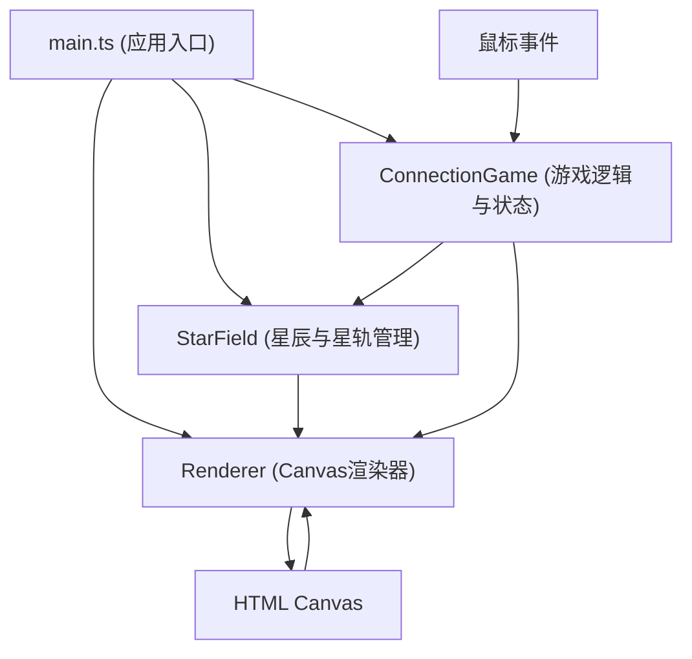

## 1. 架构设计



**分层说明：**
- **数据层 (StarField)**：管理星辰数组、星轨邻接表、位置/颜色/光晕属性，提供路径查询
- **逻辑层 (ConnectionGame)**：处理鼠标交互、连线判定、积分连击计算、游戏状态管理
- **渲染层 (Renderer)**：负责所有Canvas绘制，包括星辰、星轨、粒子特效、文字UI、动画
- **入口层 (main.ts)**：初始化各模块，启动requestAnimationFrame主循环，协调数据流转

## 2. 技术栈说明

- **前端框架**：无框架，纯TypeScript + HTML5 Canvas 2D API
- **构建工具**：Vite@5 (端口5173，HMR热更新)
- **语言**：TypeScript@5 (strict严格模式，target ES2020，module ESNext)
- **后端**：无，纯前端游戏
- **数据库**：无，状态保存在内存中

**技术选型理由：**
- 纯Canvas绘制可精确控制每帧60fps的粒子和动画效果
- TypeScript提供类型安全，避免复杂游戏逻辑中的类型错误
- Vite提供快速开发体验和ESNext模块支持

## 3. 文件结构

```
auto196/
├── .trae/documents/
│   ├── PRD.md
│   └── tech-architecture.md
├── src/
│   ├── starField.ts      # 星辰生成、星轨网络、数据管理
│   ├── connectionGame.ts # 连线逻辑、积分连击、状态管理
│   ├── renderer.ts       # Canvas渲染、动画特效系统
│   └── main.ts           # 应用入口、主循环、模块协调
├── index.html            # 入口页面
├── package.json          # 依赖配置
├── vite.config.js        # Vite配置
└── tsconfig.json         # TypeScript配置
```

## 4. 核心数据模型

### 4.1 Star (星辰)

```typescript
interface Star {
  id: number;
  x: number;          // 画布X坐标
  y: number;          // 画布Y坐标
  radius: number;     // 星辰半径 (5-10px)
  color: string;      // 颜色值 (6色调色板)
  glowRadius: number; // 光晕半径 (15-25px)
  glowAlpha: number;  // 光晕透明度 (0.3-0.6)
  isBlinking: boolean;
  blinkStartTime: number;
  isRemoving: boolean;
  removeStartTime: number;
}
```

### 4.2 StarTrack (星轨)

```typescript
interface StarTrack {
  fromId: number;
  toId: number;
}

// 星轨邻接表
type AdjacencyList = Map<number, number[]>;
```

### 4.3 GameState (游戏状态)

```typescript
type GamePhase = 'playing' | 'settling';

interface GameState {
  phase: GamePhase;
  score: number;
  scorePulseTime: number;
  comboCount: number;
  maxCombo: number;
  lastMatchTime: number;
  eliminatedPairs: number;
  selectedStarId: number | null;
  dragEndPoint: { x: number; y: number } | null;
}
```

### 4.4 Particle (粒子特效)

```typescript
interface Particle {
  x: number;
  y: number;
  vx: number;
  vy: number;
  radius: number;
  color: string;
  alpha: number;
  startTime: number;
  lifetime: number;
}

interface RippleEffect {
  centerX: number;
  centerY: number;
  color: string;
  startTime: number;
  lifetime: number;
  maxRadius: number;
}

interface EdgeRipple {
  startTime: number;
  lifetime: number;
}
```

## 5. 模块数据流向

### 5.1 StarField → Renderer
每帧输出：星辰数组、星轨邻接表，用于绘制星辰、光晕和星轨虚线。

### 5.2 ConnectionGame → Renderer
事件驱动输出：
- 消除事件：触发星辰爆裂粒子、扩散光晕、相邻闪烁、边缘涟漪
- 拖拽状态：当前选中星辰、鼠标位置，用于绘制连线路径
- 积分变化：积分值、脉冲动画起始时间
- 游戏状态切换：触发结算画面动画

### 5.3 鼠标事件 → ConnectionGame → StarField
- `mousedown`：查询命中星辰，设为选中起点
- `mousemove`：更新拖拽终点坐标
- `mouseup`：执行连线判定，成功则调用StarField移除星辰

## 6. 关键算法

### 6.1 星轨网络构建
- 在星辰生成后，基于K-近邻算法(每颗星辰连接最近的3-5颗)构建邻接表
- 确保整体网络连通性，避免孤立节点

### 6.2 最短路径查找
- BFS(广度优先搜索)在邻接表中查找两颗星辰之间的最短路径
- 用于判定两颗星辰间隔是否≤2条边

### 6.3 路径重合度判定
- 计算拖拽路径线段与星轨网络中各边的相交/接近程度
- 使用点到线段距离公式计算重合比例，超过70%即判定有效

### 6.4 动画帧更新
- requestAnimationFrame驱动，每帧计算deltaTime
- 所有动画使用时间插值计算当前状态，确保帧率独立的平滑效果
