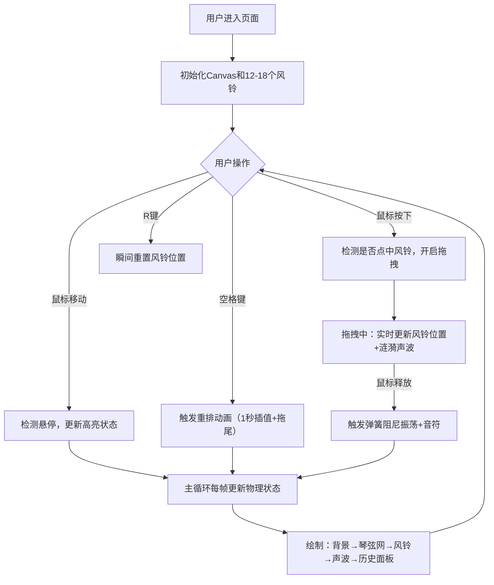

## 1. 产品概述

「风弦琴」是一款沉浸式的交互式数字风铃应用，让用户通过鼠标拖拽和键盘按键，在浏览器中弹奏一组由几何图形构成的虚拟风铃，体验物理弹簧拉伸动画和声波扩散效果的视听结合乐趣。

- 核心目的：打造一款兼具视觉美感和交互乐趣的创意工具，提供放松解压的音乐互动体验
- 目标用户：创意工作者、音乐爱好者、需要放松减压的普通用户

## 2. 核心特性

### 2.1 功能模块
1. **主画布**：全屏Canvas画布，承载所有风铃、声波、连接线的绘制
2. **风铃系统**：12-18个独立风铃对象，具备弹簧物理属性、多种几何形状、浮动子节点
3. **声波系统**：点击/拖拽风铃时产生同心圆环扩散动画，配合Web Audio API音频
4. **交互系统**：鼠标悬停高亮、点击触发、拖拽拉伸、空格键重排、R键重置
5. **历史面板**：右下角显示最近5次点击记录

### 2.2 页面详情
| 页面名称 | 模块名称 | 功能描述 |
|-----------|-------------|---------------------|
| 主画布 | 风铃绘制 | 随机生成三角形/圆形/六边形风铃，带浮动子节点 |
| 主画布 | 弹簧物理 | 弹性系数k、阻尼系数d、自然长度，拖拽后弹簧振荡3-5秒 |
| 主画布 | 鼠标交互 | 悬停高亮光环、点击触发声波、拖拽实时跟随 |
| 主画布 | 琴弦网络 | 距离<100px的风铃间绘制半透明连接线 |
| 主画布 | 键盘交互 | 空格键1秒线性插值重排+拖尾，R键瞬间重置 |
| 主画布 | 声波动画 | 同心圆环从0到80px扩散淡出，音量渐出 |
| 历史面板 | 点击记录 | 记录最近5次点击（形状图标、颜色、时间） |

## 3. 核心流程

## 4. 用户界面设计

### 4.1 设计风格
- **主色调**：深紫蓝夜空渐变背景（#0f0c29 → #302b63 → #24243e）
- **强调色**：8色鲜艳风铃配色（粉红、天蓝、金黄、橙、翠绿、紫、红、青）
- **辅助色**：白色（边框高亮、连接线、光环）
- **交互反馈**：悬停时白色边框加宽+旋转光环；点击时发光脉冲；拖拽时抓取指针
- **视觉层次**：背景→琴弦网→风铃本体→声波圆环→历史面板

### 4.2 页面设计概览
| 页面名称 | 模块名称 | UI元素 |
|-----------|-------------|-------------|
| 主画布 | 背景 | 垂直三色渐变，模拟夜空氛围 |
| 主画布 | 风铃 | 几何形状填充+1.5px描边（亮度+30%），2个浮动子节点 |
| 主画布 | 连接线 | 白色虚线（8,4 pattern，1px宽）连接鼠标与拖拽风铃 |
| 主画布 | 琴弦网 | 距离<100px的风铃间颜色混合半透明细线（alpha 0.15） |
| 主画布 | 声波 | 同心圆环半径0→80px，alpha 0.6→0.0，持续约0.5秒 |
| 历史面板 | 记录项 | 180×80px半透明黑底（rgba(0,0,0,0.4)，圆角8px），垂直排列5条记录 |

### 4.3 响应式
- 桌面优先设计，Canvas始终占满视口
- 风铃物理参数（k, d, 自然长度、最小间距）固定不变
- 风铃绘制尺寸按窗口宽度等比缩放：基准1920px，每减少200px缩小5%
- 窗口缩放时风铃位置不重置，超出边界50px外的风铃以0.3秒缓动拉回

### 4.4 性能目标
- 主循环帧率≥55FPS
- 同时活跃声波≤10个
- 单个风铃拖尾轨迹≤20帧
- 历史记录≤5条
- 总风铃对象（含子节点）≤50个
