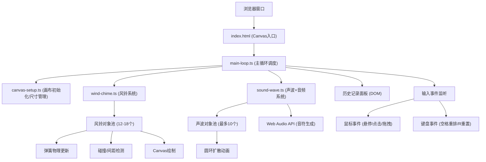

## 1. 架构设计



## 2. 技术说明
- **前端框架**：原生 TypeScript + HTML5 Canvas 2D API，无额外UI框架
- **构建工具**：Vite@5 (开启HMR，端口5173)
- **音频处理**：Web Audio API (OscillatorNode + GainNode 生成基音+泛音)
- **不使用任何外部动画/物理库**，所有动画和物理模拟纯手写实现
- **包管理**：npm

## 3. 文件结构

| 文件路径 | 职责 |
|---------|------|
| `/package.json` | 项目依赖(typescript, vite)，启动脚本 `npm run dev` |
| `/vite.config.js` | Vite基础配置，端口5173，开启HMR |
| `/tsconfig.json` | 严格模式，target ES2020，module ESNext |
| `/index.html` | 入口HTML，全屏Canvas + 历史面板DOM |
| `/src/canvas-setup.ts` | Canvas初始化、全屏尺寸、resize监听，导出ctx和尺寸 |
| `/src/wind-chime.ts` | 风铃类定义、对象池、弹簧物理、碰撞检测、绘制、重排/重置 |
| `/src/sound-wave.ts` | 声波类、扩散动画、Web Audio音符生成 |
| `/src/main-loop.ts` | requestAnimationFrame主循环、事件处理、各模块调度 |

## 4. 核心数据模型

### 4.1 风铃对象 (Chime)
```typescript
type Shape = 'triangle' | 'circle' | 'hexagon'

interface ChimeChild {
  offsetAngle: number    // 相对中心的浮动角度
  offsetRadius: number   // 相对中心的浮动半径
  phase: number          // 浮动动画相位
}

interface Chime {
  id: number
  x: number              // 当前位置X
  y: number              // 当前位置Y
  anchorX: number        // 锚点位置X（弹簧自然位置）
  anchorY: number        // 锚点位置Y
  vx: number             // 速度X
  vy: number             // 速度Y
  k: number              // 弹性系数 0.01~0.04
  d: number              // 阻尼系数 0.92~0.98
  restLength: number     // 自然长度 80~150px
  shape: Shape           // 几何形状
  color: string          // 填充色（8色调色板）
  borderColor: string    // 边框色（填充色亮度+30%）
  size: number           // 基础绘制大小
  children: [ChimeChild, ChimeChild]  // 2个浮动子节点
  trail: { x: number; y: number }[]   // 拖尾轨迹（最多20帧）
  glowPulse: number      // 发光脉冲 0~1，点击时触发
  isHovered: boolean     // 鼠标悬停状态
  isDragging: boolean    // 拖拽中状态
  rearrangeTarget?: { x: number; y: number }  // 重排目标位置
  rearrangeProgress?: number  // 重排动画进度 0~1
  pullbackTarget?: { x: number; y: number }    // 边界拉回目标
  pullbackProgress?: number                      // 拉回动画进度 0~1
}
```

### 4.2 声波对象 (SoundWave)
```typescript
interface SoundWave {
  x: number              // 触发点X
  y: number              // 触发点Y
  radius: number         // 当前半径
  maxRadius: number      // 最大半径 80px(点击) 或 10px(拖拽涟漪)
  alpha: number          // 当前透明度
  color: string          // 颜色（取风铃色或浅色）
  speed: number          // 扩散速度 px/帧
  isRipple?: boolean     // 是否为拖拽涟漪（小半径浅色）
}
```

### 4.3 历史记录 (HistoryItem)
```typescript
interface HistoryItem {
  shape: Shape
  color: string
  timestamp: number      // 精确到秒的时间戳
}
```

## 5. 核心算法

### 5.1 弹簧阻尼物理
```
每帧更新：
forceX = -k * (x - anchorX)
forceY = -k * (y - anchorY)
vx = (vx + forceX) * d
vy = (vy + forceY) * d
x += vx
y += vy
```

### 5.2 间距检测（初始化/重排）
- 随机生成位置候选点
- 与已存在风铃逐一计算欧氏距离
- 全部距离≥60px则接受，否则重试（最多100次）

### 5.3 颜色亮度提升30%
- 将HEX转为RGB
- 每个通道值 = min(255, 原通道值 + (255 - 原通道值) * 0.3)
- 转回HEX

### 5.4 响应式大小缩放
```
scaleFactor = max(0.5, 1 - floor((1920 - windowWidth) / 200) * 0.05)
renderSize = baseSize * scaleFactor
```

### 5.5 性能限制
- 声波池容量10，新声波生成前检查 `waves.length < 10`
- 拖尾数组每帧 `unshift` 后 `splice(20)` 截断
- 历史记录数组超过5条时 `shift()` 删除最早记录

## 6. 音频生成方案

使用 Web Audio API，每次点击：
1. 创建 `AudioContext`（首次点击时懒加载）
2. 基音振荡器：`OscillatorNode` 频率 220~880Hz 随机
3. 泛音振荡器：另一个 `OscillatorNode` 频率为基音×2
4. 通过 `GainNode` 设置音量，泛音音量为基音的30%
5. 音量包络：起始0.3 → 0.3秒内指数衰减至0.001
6. 使用 `linearRampToValueAtTime` / `exponentialRampToValueAtTime` 实现平滑淡出
