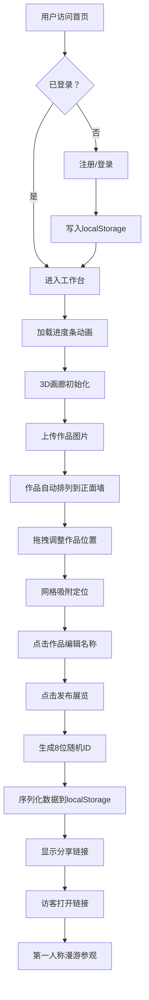

## 1. 产品概述

虚拟策展人是一款面向独立策展人和艺术爱好者的在线虚拟艺术展览Web应用，让没有技术背景的用户在浏览器中快速创建3D画廊空间、上传作品、自由布置墙面、添加标签，并生成可分享链接供他人以第一人称视角漫游参观，降低线上策展门槛。

## 2. 核心功能

### 2.1 用户角色

| 角色 | 注册方式 | 核心权限 |
|------|----------|----------|
| 策展用户 | 前端注册（localStorage） | 创建展览、上传作品、布置画廊、发布展览 |
| 访客用户 | 无需注册 | 通过分享链接以第一人称视角参观展览 |

### 2.2 功能模块

1. **登录注册页**：用户注册/登录表单，纯前端模拟
2. **策展工作台**：左右分栏布局，包含控制面板和3D画廊预览
3. **控制面板**：作品上传、墙面添加、展品列表管理
4. **3D画廊预览**：Three.js渲染的长方体空间，支持拖拽布置作品
5. **展览发布**：生成唯一ID和分享链接
6. **访客画廊**：第一人称视角漫游参观

### 2.3 页面详情

| 页面名称 | 模块名称 | 功能描述 |
|----------|----------|----------|
| 登录注册页 | 注册表单 | 用户名+密码注册，写入localStorage |
| 登录注册页 | 登录表单 | 验证localStorage中存储的用户信息 |
| 登录注册页 | 切换链接 | 登录/注册模式切换 |
| 策展工作台 | 加载进度条 | 0%-100%渐变动画（#7c5cbf→#4a90d9），1.5秒完成 |
| 策展工作台 | 控制面板（左25%） | 上传作品按钮、添加墙面按钮、展品列表 |
| 策展工作台 | 3D画廊（右75%） | 长方体空间（8:6:3），墙面暖灰、天花板浅米、地板深木色带反射 |
| 策展工作台 | 发布按钮 | 生成8位随机ID，序列化数据到localStorage，显示分享链接 |
| 控制面板 | 作品上传 | 仅接受jpg/png，每次最多6张，单张最大1200×1200自动压缩 |
| 控制面板 | 添加墙面 | 增加场景宽度 |
| 控制面板 | 展品列表 | 缩略图、文件名、删除按钮 |
| 3D画廊 | 作品上墙 | 正面墙等距排列（间距15%墙宽），2px金边画框 |
| 3D画廊 | 作品点击 | 弹出模态框展示大图（半透明黑色模糊背景） |
| 3D画廊 | 作品拖拽 | 鼠标拖拽移动，3×3隐蔽网格吸附（15px触发，0.3秒弹性缓动） |
| 3D画廊 | 拖拽越界 | 作品浮空并1秒内返回原位 |
| 访客画廊 | 第一人称漫游 | OrbitControls，初始相机(0,1.5,6)，看向(0,1,0) |

## 3. 核心流程

用户注册→登录→进入工作台（加载动画）→上传作品→作品自动上墙→拖拽调整位置→点击编辑名称→添加墙面（可选）→点击发布→生成分享链接→访客打开链接→第一人称漫游参观

## 4. 用户界面设计

### 4.1 设计风格

- **主色调**：#2c3e50（深海蓝）、#e8e0d4（暖灰）、#4a90d9（亮蓝点缀）、#c8a96e（金色细节）
- **页面背景**：#1a1a2e到#16213e深色渐变，带细微星点闪烁动画
- **按钮风格**：圆角12px，背景#4a90d9，悬浮#5ba3e6（0.2秒过渡），点击下沉2px+阴影缩小
- **控制面板**：半透明#2c3e50玻璃效果（backdrop-filter:blur(10px)，rgba(255,255,255,0.05)边框）
- **滚动条**：#4a90d9宽6px细条
- **整体风格**：极简北欧风

### 4.2 页面设计概览

| 页面名称 | 模块名称 | UI元素 |
|----------|----------|--------|
| 登录注册页 | 表单卡片 | 居中玻璃卡片、深色渐变星空背景、输入框圆角12px |
| 策展工作台 | 布局 | 左右分栏（25%/75%），移动端底部浮层（30%高度可展开） |
| 策展工作台 | 进度条 | 顶部横向进度条，颜色渐变#7c5cbf→#4a90d9，数字实时显示 |
| 控制面板 | 按钮组 | 上传、添加墙面按钮，蓝色圆角风格 |
| 控制面板 | 展品列表 | 竖向滚动列表，每项含缩略图、文件名、删除按钮 |
| 3D画廊 | 场景 | 长方体空间，暖灰墙面#e8e0d4，浅米天花板#f5f0e8，深木地板#5d4037带反射 |
| 3D画廊 | 光照 | 主光左上45°，辅光右下补光，地面环境光反弹 |
| 3D画廊 | 作品画框 | 2px金边#c8a96e，画面保持宽高比裁剪 |
| 作品模态框 | 展示 | 半透明黑色rgba(0,0,0,0.7)背景，backdrop-filter:blur(4px) |
| 分享链接 | 展示 | 发布按钮下方显示可复制链接 |

### 4.3 响应式

桌面端优先，移动端适配：屏幕宽度<768px时，控制面板折叠为底部浮层（高度30%可向上滑动展开），3D预览区域自适应剩余高度。

### 4.4 3D场景指引

- **环境**：长方体室内空间（长宽高8:6:3），封闭六面体
- **光照**：DirectionalLight主光（左上45°）+ DirectionalLight辅光（右下）+ AmbientLight环境光
- **相机**：策展模式使用透视相机，访客模式使用OrbitControls（初始位置(0,1.5,6)，看向(0,1,0)）
- **材质**：墙面MeshStandardMaterial，地板带envMapIntensity实现微弱反射
- **交互**：作品拖拽→射线拾取→平面投影→网格吸附→弹性缓动动画
- **性能目标**：30FPS以上，拖拽响应<50ms
