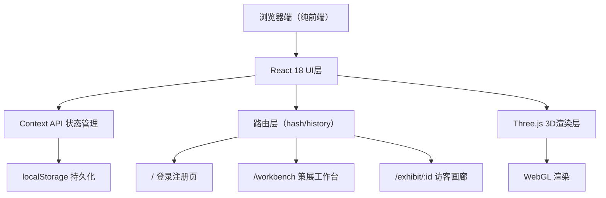
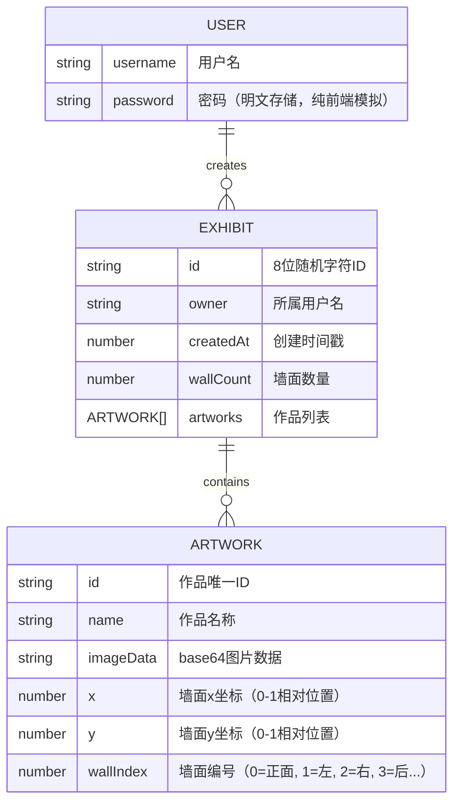

## 1. 架构设计



## 2. 技术描述

- **前端框架**：React 18 + TypeScript
- **构建工具**：Vite（端口5173，开启HMR）
- **3D引擎**：Three.js 0.160 + @types/three
- **状态管理**：React Context API
- **数据持久化**：localStorage
- **路由**：React Router（可选，或简单hash路由）
- **无后端服务**：纯前端实现

## 3. 路由定义

| 路由 | 用途 |
|------|------|
| / | 登录注册页（AuthPage） |
| /workbench | 策展工作台（含ControlPanel + GalleryScene） |
| /exhibit/:id | 访客画廊漫游页面 |

## 4. 数据模型

### 4.1 数据模型定义



### 4.2 localStorage存储键

| 键名 | 数据结构 | 说明 |
|------|----------|------|
| vg_users | User[] | 用户列表 |
| vg_currentUser | string | 当前登录用户名 |
| vg_exhibits | Record<string, Exhibit> | 展览数据字典，key为exhibitId |

## 5. 文件结构

```
/
├── package.json
├── index.html
├── vite.config.js
├── tsconfig.json
└── src/
    ├── App.tsx                    # 主组件、路由、Context
    ├── context/
    │   └── AppContext.tsx         # 全局Context定义
    ├── types/
    │   └── index.ts               # TypeScript类型定义
    ├── utils/
    │   ├── storage.ts             # localStorage工具函数
    │   └── helpers.ts             # 通用辅助函数（ID生成、图片压缩等）
    ├── components/
    │   ├── AuthPage.tsx           # 登录注册页
    │   ├── ControlPanel.tsx       # 控制面板
    │   ├── GalleryScene.tsx       # 3D画廊场景
    │   ├── Workbench.tsx          # 工作台布局
    │   ├── ExhibitView.tsx        # 访客画廊页面
    │   ├── ArtworkModal.tsx       # 作品大图模态框
    │   └── LoadingProgress.tsx    # 加载进度条
    └── styles/
        └── global.css             # 全局样式
```

## 6. 核心技术实现要点

### 6.1 Three.js场景架构
- GalleryScene封装为React组件，使用useRef管理Three.js对象
- 提供addArtwork/moveArtwork/removeArtwork/exportLayout方法通过ref暴露
- 作品使用Group管理（画框Mesh + 画面PlaneMesh）
- 拖拽交互：Raycaster射线拾取 + 平面坐标映射

### 6.2 网格吸附算法
- 3×3网格，每格占墙宽/高33%
- 拖拽结束时计算最近网格点，距离<15px触发吸附
- 使用线性插值+easeOutBack弹性缓动函数，0.3秒完成动画

### 6.3 图片压缩
- 使用Canvas API将图片缩放到最大1200×1200
- 保持原图宽高比，输出JPEG格式base64

### 6.4 性能优化
- 纹理复用：相同图片不重复创建Texture
- 拖拽节流：requestAnimationFrame更新位置
- 离屏作品隐藏：frustumCulled=true
