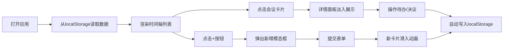

## 1. 产品概述

会议纪要时间轴管理应用，面向远程协作团队，用于快速整理、回放和追踪会议中的重点决议与待办事项。通过可视化时间轴和双栏详情面板，让会议成果可追溯、可执行。

- **目标用户**：远程团队成员、项目经理、产品经理
- **核心价值**：提升会议信息沉淀效率，确保决议落地执行

## 2. 核心功能

### 2.1 用户角色

| 角色 | 注册方式 | 核心权限 |
|------|----------|----------|
| 普通用户 | 无需注册（本地存储） | 会议增删改查、待办标记完成 |

### 2.2 功能模块

1. **时间轴展示**：左侧纵向时间轴，按日期倒序排列会议卡片
2. **详情面板**：右侧展示选中会议的决议与待办事项
3. **新增会议**：模态框表单创建新会议
4. **编辑会议**：修改会议主题、日期、标签
5. **删除会议**：带确认弹窗的删除操作
6. **待办管理**：新增、标记完成待办和决议

### 2.3 页面详情

| 页面名称 | 模块名称 | 功能描述 |
|----------|----------|----------|
| 主页面 | 顶部操作栏 | 绿色"+"按钮新增会议 |
| 主页面 | 时间轴列表 | 日期倒序展示，卡片标签随机色，hover显示编辑/删除 |
| 主页面 | 详情面板 | 决议/待办双列展示，复选框标记完成 |
| 模态框 | 新增/编辑表单 | 主题输入、日期选择、标签下拉 |
| 确认弹窗 | 删除确认 | Shake抖动动画，确认/取消按钮 |

## 3. 核心流程

用户打开应用 → 从localStorage恢复数据 → 浏览时间轴 → 点击会议卡片查看详情 → 标记待办完成或新增条目 → 点击"+"新增会议 → 填写表单提交 → 数据自动持久化

## 4. 用户界面设计

### 4.1 设计风格
- **主色调**：浅灰背景 #F5F5F5，白色卡片 #FFFFFF
- **辅助色**：6种标签色盘（蓝、绿、橙、紫、红、青）随机分配
- **按钮样式**：绿色"+"按钮，圆角设计
- **字体**：等宽字体（monospace）用于待办/决议文本 14px/1.5
- **布局风格**：左侧32%时间轴 + 右侧68%详情，卡片圆角10px
- **图标风格**：盾牌emoji（决议）、⚡（待办）

### 4.2 页面设计概述

| 页面名称 | 模块名称 | UI元素 |
|----------|----------|--------|
| 主页面 | 时间轴卡片 | 白底圆角10px，阴影0 2px 8px rgba(0,0,0,0.08)，hover加深阴影并上移2px |
| 主页面 | 标签 | 12px加粗，圆角4px，padding 8px 4px |
| 主页面 | 时间轴连线 | 灰色竖线，灰白色小圆点标记节点 |
| 主页面 | 复选框 | 蓝色边框，选中时蓝色勾号填充 |
| 模态框 | 毛玻璃效果 | 居中，黑色半透明遮罩 |
| 动画 | 卡片进入 | 从下方滑入，200ms |
| 动画 | 删除 | 向左缩小平移消失，200ms |
| 动画 | 详情面板 | 淡入淡出，opacity 0→1，200ms ease-out |

### 4.3 响应式
- **桌面端**：左侧32%时间轴 + 右侧68%详情
- **移动端（<768px）**：时间轴改为顶部横向可滚动日期条，详情面板占满下方

## 5. 性能约束
- 时间轴最多支持100条会议记录
- 初次渲染 ≤ 500ms
- 增删改操作（含动画）数据更新 ≤ 100ms
- localStorage写入 ≤ 30ms
