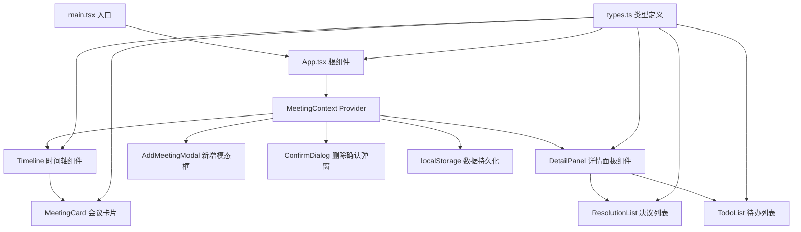
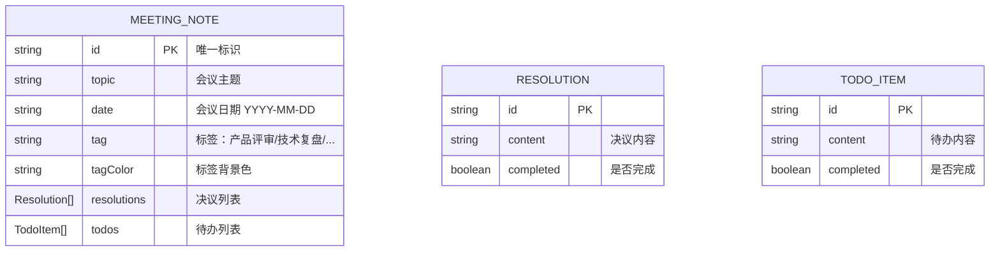

## 1. 架构设计



## 2. 技术描述

- **前端框架**：React 18 + TypeScript
- **构建工具**：Vite
- **状态管理**：React Context API
- **数据持久化**：Browser localStorage
- **样式方案**：原生CSS（CSS Modules或内联样式）
- **图标**：lucide-react + Emoji

## 3. 文件结构与调用关系

```
├── package.json              # 项目依赖配置
├── vite.config.js            # Vite配置（React插件，@别名）
├── tsconfig.json             # TypeScript配置（严格模式）
├── index.html                # HTML入口
└── src/
    ├── main.tsx              # 入口：渲染<App />，调用App组件
    ├── types.ts              # 类型：MeetingNote接口，被所有组件引用
    ├── App.tsx               # 根组件：状态管理+Context+布局组合
    ├── context/
    │   └── MeetingContext.tsx # 数据Context：增删改查+localStorage同步
    └── components/
        ├── Timeline.tsx       # 时间轴：接收notes，渲染卡片列表
        ├── MeetingCard.tsx    # 会议卡片：Timeline子组件，显示主题/日期/标签
        ├── DetailPanel.tsx    # 详情面板：接收selectedId，展示决议/待办
        ├── AddMeetingModal.tsx # 新增模态框：表单输入，回调到Context
        ├── ConfirmDialog.tsx   # 确认弹窗：删除警告动画
        └── Checkbox.tsx        # 自定义复选框组件
```

**数据流向**：
1. `main.tsx` → 渲染 `App.tsx`
2. `App.tsx` → 包裹 `MeetingContext.Provider`，组合 Timeline + DetailPanel
3. `MeetingContext` → 管理 notes 状态，所有操作自动同步 localStorage
4. `Timeline` → 从 Context 获取 notes，渲染 MeetingCard 列表
5. `MeetingCard` → 点击时通过 Context 设置 selectedId
6. `DetailPanel` → 从 Context 获取 selectedNote，渲染决议/待办列表，操作回调到 Context

## 4. 数据模型

### 4.1 数据模型定义



### 4.2 TypeScript 类型定义

```typescript
interface Resolution {
  id: string;
  content: string;
  completed: boolean;
}

interface TodoItem {
  id: string;
  content: string;
  completed: boolean;
}

interface MeetingNote {
  id: string;
  topic: string;
  date: string;
  tag: string;
  tagColor: string;
  resolutions: Resolution[];
  todos: TodoItem[];
}
```

## 5. 预设标签与色盘

| 标签 | 背景色 |
|------|--------|
| 产品评审 | #3B82F6 (蓝) |
| 技术复盘 | #10B981 (绿) |
| 需求讨论 | #F59E0B (橙) |
| 团队周会 | #8B5CF6 (紫) |
| 紧急会议 | #EF4444 (红) |
| 规划会议 | #06B6D4 (青) |
