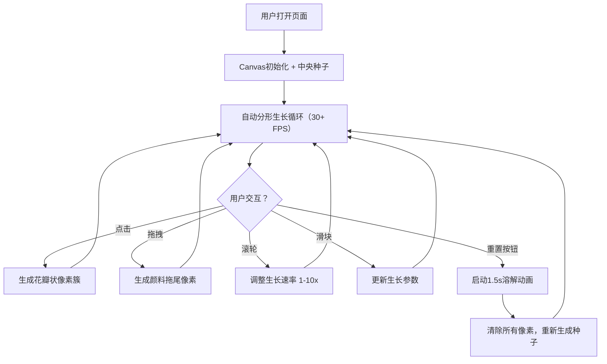

## 1. 产品概述

像素花园是一款在浏览器中运行的交互式生成艺术应用，通过自动繁殖的彩色像素块模拟分形植物生长，让用户实时参与和塑造动态像素艺术作品。

- 核心目标：用像素化的自动繁殖机制替代传统植物生长，创造用户可交互的动态分形艺术
- 目标用户：艺术爱好者、交互设计爱好者、休闲创意用户
- 市场价值：提供一款无需安装、即可体验生成艺术创作的轻量级Web应用

## 2. 核心功能

### 2.1 用户角色
本产品为单用户工具，无角色区分。

### 2.2 功能模块
1. **像素花园生长系统**：Canvas画布、分形递归生长算法、颜色渐变与生命周期管理
2. **用户交互系统**：点击生成花瓣簇、拖拽颜料拖尾、滚轮调整生长速率
3. **参数控制面板**：分支密度滑块、色相偏移范围滑块、生命周期世代数滑块
4. **重置与状态显示**：溶解动画重置按钮、FPS计数器、活跃像素数显示

### 2.3 页面详情
| 页面名称 | 模块名称 | 功能描述 |
|-----------|-------------|---------------------|
| 主页面（单页） | Canvas主画布 | 全屏径向渐变背景，承载像素花园的生长与渲染 |
| 主页面（单页） | 中央种子 | 初始3x3像素种子，带黄色光晕，作为生长起点 |
| 主页面（单页） | 点击花瓣簇 | 在点击位置生成20-30颗粉色渐变像素簇 |
| 主页面（单页） | 拖拽颜料拖尾 | 鼠标轨迹上每隔5px生成继承当前规则的像素 |
| 主页面（单页） | 滚轮速率控制 | 1-10倍速调整，步进0.5，实时显示 |
| 主页面（单页） | 右侧控制条 | 三个垂直滑块控制分支密度、色相偏移、生命周期 |
| 主页面（单页） | 底部重置按钮 | 1.5秒溶解动画后从种子重新生长 |
| 主页面（单页） | FPS计数器 | 左上角实时显示帧率 |
| 主页面（单页） | 参数面板 | 左上角显示生长速率与活跃像素数（每2秒更新） |

## 3. 核心流程

用户打开页面后，中央种子自动开始分形生长。用户可随时通过点击、拖拽、滚轮进行干预，通过右侧滑块调整生长参数，或点击底部重置按钮重新开始。

## 4. 用户界面设计

### 4.1 设计风格
- **主色调**：深紫#1a0e2e到墨蓝#2f1d4a的径向渐变背景
- **点缀色**：金色#cba55b / #f5d47a，荧光黄#e6c700，荧光粉#ff6b8a / #e6739f
- **UI控件**：圆角矩形，金色点缀，悬停加深动画（0.1s），点击按压动画（0.05s缩放至0.95）
- **像素效果**：Canvas shadowBlur实现2-6px的微弱发光边缘
- **字体**：无衬线系统字体，12-14px为主，移动端降至10px

### 4.2 页面设计概述
| 页面名称 | 模块名称 | UI元素 |
|-----------|-------------|-------------|
| 主页面 | Canvas画布 | 全屏径向渐变(#1a0e2e→#2f1d4a)，像素带发光效果 |
| 主页面 | 右侧控制条 | 12%宽度，#0f0820背景80%不透明度，三个垂直滑块 |
| 主页面 | 滑块控件 | 轨道#3a2a5a，旋钮#cba55b，拖拽渐变到#f5d47a（0.15s） |
| 主页面 | 底部重置按钮 | 圆角矩形，#2a1f40背景，#f0ddaa文字，loading旋转图标 |
| 主页面 | FPS/参数面板 | 左上角，白色12px文字，#00000080投影，半透明面板 |
| 主页面 | 种子/像素 | 3x3像素种子带黄色光晕，像素块2-6px发光 |

### 4.3 响应式设计
- **桌面端（≥768px）**：右侧垂直控制条（12%屏宽），滑块纵向排列
- **平板端（480-768px）**：控制条变为底部水平条（全宽，高80px），滑块横向排列
- **移动端（<480px）**：滑块文字缩小至10px，隐藏描述文本仅保留数字，所有控件支持320px宽度触摸操作

### 4.4 性能指标
- 活跃像素数达到50000颗时仍维持30+ FPS
- 所有交互操作响应延迟不超过100ms
