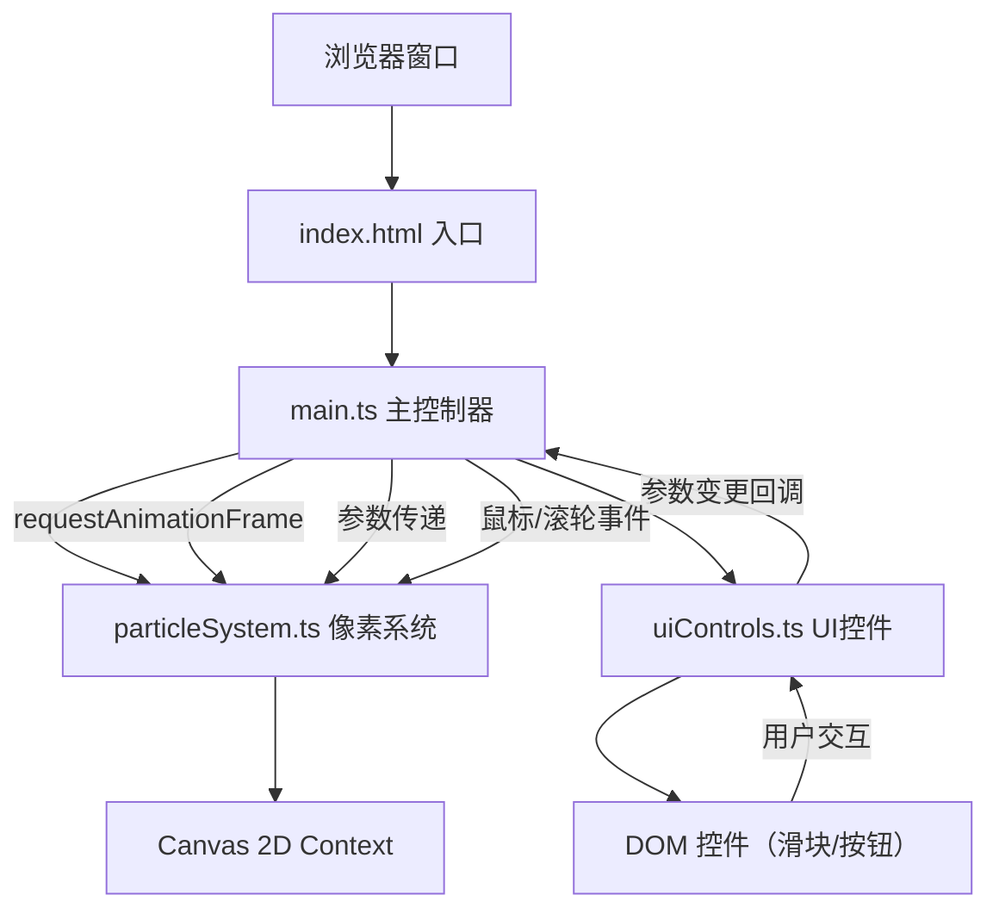

## 1. 架构设计



## 2. 技术描述

- **前端框架**：原生 TypeScript（无UI框架）
- **构建工具**：Vite@5（端口5173，开启HMR）
- **语言标准**：TypeScript 严格模式，target ES2020，module ESNext
- **渲染引擎**：Canvas 2D API（无外部动画库或游戏引擎）
- **样式方案**：原生CSS（通过内联样式注入，无外部样式文件）
- **后端服务**：无（纯前端应用）

## 3. 文件结构与职责

| 文件路径 | 职责 | 输出/接口 |
|-----------|------|-----------|
| `package.json` | 依赖声明（typescript, vite）与启动脚本 | `npm run dev` |
| `vite.config.js` | Vite基础配置（端口5173，HMR） | - |
| `tsconfig.json` | TypeScript编译配置（严格模式、ES2020、ESNext） | - |
| `index.html` | 入口HTML，全屏Canvas容器，无外部样式 | 挂载点 `<div id="app">` |
| `src/main.ts` | 入口文件：画布初始化、UI控件创建、事件监听、动画循环驱动、事件分发 | 初始化并协调各模块 |
| `src/particleSystem.ts` | 像素花园核心逻辑：像素数组维护、分形生长、颜色渐变、生命周期、渲染、重置 | `ParticleSystem` 类 |
| `src/uiControls.ts` | UI控件管理：滑块创建与事件、重置按钮、DOM操作、回调通知 | `UIControls` 类 |

## 4. 核心类与数据流

### 4.1 ParticleSystem 类（src/particleSystem.ts）

**状态数据：**
```typescript
interface Particle {
  x: number;          // 格子坐标X
  y: number;          // 格子坐标Y
  h: number;          // 色相 0-360
  s: number;          // 饱和度 0-100
  l: number;          // 亮度 0-100
  generation: number; // 当前世代数
  alive: boolean;     // 是否存活
  hasReproduced: boolean; // 是否已繁殖
}

interface GrowthParams {
  branchDensity: number;    // 分支密度 0.2-1.0
  hueShiftRange: number;    // 色相偏移范围 ±度
  maxGenerations: number;   // 最大世代数 10-60
  growthRate: number;       // 生长速率 1-10
}
```

**对外方法：**
- `constructor(canvas: HTMLCanvasElement)`：初始化系统，绑定画布
- `setParams(params: Partial<GrowthParams>)`：更新生长参数
- `reset()`：立即重置为中央种子状态
- `startDissolve(onComplete: () => void)`：启动溶解动画，完成后调用回调
- `spawnPetalCluster(x: number, y: number)`：在指定位置生成花瓣簇
- `spawnTrailPixel(x: number, y: number)`：在轨迹上生成拖尾像素
- `render(frameCount: number)`：单帧更新与渲染，返回活跃像素数
- `getActivePixelCount()`：获取当前活跃像素数
- `getAverageHue()`：获取最近生长像素的平均色相（用于拖尾颜色）

### 4.2 UIControls 类（src/uiControls.ts）

**回调接口：**
```typescript
interface UICallbacks {
  onParamChange: (key: 'branchDensity' | 'hueShiftRange' | 'maxGenerations', value: number) => void;
  onGrowthRateChange: (value: number) => void;
  onReset: () => void;
}
```

**对外方法：**
- `constructor(container: HTMLElement, callbacks: UICallbacks)`：创建所有UI控件
- `setGrowthRateDisplay(value: number)`：更新参数面板中的速率显示
- `setActivePixelCount(count: number)`：更新参数面板中的像素数显示
- `setResetButtonLoading(loading: boolean)`：设置重置按钮loading状态
- `handleResize(width: number, height: number)`：响应式布局调整

### 4.3 main.ts 数据流

1. 初始化：创建Canvas → 实例化ParticleSystem → 实例化UIControls
2. 动画循环：`requestAnimationFrame` → 调用 `particleSystem.render()` → 更新FPS/像素计数显示
3. 事件分发：
   - 鼠标点击 → `particleSystem.spawnPetalCluster(x, y)`
   - 鼠标拖拽 → `particleSystem.spawnTrailPixel(x, y)`
   - 滚轮事件 → `uiControls.setGrowthRateDisplay()` → `particleSystem.setParams()`
   - 滑块变化 → UIControls回调 → `particleSystem.setParams()`
   - 重置按钮 → `particleSystem.startDissolve()` → 完成后重新初始化

## 5. 性能优化策略

1. **像素网格存储**：使用 `Uint8Array` 或 `Map<string, Particle>` 进行空间索引，避免O(n²)碰撞检测
2. **分帧繁殖**：每帧限制繁殖数量，使用队列分摊计算压力
3. **脏区域渲染**：仅重绘变化区域（如有需要），而非全量重绘
4. **离屏Canvas**：使用双缓冲避免闪烁
5. **高效颜色计算**：预计算HSL到RGB转换，减少每帧重复计算
6. **requestAnimationFrame驱动**：使用浏览器原生帧率控制，避免setTimeout抖动
