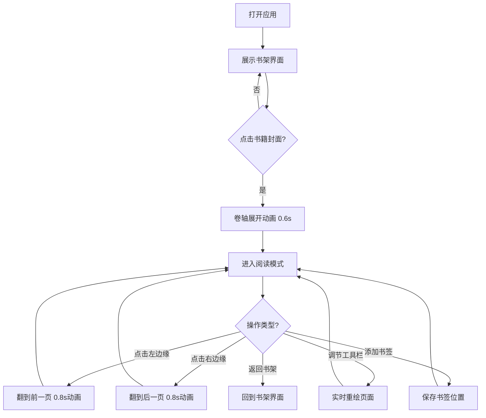

## 1. 产品概述

「墨韵书阁」是一款基于浏览器的交互式数字文库应用，通过 Canvas 技术模拟古典线装书的阅读体验，让用户以卷轴形式浏览、搜索和阅读虚拟古典书籍。

- 主要目标：打造沉浸式古籍阅读体验，融合纸张透光、翻页褶皱等逼真动画效果
- 目标用户：古典文学爱好者、文化产品用户、教育场景师生
- 产品价值：在数字时代重现传统纸质阅读的温润质感

## 2. 核心特性

### 2.1 用户角色
| 角色 | 注册方式 | 核心权限 |
|------|----------|----------|
| 普通用户 | 无需注册，直接使用 | 浏览书架、阅读书籍、添加书签、调整阅读参数 |

### 2.2 功能模块
1. **书架界面**：横向滚动书架展示，书籍封面展示与点击进入阅读
2. **阅读界面**：卷轴展开动画、书页内容渲染、翻页动画
3. **工具栏**：页面透明度、字号、背景色相调节，书签列表
4. **书签系统**：添加书签、悬停放大动画、书签跳转

### 2.3 页面详情
| 页面名称 | 模块名称 | 功能描述 |
|----------|----------|----------|
| 书架主页 | 书架展示区 | 横向滚动的木质书架，每格展示书籍封面 |
| 书架主页 | 书籍封面 | 240x340像素木纹封面，中央显示书名 |
| 阅读页面 | 卷轴背景 | 仿古卷轴条带渐变背景 |
| 阅读页面 | 书页内容区 | 宽度840px弹性区域，渲染古典诗词内容 |
| 阅读页面 | 翻页交互 | 左右边缘60px触发区域，点击翻页带动画 |
| 阅读页面 | 底部书签栏 | 展示当前页书签，悬停放大1.2倍 |
| 工具栏 | 透明度滑块 | 0.3-1.0范围调节页面透明度 |
| 工具栏 | 字号滑块 | 14px-28px调节正文字号 |
| 工具栏 | 背景色相 | 0-360度调节宣纸背景色调 |
| 工具栏 | 书签列表 | 显示已添加书签页码，点击跳转 |

## 3. 核心流程

用户打开应用后看到横向书架，点击任意书籍封面触发卷轴展开动画进入阅读模式；在阅读模式下，点击书页左右边缘翻页，翻页伴随纸张透光和褶皱动画；通过右侧工具栏调节阅读参数，底部添加书签标记位置。

## 4. 用户界面设计

### 4.1 设计风格
- **主色调**：#f0e6d3 暖土黄（宣纸）与 #2a1f14 深褐（墨色）搭配
- **辅助色**：#d4b483 卷轴金色、#8b7355 书架木纹棕、#d4af37 滑块金色
- **书签色**：#c0392b 朱红、#8e44ad 紫色、#2980b9 靛蓝、#27ae60 翠绿
- **字体**：衬线体（serif），书名使用手写风格描边
- **布局风格**：Canvas 全屏画布，仿古书卷布局，右侧悬浮工具栏
- **动画风格**：全部使用 ease-out 缓动，翻页 0.8s、卷轴展开 0.6s、书签放大 0.3s

### 4.2 页面设计概览
| 页面名称 | 模块名称 | UI 元素 |
|----------|----------|---------|
| 书架主页 | 书架背景 | #f0e6d3 到 #e8dcc8 径向渐变宣纸纹理，4x4 像素噪声颗粒 |
| 书架主页 | 木质书架 | #8b7355 到 #a68a6c 竖纹木纹渐变，每格 12px #5a4a35 阴影分隔 |
| 书架主页 | 书籍封面 | 240x340 像素，中央书名 36px #2a1f14 |
| 阅读页面 | 卷轴条带 | #d4b483 到 #c2a66b 仿古渐变 |
| 阅读页面 | 书籍信息 | 左上角书名作者 18px #2a1f14，距顶部 60px |
| 阅读页面 | 书页内容 | 宽度弹性 640px-1200px，从顶部 120px 到底部 100px |
| 阅读页面 | 翻页动画 | 卷曲曲线卷起，新页滑入，背光亮度 100%→60%→100%，Y 轴 ±2px 正弦波动 |
| 工具栏 | 右侧面板 | 宽度 200px，#2c2c3e 带 0.4 透明度，固定右边缘 |
| 工具栏 | 滑块手柄 | 半径 10px #d4af37，悬停直径 16px 带 #ffd700 光晕 |

### 4.3 响应式
- 桌面优先设计，Canvas 占满浏览器视口
- 书页内容区宽度随浏览器宽度在 640px 到 1200px 之间弹性缩放
- 最小支持宽度 640px

## 5. 性能要求
- 翻页动画帧率不低于 50FPS
- 滑块调整后页面重绘延迟不超过 16ms
- 书页内容渲染（含纹理颗粒）每帧耗时小于 5ms
- 整体内存占用控制在 200MB 以内
