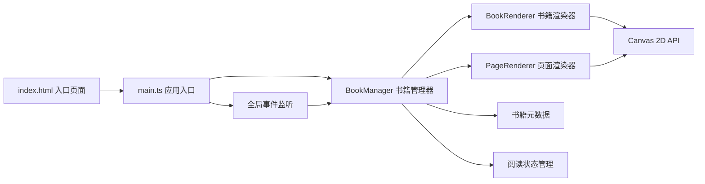

## 1. 架构设计



## 2. 技术说明
- **前端框架**：原生 TypeScript + HTML5 Canvas 2D API
- **构建工具**：Vite 5.x
- **编程语言**：TypeScript（严格模式，target ES2020，module ESNext）
- **无外部动画库**：所有动画通过 requestAnimationFrame + 自定义缓动函数实现
- **无 UI 框架**：所有界面通过 Canvas 原生绘制

## 3. 文件结构

| 文件路径 | 职责说明 |
|----------|----------|
| `package.json` | 项目依赖与启动脚本配置 |
| `vite.config.js` | Vite 基础配置，端口 5173，开启 HMR |
| `tsconfig.json` | TypeScript 严格模式配置 |
| `index.html` | 入口页面，包含全屏 Canvas 画布 |
| `src/main.ts` | 应用入口，初始化画布、加载书籍、注册事件 |
| `src/bookManager.ts` | 书籍管理器，加载切换书籍、管理阅读状态 |
| `src/bookRenderer.ts` | 书籍渲染器，绘制封面、卷轴背景 |
| `src/pageRenderer.ts` | 页面渲染器，翻页动画、书页内容、透光纹理 |
| `src/types.ts` | 类型定义（书籍、书签、阅读状态等） |
| `src/data/books.ts` | 书籍元数据与古典诗词内容 |
| `src/utils/easing.ts` | 缓动函数工具库 |

## 4. 核心数据模型

```typescript
interface Book {
  id: string;
  title: string;
  author: string;
  pages: BookPage[];
}

interface BookPage {
  content: string;
}

interface Bookmark {
  pageIndex: number;
  color: string;
}

interface ReadingState {
  currentBook: Book | null;
  currentPage: number;
  bookmarks: Map<string, Bookmark[]>;
  opacity: number;
  fontSize: number;
  hue: number;
  isAnimating: boolean;
  animationType: 'scroll' | 'page' | null;
}
```

## 5. 渲染管线

1. **主循环**：requestAnimationFrame 驱动，每帧根据状态重绘整个 Canvas
2. **分层渲染**：
   - 底层：宣纸背景纹理（预缓存到 OffscreenCanvas）
   - 中层：书架/卷轴/书页内容
   - 顶层：工具栏、书签、交互反馈
3. **性能优化**：
   - 静态纹理预渲染缓存
   - 动画期间仅重绘必要区域
   - 噪声颗粒离屏画布复用
