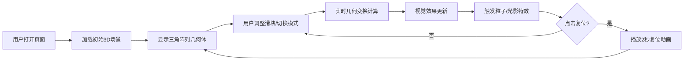

## 1. 产品概述
「拓扑折叠」是一款交互式三维几何变换可视化项目，通过浏览器实时操控复合几何体群，观察数学与艺术交织的形态演变。
- 面向对数学美学、几何变换、创意编程感兴趣的用户群体
- 提供沉浸式的三维交互体验，结合粒子特效与光影变换，打造优雅的视觉艺术品

## 2. 核心功能

### 2.1 用户角色
本项目为单用户体验型应用，无需用户角色区分。

### 2.2 功能模块
1. **主3D场景**：全屏Three.js渲染窗口，包含二十面体、立方体、环面三个几何体的三角阵列
2. **控制面板**：左侧参数控制面板，包含滑块、下拉菜单、复位按钮
3. **三种变换模式**：折叠、扭曲、展开，每种模式有独特的视觉效果
4. **粒子系统**：变换触发时的粒子烟花效果
5. **响应式适配**：移动端控制面板折叠为底部抽屉

### 2.3 页面详情
| 页面名称 | 模块名称 | 功能描述 |
|-----------|-------------|---------------------|
| 主页面 | 3D渲染画布 | 全屏Canvas渲染，深蓝渐变背景，实时几何变换展示 |
| 主页面 | 控制面板 | 参数调节滑块（折叠强度、扭曲角度、展开比例）、模式切换下拉菜单、复位按钮 |
| 主页面 | 粒子特效 | 折叠模式触发彩色螺旋粒子喷射 |
| 主页面 | 辅助网格 | 展开模式浮现动态线条网格 |

## 3. 核心流程
用户打开页面 → 观察初始三角阵列几何体 → 通过滑块调整参数或切换变换模式 → 实时观察几何体形态演变 → 触发粒子特效/光影重组 → 点击复位按钮回到初始状态

## 4. 用户界面设计

### 4.1 设计风格
- **主色调**：深蓝渐变背景（#0d0f1a → #1c1e30）
- **几何体色彩**：二十面体#ff6b8a（粉红）、立方体#4fc3f7（浅蓝）、环面#ffd54f（金黄），均为alpha 0.7半透明
- **UI面板**：#1e2030底色，#2a2d40边框，4px圆角
- **交互元素**：滑块轨道#3a3d50，滑块手柄#6dd3ff带2px光晕
- **边缘线条**：0.5px白色发光线条
- **过渡动画**：所有UI切换0.3秒平滑过渡

### 4.2 页面设计概述
| 页面名称 | 模块名称 | UI元素 |
|-----------|-------------|-------------|
| 主页面 | 3D画布 | 全屏、深蓝渐变、居中三角阵列、环境光+方向光 |
| 主页面 | 控制面板 | 固定左侧、半透明深色面板、三个滑块、下拉菜单、复位按钮 |
| 主页面 | 移动端抽屉 | 底部固定、高度200px、圆形展开/收起按钮带箭头旋转动画 |

### 4.3 响应式设计
- 桌面端（≥768px）：左侧固定控制面板，画布填充剩余空间
- 移动端（<768px）：控制面板折叠为底部抽屉，点击按钮展开/收起，所有几何体按比例缩放保持视觉均衡

### 4.4 3D场景设计
- **环境**：深蓝渐变背景，环境光强度0.3
- **光照**：右上角方向光产生立体感
- **相机**：PerspectiveCamera，合理视场角，支持轨道控制
- **几何体**：二十面体（半径2）、立方体（边长1.8）、环面（半径1.5，管半径0.4），三角阵排列
- **材质**：半透明MeshPhongMaterial + EdgesGeometry边缘发光线
- **粒子**：最多200个，BufferGeometry，一次绘制调用，螺旋运动轨迹
- **性能目标**：稳定55FPS以上
