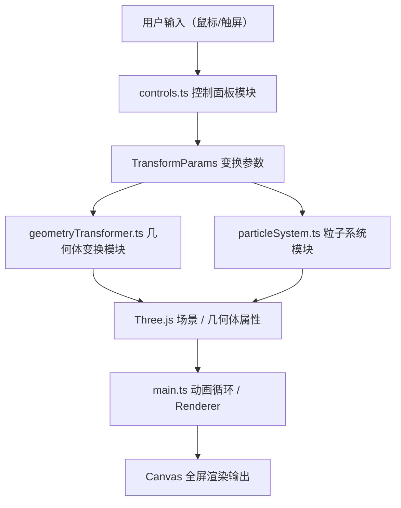

## 1. 架构设计



## 2. 技术描述
- **前端框架**：TypeScript + Three.js@0.160 + Vite@5.x
- **构建工具**：Vite（端口5173，开启HMR）
- **语言标准**：TypeScript 严格模式，target ES2020，module ESNext
- **后端**：无后端，纯前端可视化项目
- **数据存储**：无持久化存储，运行时内存状态管理

## 3. 文件结构定义
| 文件路径 | 目的 |
|-------|---------|
| /package.json | 项目依赖与启动脚本 |
| /vite.config.js | Vite构建配置 |
| /tsconfig.json | TypeScript编译配置 |
| /index.html | 入口HTML页面，Canvas挂载点 |
| /src/types.ts | 类型接口定义（TransformParams、Particle、GeometryGroup等） |
| /src/controls.ts | 控制面板DOM创建与事件绑定，导出变换参数与复位函数 |
| /src/geometryTransformer.ts | 几何体变换计算，导出updateGeometries函数 |
| /src/particleSystem.ts | 粒子池管理，导出emitParticles和updateParticles函数 |
| /src/main.ts | 应用入口，场景/相机/渲染器初始化，动画循环管理 |

## 4. 核心数据类型定义

```typescript
type TransformMode = 'fold' | 'twist' | 'unfold';

interface TransformParams {
  foldStrength: number;    // 0 ~ 1
  twistAngle: number;      // 0 ~ 360 度
  unfoldRatio: number;     // 0.5 ~ 2.0
  mode: TransformMode;
}

interface Particle {
  position: { x: number; y: number; z: number };
  velocity: { x: number; y: number; z: number };
  color: THREE.Color;
  size: number;
  life: number;      // 剩余生命周期（秒）
  maxLife: number;
  spiralOffset: number;
}

interface GeometryGroup {
  icosahedron: THREE.Mesh;
  cube: THREE.Mesh;
  torus: THREE.Mesh;
  icosahedronEdges: THREE.LineSegments;
  cubeEdges: THREE.LineSegments;
  torusEdges: THREE.LineSegments;
}
```

## 5. 数据流与模块职责

### 5.1 controls.ts
- **输入**：用户滑块拖动、模式切换、复位按钮点击
- **输出**：TransformParams 对象、复位事件回调
- **职责**：
  - 创建左侧控制面板DOM元素
  - 绑定滑块、下拉菜单、按钮事件
  - 实时输出变换参数
  - 复位动画（2秒平滑过渡）
  - 响应式布局（移动端抽屉）

### 5.2 geometryTransformer.ts
- **输入**：TransformParams、GeometryGroup、deltaTime
- **输出**：更新几何体的position/rotation/scale/材质属性
- **职责**：
  - 折叠模式：Y轴收缩 + 几何体聚合 + 发光球体渐变
  - 扭曲模式：顶点按距离中心比例绕Y轴旋转 + 波纹色带
  - 展开模式：径向扩散 + 透明度降低 + 辅助网格浮现

### 5.3 particleSystem.ts
- **输入**：发射指令（位置、数量、变换进度）
- **输出**：粒子BufferGeometry属性更新
- **职责**：
  - 预分配粒子对象池（最多200个）
  - 发射粒子时从池中取可用对象
  - 每帧更新粒子位置（螺旋轨迹）、生命周期、颜色
  - 生命周期结束后回收粒子
  - 使用BufferGeometry + PointsMaterial，一次绘制调用

### 5.4 main.ts
- **职责**：
  - 初始化THREE.Scene、PerspectiveCamera、WebGLRenderer
  - 创建三个几何体及边缘线条，组成三角阵列
  - 设置环境光、方向光、渐变背景
  - 集成OrbitControls鼠标拖拽控制
  - 主循环：requestAnimationFrame，按帧调用各模块update
  - 响应窗口resize事件
